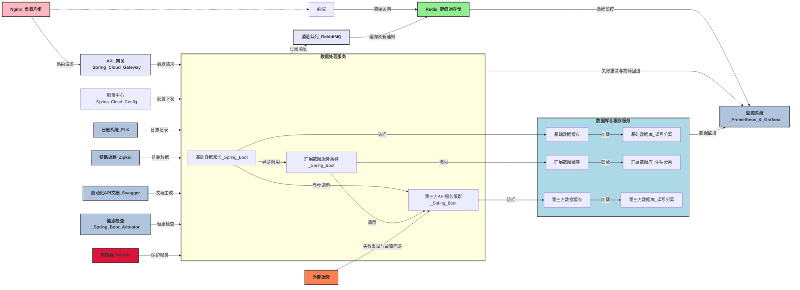
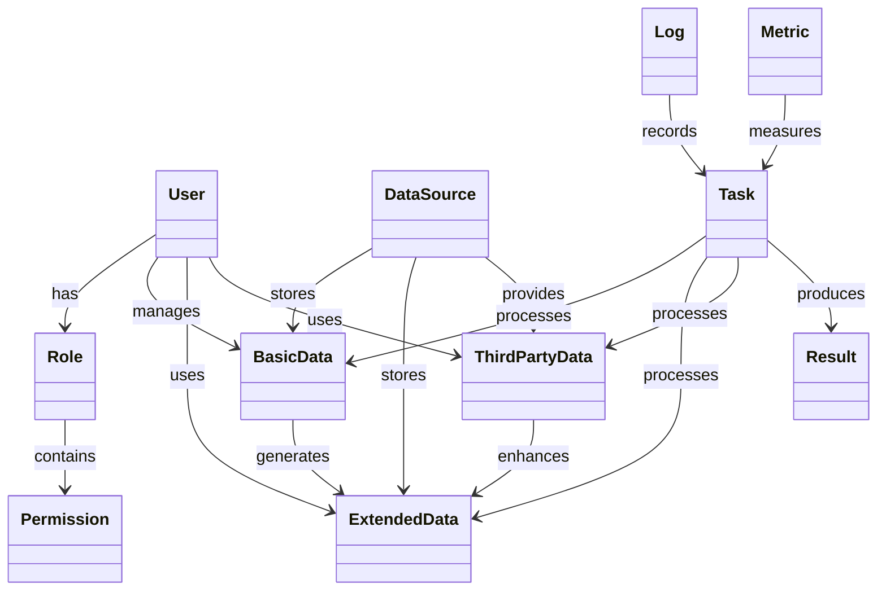
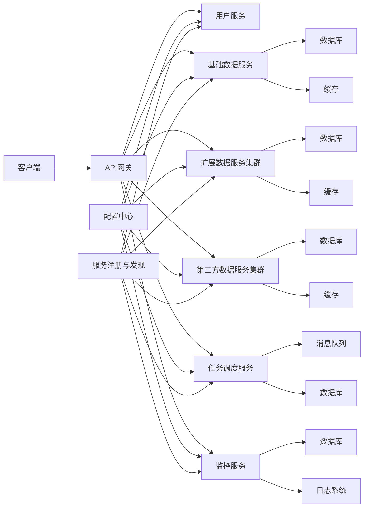
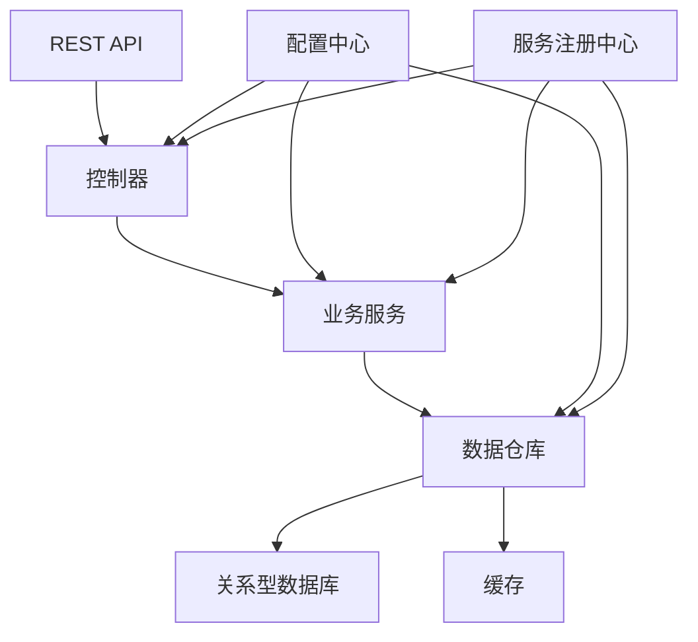
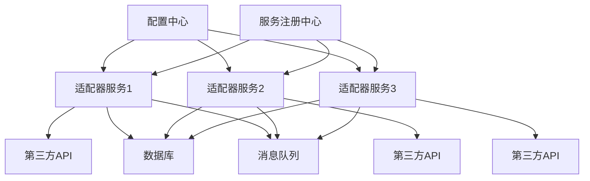

https://claude.ai/chat/81b1ca34-205d-445c-82d7-37f6030009db
## Prompt:
undefined

## Response:
根据您提供的文档和最终选定的架构设计图,我总结了以下的设计需求:

1. 系统由三个核心服务组成:基础数据服务、扩展数据服务集群和第三方API服务集群。
2. 基础数据服务通过异步调用与扩展数据服务集群和第三方API服务集群通信,整合数据后返回给客户端。
3. 每个服务都有其独立的数据库(读写分离)和缓存,以提高性能和可扩展性。其中,基础数据缓存直接与Redis键值对存储交互。
4. 利用消息队列(RabbitMQ)实现缓存的异步刷新,保证数据一致性。
5. 引入断路器(Hystrix)来保护核心服务,防止局部故障导致整个系统不可用。
6. 通过API网关(Spring Cloud Gateway)统一管理客户端请求,并利用Nginx进行负载均衡。
7. 集成配置中心(Spring Cloud Config)实现配置的集中管理和动态更新。
8. 利用健康检查(Spring Boot Actuator)、日志聚合(ELK)、链路追踪(Zipkin)、监控(Prometheus & Grafana)等组件全方位监控系统的运行状态。
9. 自动生成API文档(Swagger)以便于理解和调试系统接口。
10. 第三方服务调用失败时,通过重试和故障回退保证系统的可用性。

下面是您选定的终稿架构图:

这个架构设计涵盖了现代分布式系统的多个关键方面,如微服务、缓存、消息队列、配置中心、服务网关、监控、链路追踪、API文档等。它的目标是构建一个高性能、高可用、可扩展的后端服务系统。

如果您对这个设计还有任何其他问题或建议,欢迎随时提出。我很乐意与您进一步讨论和优化这个架构设计。

## Prompt:
undefined

## Response:
好的,根据您的设计需求和选定的架构图,我建议采用以下的架构文档目录结构:

1. 简介 1.1 目的 1.2 范围 1.3 定义与缩写
2. 架构概览 2.1 系统上下文 2.2 架构风格 2.3 架构决策 2.4 架构图
3. 业务架构 3.1 业务上下文 3.2 领域模型 3.3 业务流程
4. 应用架构 4.1 应用概览 4.2 核心服务 4.2.1 基础数据服务 4.2.2 扩展数据服务集群 4.2.3 第三方API服务集群 4.3 服务交互 4.4 数据流
5. 技术架构 5.1 技术栈概览 5.2 数据层 5.2.1 数据库设计 5.2.2 缓存设计 5.2.3 数据同步与一致性 5.3 服务层 5.3.1 微服务框架 5.3.2 服务发现与注册 5.3.3 服务网关 5.3.4 服务容错 5.4 消息通信 5.4.1 消息队列 5.4.2 事件驱动架构 5.5 配置管理 5.6 安全设计 5.7 日志与监控 5.7.1 集中日志管理 5.7.2 监控与告警 5.7.3 链路追踪 5.8 API文档
6. 部署架构 6.1 部署模型 6.2 部署环境 6.3 容器化 6.4 编排工具
7. 非功能需求 7.1 性能与可扩展性 7.2 可用性与容错 7.3 安全性 7.4 可维护性 7.5 数据隐私与合规
8. 演进路线 8.1 当前阶段 8.2 下一步计划 8.3 长期愿景
9. 附录 9.1 名词解释 9.2 参考资料

这是一个比较完整的架构文档目录结构,涵盖了系统设计的主要方面。我们可以按照这个目录,详细阐述每个部分的内容。

在接下来的讨论中,我们将逐步完善这个文档,确保系统设计满足您的需求,并且易于理解、实施和维护。让我们从"简介"部分开始吧。

## Prompt:
undefined

## Response:
1. 简介

1.1 目的 本文档旨在描述一个基于微服务架构的高性能、高可用、可扩展的后端服务系统的架构设计。该系统由三个核心服务组成:基础数据服务、扩展数据服务集群和第三方API服务集群。文档将详细阐述系统的业务需求、架构决策、技术选型以及部署策略,为开发团队提供清晰的指导和参考。

通过本文档,读者将了解:

* 系统的整体架构和各个组件之间的交互关系
* 每个服务的职责边界和设计考量
* 如何利用缓存、消息队列、配置中心等组件提高系统的性能和可扩展性
* 如何通过服务容错、监控、日志等机制保障系统的高可用性
* 如何利用容器化技术和编排工具简化系统的部署和运维

1.2 范围 本文档的范围包括:

* 业务架构:描述系统所处的业务环境、领域模型以及关键业务流程
* 应用架构:描述系统的核心服务、服务交互模式以及数据流
* 技术架构:描述系统采用的技术栈、数据存储设计、服务框架选择、消息通信机制、配置管理、安全设计、日志与监控等方面的技术决策
* 部署架构:描述系统的部署模型、环境、容器化策略以及编排工具的使用

本文档不包括:

* 详细的API设计和接口定义
* 详细的数据库表结构和SQL语句
* 详细的代码实现和算法描述

1.3 定义与缩写

* API:Application Programming Interface,应用程序编程接口
* REST:Representational State Transfer,表述性状态传递
* HTTP:Hypertext Transfer Protocol,超文本传输协议
* JSON:JavaScript Object Notation,一种轻量级的数据交换格式
* ACID:Atomicity, Consistency, Isolation, Durability,数据库事务的四个特性:原子性、一致性、隔离性、持久性
* CAP:Consistency, Availability, Partition tolerance,分布式系统的三个特性:一致性、可用性、分区容错性
* BASE:Basically Available, Soft state, Eventually consistent,基本可用、软状态、最终一致性
* HA:High Availability,高可用性
* SSL:Secure Sockets Layer,安全套接层
* TLS:Transport Layer Security,传输层安全性协议
* JWT:JSON Web Token,一种基于JSON的、用于在网络上声明某种主张的令牌
* OAuth:Open Authorization,开放授权协议
* RBAC:Role-Based Access Control,基于角色的访问控制
* SLA:Service Level Agreement,服务等级协议
* QPS:Queries Per Second,每秒查询率
* TPS:Transactions Per Second,每秒事务处理量

这部分内容为架构文档奠定了基础,明确了文档的目标受众、覆盖范围以及涉及的关键概念和术语。接下来,我们将进入"架构概览"部分,给出系统的整体轮廓。

## Prompt:
undefined

## Response:
2. 架构概览

2.1 系统上下文 本系统是一个面向多个客户端的后端服务,提供基础数据查询、扩展数据计算以及第三方数据访问等功能。系统采用微服务架构,通过RESTful API与前端应用、移动端App以及其他外部系统进行交互。

主要涉及的用户角色和外部系统包括:

* 普通用户:通过Web浏览器或移动端App访问系统,查询基础数据、扩展数据以及第三方数据。
* 管理员:通过管理控制台监控系统运行状态,管理系统配置,查看日志和报警信息。
* 第三方系统:通过API接口调用系统,获取所需的数据或服务。

2.2 架构风格 本系统采用微服务架构风格,将业务功能拆分为多个独立的服务,每个服务都有自己的数据存储和部署环境。服务之间通过轻量级的通信机制(如HTTP/REST或消息队列)进行交互,实现松耦合和高内聚。

同时,系统引入了多个支撑组件,如API网关、配置中心、消息队列、缓存等,以提高系统的性能、可扩展性和可维护性。

2.3 架构决策 在设计本系统架构时,我们做出了以下关键决策:

1. 采用微服务架构,将系统拆分为基础数据服务、扩展数据服务集群和第三方API服务集群,提高系统的可扩展性和灵活性。
2. 使用Spring Boot作为微服务开发框架,Spring Cloud作为微服务治理平台,提高开发效率和系统稳定性。
3. 使用Nginx作为反向代理和负载均衡器,提高系统的并发处理能力和可用性。
4. 使用Redis作为分布式缓存,提高数据访问性能和减轻数据库压力。
5. 使用RabbitMQ作为消息队列,实现服务之间的异步通信和解耦。
6. 采用读写分离的数据库设计,提高数据读取性能和可扩展性。
7. 引入Hystrix作为断路器,防止服务级联失败和提高系统容错能力。
8. 集成ELK stack(Elasticsearch, Logstash, Kibana)进行集中日志管理和分析。
9. 集成Prometheus和Grafana进行系统监控和告警。
10. 使用Zipkin进行分布式链路追踪,快速定位和诊断性能问题。
11. 使用Swagger生成API文档,方便前后端开发人员协作和测试。
12. 使用Docker和Kubernetes进行服务的容器化部署和编排,提高部署效率和系统可维护性。

2.4 架构图 参考文档中给出的Mermaid格式的架构图。

这部分内容从全局视角描述了系统的上下文环境、架构风格以及重要的架构决策。通过对这些关键决策的解释,读者可以了解系统的整体设计理念和技术选型。

接下来,我们将在"业务架构"部分深入讨论系统所涉及的业务领域和流程。

## Prompt:
undefined

## Response:
3. 业务架构

3.1 业务上下文 本系统服务于一个在线数据平台,为用户提供基础数据查询、扩展数据分析以及第三方数据集成等功能。用户可以通过Web门户或移动端App访问系统,管理员可以通过管理控制台对系统进行配置和监控。

系统涉及的主要业务领域包括:

* 用户管理:用户注册、登录、权限控制等。
* 基础数据管理:基础数据的录入、存储、查询、更新等。
* 扩展数据管理:扩展数据的采集、清洗、计算、存储等。
* 第三方数据集成:第三方数据源的接入、适配、调用等。
* 数据服务:为前端应用和其他外部系统提供数据查询和分析服务。

3.2 领域模型 根据业务分析,我们识别出了以下核心的领域实体和概念:

* User:用户,包括普通用户和管理员。
* Role:角色,用于划分用户的权限和职责。
* Permission:权限,用于控制用户对系统功能和数据的访问。
* BasicData:基础数据,系统的核心数据资产,由管理员录入和维护。
* ExtendedData:扩展数据,由系统根据基础数据和外部数据源计算生成。
* ThirdPartyData:第三方数据,由外部系统提供,经过适配和转换后供系统使用。
* DataSource:数据源,包括内部数据库和外部数据接口。
* Task:任务,表示一次数据处理或分析的操作,包括数据采集、清洗、计算、存储等步骤。
* Result:结果,表示一次任务的输出,可以是报表、图表、文件等形式。
* Log:日志,记录系统的运行状态、异常信息、调用链等。
* Metric:指标,反映系统的性能、可用性、业务量等关键数据。

下面是一个简化的领域模型图,展示了这些核心概念之间的关系:

在接下来的 3.3 业务流程部分,我们将介绍系统的关键业务流程和用例,说明这些领域实体如何在业务场景中交互和协作。

## Prompt:
undefined

## Response:
3.3 业务流程 根据业务需求和领域模型,我们梳理出了系统的以下关键业务流程:

1. 用户注册与登录

* 用户通过注册页面填写个人信息,提交注册请求。
* 系统验证用户信息,创建新的用户账号,分配默认角色和权限。
* 用户通过登录页面输入账号和密码,提交登录请求。
* 系统验证用户身份,生成授权令牌,记录登录日志。

2. 基础数据管理

* 管理员通过数据管理界面,选择要录入或更新的基础数据类型。
* 管理员填写或修改数据内容,提交保存请求。
* 系统验证数据格式和完整性,将数据存储到基础数据库,记录操作日志。
* 用户通过数据查询界面,设置查询条件,提交查询请求。
* 系统根据查询条件,从基础数据库获取数据,返回结果给用户。

3. 扩展数据处理

* 系统定期扫描基础数据和外部数据源,发现有更新的数据。
* 系统创建数据处理任务,将任务分配给扩展数据服务集群。
* 扩展数据服务从数据源获取原始数据,执行清洗、转换、计算等操作。
* 扩展数据服务将处理结果保存到扩展数据库,更新任务状态,记录处理日志。
* 用户通过数据分析界面,设置分析条件,提交分析请求。
* 系统根据分析条件,从扩展数据库获取数据,执行必要的计算,生成分析结果。

4. 第三方数据集成

* 管理员通过系统配置界面,注册第三方数据源的连接信息和接口参数。
* 系统定期调用第三方数据接口,获取增量数据或全量快照。
* 系统将第三方数据转换为标准格式,保存到第三方数据库,记录同步日志。
* 当扩展数据处理或用户查询涉及第三方数据时,系统从第三方数据库获取数据。

5. 系统监控与告警

* 系统持续收集各个服务和组件的性能指标、错误日志、调用链等监控数据。
* 监控系统聚合和分析监控数据,计算关键指标,生成仪表盘和报告。
* 当监控指标触发预设的阈值或规则时,系统发送告警通知给相关责任人。
* 管理员通过监控界面,查看系统的实时状态和历史趋势,进行容量规划和优化。

以上业务流程涵盖了系统的主要用例和场景,体现了不同角色(用户、管理员)与系统的交互,以及系统内部的数据处理和集成过程。

接下来,在"应用架构"部分,我们将进一步详细描述每个核心服务的职责、接口和内部设计,以及服务之间的调用关系和数据依赖。

## Prompt:
undefined

## Response:
4. 应用架构

4.1 应用概览 本系统采用微服务架构,由多个独立部署的服务组成,每个服务负责一个特定的业务领域或功能。服务之间通过REST API进行同步通信,通过消息队列进行异步通信。服务可以独立扩容和升级,提高了系统的可扩展性和灵活性。

主要的服务包括:

* 基础数据服务:负责基础数据的管理和查询。
* 扩展数据服务集群:负责扩展数据的采集、处理和分析。
* 第三方数据服务集群:负责第三方数据的集成和供给。
* 用户服务:负责用户的注册、认证和授权。
* 任务调度服务:负责数据处理任务的调度和执行。
* 监控服务:负责系统的监控、告警和日志管理。

这些服务通过以下中间件和基础设施提供支持:

* API网关:作为所有客户端请求的入口,提供路由、限流、鉴权等功能。
* 配置中心:集中管理所有服务的配置信息,支持动态更新。
* 服务注册与发现:实现服务的自动注册和发现,方便服务的调用和编排。
* 消息队列:支持服务之间的异步通信和解耦,提高系统的性能和可靠性。
* 缓存:减少数据库的访问压力,提高数据的读取性能。
* 数据库:存储业务数据和状态,支持事务和持久化。

下面是一个高层的应用架构图,展示了主要的服务和组件:

在接下来的小节中,我们将详细介绍每个核心服务的设计和职责。首先,我们来看一下基础数据服务。

## Prompt:
undefined

## Response:
4.2 核心服务

4.2.1 基础数据服务 基础数据服务负责管理系统的核心数据资产,提供数据的录入、存储、查询、更新等功能。它采用Spring Boot框架开发,通过REST API提供服务。

主要功能包括:

* 数据录入:提供用户界面和API接口,支持手动录入和批量导入基础数据。
* 数据存储:将基础数据持久化到关系型数据库(如MySQL)和缓存(如Redis)。
* 数据查询:提供灵活的查询条件和分页机制,支持结构化查询和全文检索。
* 数据更新:提供用户界面和API接口,支持对已有数据进行修改和删除。
* 数据同步:与其他服务(如扩展数据服务)协调,确保数据的一致性和实时性。

该服务使用Spring Data JPA简化数据库访问,使用Spring Cache实现缓存管理。它通过服务注册中心(如Eureka)实现服务注册和发现,通过配置中心(如Spring Cloud Config)获取运行时配置。

下面是基础数据服务的内部架构图:

4.2.2 扩展数据服务集群 扩展数据服务集群负责处理基础数据和第三方数据,生成衍生的、高价值的数据。它采用微服务架构,由多个独立的数据处理服务组成,每个服务专注于一类数据处理任务。

主要功能包括:

* 数据采集:定期从基础数据服务、第三方数据服务以及外部数据源获取原始数据。
* 数据清洗:对原始数据进行去重、过滤、格式化等预处理操作,提高数据质量。
* 数据转换:根据业务规则和算法,将原始数据转换为结构化、标准化的数据。
* 数据计算:对结构化数据进行聚合、统计、挖掘等分析计算,产生高阶数据。
* 数据存储:将处理后的数据持久化到关系型数据库、NoSQL数据库或大数据平台。

扩展数据服务集群中的每个服务都采用Spring Boot开发,通过消息队列(如Kafka)实现服务解耦和异步通信。服务可以根据数据量和处理复杂度独立扩容,提高系统的吞吐量和性能。

我们接下来将讨论第三方数据服务集群的设计。

## Prompt:
undefined

## Response:
4.2.3 第三方数据服务集群 第三方数据服务集群负责集成和管理来自外部系统和数据提供商的数据。它采用微服务架构,由多个适配器服务组成,每个适配器服务对接一个特定的第三方数据源。

主要功能包括:

* 数据采集:定期从第三方数据源获取增量数据或全量快照。
* 数据适配:将异构的第三方数据转换为系统内部的标准格式。
* 数据校验:对第三方数据进行完整性、一致性和合规性检查。
* 数据存储:将适配后的第三方数据持久化到关系型数据库或NoSQL数据库。
* 数据供给:通过REST API或消息队列向其他服务提供第三方数据。

适配器服务采用Spring Boot开发,使用Spring Cloud OpenFeign简化第三方API的调用。它通过配置中心管理第三方数据源的连接信息和认证凭据,通过服务注册中心实现服务发现和负载均衡。

下面是第三方数据服务集群的内部架构图:

4.3 服务交互 在整个应用架构中,服务之间通过两种主要方式进行交互:同步调用和异步通信。

同步调用采用REST API,服务通过HTTP请求直接调用其他服务提供的接口。例如:

* 基础数据服务提供查询接口,供用户服务和扩展数据服务调用。
* 第三方数据服务提供数据接口,供扩展数据服务调用。

异步通信采用消息队列,服务通过发送和消费消息与其他服务进行解耦。例如:

* 当基础数据发生变更时,基础数据服务发送消息通知扩展数据服务。
* 扩展数据服务处理完成后,发送消息触发下游服务的操作。

服务交互过程中,服务注册中心提供服务发现功能,使得服务可以动态地找到对方的网络地址。配置中心提供统一的配置管理,使得服务可以灵活地调整运行参数和依赖关系。

4.4 数据流 在应用架构中,数据在不同服务之间流动,形成了复杂的数据依赖关系。主要的数据流包括:

1. 基础数据录入流:外部数据通过用户界面或批量导入进入基础数据服务。
2. 扩展数据处理流:基础数据和第三方数据经过扩展数据服务的采集、清洗、转换、计算,生成扩展数据。
3. 数据查询流:用户通过用户界面或API发起查询请求,基础数据服务和扩展数据服务提供相应的数据。
4. 第三方数据同步流:第三方数据服务从外部数据源定期同步数据,并供给其他服务使用。

以上就是应用架构的主要内容,涵盖了核心服务、服务交互和数据流等方面。接下来,我们将在"技术架构"部分深入讨论每个服务和组件的技术细节。

## Prompt:
undefined

## Response:
5. 技术架构

5.1 技术栈概览 本系统采用以下主要技术栈:

* 编程语言:Java 8+
* 开发框架:Spring Boot, Spring Cloud
* 数据库:MySQL, Redis, MongoDB
* 消息队列:RabbitMQ
* 全文检索:Elasticsearch
* 服务注册与发现:Eureka
* 配置中心:Spring Cloud Config
* 服务网关:Spring Cloud Gateway
* 服务容错:Hystrix, Resilience4j
* 安全框架:Spring Security, OAuth2
* 日志管理:ELK(Elasticsearch, Logstash, Kibana)
* 监控:Prometheus, Grafana
* 链路追踪:Zipkin
* API文档:Swagger
* 持续集成/部署:Jenkins, Docker, Kubernetes

5.2 数据层

5.2.1 数据库设计 系统使用关系型数据库(MySQL)存储结构化数据,使用非关系型数据库(MongoDB)存储半结构化和非结构化数据。

主要的数据实体及其关系包括:

* 用户(User):记录用户的基本信息、角色和权限。
* 基础数据(BasicData):记录系统的核心数据,包括各种类型和属性。
* 扩展数据(ExtendedData):记录根据基础数据和第三方数据衍生的数据。
* 第三方数据(ThirdPartyData):记录从外部数据源同步的数据。
* 数据处理任务(ProcessingTask):记录数据处理的任务信息和执行状态。
* 数据处理日志(ProcessingLog):记录数据处理过程中的日志和异常信息。

数据库设计遵循范式化原则,通过主键、外键和索引保证数据的完整性和查询性能。同时,针对高并发的查询场景,使用反范式化设计和冗余字段优化查询。

5.2.2 缓存设计 系统使用Redis作为分布式缓存,用于提高数据访问性能和减轻数据库压力。

主要的缓存用例包括:

* 用户会话(UserSession):存储用户的登录信息和授权令牌。
* 基础数据(BasicDataCache):缓存常用的基础数据,如字典表、配置项等。
* 扩展数据(ExtendedDataCache):缓存计算耗时较长或访问频繁的扩展数据。
* 第三方数据(ThirdPartyDataCache):缓存从外部数据源同步的数据。
* 数据处理结果(ProcessingResultCache):缓存数据处理的中间结果和最终输出。

缓存设计考虑数据的时效性和一致性,通过设置合理的过期时间和刷新策略,保证缓存数据与数据库的同步。同时,针对大对象和热点数据,使用序列化和分片技术优化缓存性能。

接下来我们将讨论数据同步与一致性方面的内容。

## Prompt:
undefined

## Response:
5.2.3 数据同步与一致性 由于系统采用分布式架构和多数据源,需要解决数据同步和一致性的问题。

在基础数据服务和扩展数据服务之间,采用异步事件驱动的方式实现增量数据同步:

1. 当基础数据发生变更(新增、修改、删除)时,将变更事件发布到消息队列。
2. 扩展数据服务订阅消息队列,接收变更事件,触发相应的数据处理流程。
3. 数据处理完成后,将结果写入扩展数据库,并更新缓存。

在第三方数据服务和其他服务之间,采用定时轮询和增量拉取的方式实现数据同步:

1. 第三方数据服务定期调用外部数据源的API,获取增量数据或全量快照。
2. 将获取到的数据转换为统一格式,写入本地数据库,并更新缓存。
3. 其他服务根据需要,定期从第三方数据服务拉取数据,更新本地缓存。

为了保证最终一致性,系统设计了以下机制:

* 幂等性:对于同一个请求,多次执行的结果与一次执行的结果相同。通过请求唯一标识、乐观锁等技术实现。
* 补偿机制:如果数据处理失败或部分成功,通过重试、回滚、人工干预等方式进行补偿,最终达成一致状态。
* 数据校验:定期对不同数据源的数据进行全量或抽样比对,发现和修复数据不一致的情况。

5.3 服务层

5.3.1 微服务框架 系统采用Spring Boot作为微服务开发框架,提供了以下主要特性:

* 自动配置:根据类路径中的jar包和配置文件,自动配置Spring应用上下文。
* 起步依赖:提供了一组基于功能的起步依赖,简化了项目的Maven或Gradle配置。
* Actuator:提供了生产级别的特性,如健康检查、审计、指标收集等。
* 命令行接口:提供了一组命令行工具,用于快速开发、调试和部署Spring Boot应用。

在Spring Boot的基础上,系统使用Spring Cloud作为微服务治理框架,提供了以下主要组件:

* Eureka:用于服务注册与发现。
* Config Server:用于集中管理服务的配置信息。
* Gateway:用于服务路由、负载均衡、认证授权等。
* Feign:用于声明式REST客户端的开发。

5.3.2 服务发现与注册 系统使用Eureka作为服务注册与发现中心。每个微服务在启动时,将自己的网络地址和元数据信息注册到Eureka Server。当服务消费者需要调用服务时,从Eureka Server获取服务提供者的地址,然后发起调用。

Eureka基于心跳机制和自我保护机制,保证了服务注册表的实时性和可用性。同时,Eureka支持多级注册中心和分区,提高了系统的扩展性和容灾能力。

接下来我们将介绍服务网关的相关内容。

## Prompt:
undefined

## Response:
5.3.3 服务网关 系统使用Spring Cloud Gateway作为服务网关,提供了以下主要功能:

* 路由:根据请求的URL、HTTP方法、请求头等条件,将请求转发到对应的微服务实例。
* 负载均衡:根据服务的负载情况,将请求分发到不同的服务实例,实现流量的均衡分配。
* 熔断:当服务发生故障或响应超时时,快速失败并返回友好提示,防止故障蔓延。
* 限流:根据服务的QPS、并发数等指标,对请求进行限制,保护服务不被过载。
* 认证:对请求进行身份验证,支持JWT、OAuth2等标准协议。
* 鉴权:对请求进行权限检查,根据用户的角色和权限决定是否允许访问。
* 监控:收集并统计请求的数量、响应时间、异常率等指标,用于服务的监控和告警。

网关基于Spring WebFlux和Netty实现,提供了非阻塞的异步编程模型和高性能的事件循环模型,能够支撑高并发、低延迟的访问场景。

5.3.4 服务容错 为了提高系统的可用性和鲁棒性,系统在服务调用的过程中引入了以下容错机制:

* 超时机制:为服务调用设置超时时间,当响应时间超过阈值时,及时中断调用并返回。
* 重试机制:当服务调用失败时,自动重新发起调用,直到达到最大重试次数或成功为止。
* 断路器:当服务调用的失败率或延迟达到一定阈值时,自动打开断路器,拒绝新的请求,避免故障传播。
* 降级机制:当服务调用失败或服务不可用时,返回默认值或备选方案,保证系统的可用性。
* 隔离机制:将不同服务的调用隔离在独立的线程池或信号量中,防止单个服务的故障影响其他服务。

系统使用Hystrix和Resilience4j实现服务容错。Hystrix是Netflix开源的熔断器框架,提供了注解和配置化的方式来定义服务容错策略。Resilience4j是一个轻量级的容错库,提供了函数式编程和流式调用的方式来实现服务容错。

5.4 消息通信

5.4.1 消息队列 系统使用RabbitMQ作为消息队列,用于服务间的异步通信和解耦。RabbitMQ基于AMQP协议,提供了可靠的消息传输和灵活的路由机制。

主要的消息模型包括:

* 点对点:每个消息只有一个消费者,消息处理完成后自动删除。
* 发布订阅:每个消息可以有多个消费者,消费者通过不同的队列接收消息。
* 主题模式:每个消息可以有多个消费者,消费者通过模式匹配的方式接收消息。
* 头部模式:每个消息可以有多个消费者,消费者通过消息头部的属性接收消息。

系统使用Spring AMQP简化消息的发送和接收。生产者通过RabbitTemplate发送消息,消费者通过@RabbitListener注解监听消息。同时,系统还提供了消息的序列化、反序列化、异常处理、死信队列、重试等高级特性。

接下来我们将讨论事件驱动架构。

## Prompt:
undefined

## Response:
5.4.2 事件驱动架构 系统采用事件驱动架构(EDA),将业务逻辑拆分为一系列事件的产生、处理和响应。服务之间通过事件进行通信和协作,而不是直接调用。

主要的事件类型包括:

* 领域事件:表示领域模型中的重要变化,如用户注册、订单创建等。
* 集成事件:表示跨服务或跨系统的业务活动,如支付成功、物流发货等。
* 系统事件:表示系统运行过程中的重要状态,如服务启动、数据备份等。

事件通过消息队列进行传递,每个事件包含唯一标识、时间戳、类型、内容等元数据。事件的生产者和消费者通过订阅主题或路由键来匹配事件。

事件驱动架构具有以下优点:

* 解耦:事件的生产者和消费者只依赖于事件本身,而不依赖于对方的具体实现。
* 可扩展:可以根据业务需求动态增加或移除事件的消费者,而不影响生产者。
* 可恢复:事件的处理可以被记录和追踪,出现异常时可以重新处理或补偿。
* 可测试:事件的生产和消费可以独立进行测试,提高了测试的覆盖率和效率。

系统使用Spring Cloud Stream简化事件驱动架构的开发。通过定义输入和输出通道,以及绑定到具体的消息中间件,实现了事件的发布和订阅。同时,还提供了消息分区、消费组、错误处理等高级特性。

5.5 配置管理 系统使用Spring Cloud Config实现配置的集中管理和动态更新。

Config Server作为配置的存储和分发中心,支持以下存储方式:

* 本地文件系统:将配置文件存储在Config Server的文件系统中。
* Git仓库:将配置文件存储在远程的Git仓库中,支持版本控制和分支管理。
* JDBC数据源:将配置信息存储在关系型数据库中,支持动态修改和持久化。

Config Client作为配置的消费者,通过以下方式获取配置:

* Environment对象:通过@Value注解或Environment接口获取配置属性。
* @ConfigurationProperties注解:通过@EnableConfigurationProperties注解和@ConfigurationProperties注解将配置属性绑定到Java对象。
* 配置刷新:通过调用/refresh端点或发送RefreshRemoteApplicationEvent事件,触发配置的动态更新。

配置文件支持以下格式:

* Properties:以key-value对的形式存储配置,支持多环境配置和占位符。
* YAML:以缩进和分行的形式存储配置,支持多环境配置和占位符。
* JSON:以JSON对象的形式存储配置,支持多环境配置和占位符。

配置管理还提供了以下高级特性:

* 加密解密:对敏感配置信息进行加密存储和解密获取,保证配置的安全性。
* 配置共享:不同应用或环境可以共享通用的配置,减少配置的重复和冗余。
* 配置继承:不同环境的配置可以继承和覆盖,实现配置的复用和定制。

5.6 安全设计 系统的安全设计遵循"深度防御、纵深分层、最小权限、职责分离"的原则,采用以下措施保证系统的机密性、完整性和可用性:

* 身份认证:

## Prompt:
undefined

## Response:
对用户的身份进行验证,支持用户名/密码、短信验证码、人脸识别等方式。

* 访问控制:对用户的访问权限进行管理,支持基于角色、资源、操作等粒度的授权。
* 数据加密:对敏感数据进行加密存储和传输,支持对称加密、非对称加密、哈希等算法。
* 安全通信:对服务间的通信进行加密和认证,支持HTTPS、SSL/TLS等安全协议。
* 输入验证:对用户的输入数据进行校验和过滤,防止SQL注入、XSS等攻击。
* 日志审计:对用户的操作行为进行记录和审计,满足合规性和取证的需求。

系统使用Spring Security和OAuth2实现认证和授权。Spring Security提供了声明式的安全配置和注解,支持多种身份验证和访问控制方式。OAuth2提供了开放的授权协议,支持第三方应用的接入和集成。

具体的安全措施包括:

* 用户认证:使用Spring Security的UserDetailsService和PasswordEncoder接口实现用户的身份验证,支持自定义的认证逻辑和密码加密算法。
* 会话管理:使用Spring Security的SessionCreationPolicy和InvalidSessionStrategy接口实现会话的创建和失效策略,防止会话劫持和固定攻击。
* 角色授权:使用Spring Security的@PreAuthorize和@PostAuthorize注解实现方法级别的权限控制,支持角色继承和动态权限。
* JWT认证:使用JSON Web Token作为无状态的认证机制,通过RSA非对称加密和数字签名保证token的安全性和完整性。
* OAuth2认证:使用Spring Security OAuth2实现OAuth2的授权服务器和资源服务器,支持授权码模式、密码模式、客户端模式等。

5.7 日志与监控

5.7.1 集中日志管理 系统使用ELK(Elasticsearch, Logstash, Kibana)栈实现日志的集中收集、存储、查询和展示。

服务通过Logback或Log4j 2将日志输出到控制台或文件,并通过Logstash的日志采集器将日志发送到Elasticsearch中。Elasticsearch提供了高性能的全文检索和聚合分析能力,支持PB级别的日志存储和秒级别的查询响应。Kibana提供了直观的Web界面,支持日志的可视化展示和交互式查询。

日志的字段和格式遵循统一的规范,包含以下内容:

* 时间戳:日志产生的时间,精确到毫秒。
* 应用名:产生日志的应用名称,方便问题定位。
* 日志级别:日志的重要程度,如INFO、WARN、ERROR等。
* 线程名:产生日志的线程名,方便性能分析。
* 类名:产生日志的类名,方便代码跟踪。
* 消息:日志的具体内容,支持结构化和非结构化数据。
* 异常堆栈:发生异常时的堆栈信息,方便故障诊断。

系统还提供了以下日志管理功能:

* 日志归档:按照时间或大小对日志进行自动归档,节省存储空间。
* 日志告警:根据日志的关键字或正则表达式触发告警,及时发现问题。
* 日志分析:对日志进行统计和挖掘,生成报表和图表,助力决策优化。

接下来我们将讨论系统的监控和告警。

## Prompt:
undefined

## Response:
5.7.2 监控与告警 系统使用Prometheus和Grafana实现服务和基础设施的监控和告警。

Prometheus作为监控的时序数据库,提供了以下特性:

* 多维数据模型:每个时间序列由指标名称和一组标签构成,支持灵活的查询和聚合。
* 灵活的查询语言:通过PromQL查询语言,支持对时间序列数据的过滤、聚合、运算等操作。
* 高效的存储引擎:通过自定义的存储格式和压缩算法,实现了高效的数据存储和查询。
* 服务发现:支持多种服务发现机制,如DNS、Consul、Kubernetes等,动态发现和监控目标服务。
* 告警管理:内置告警规则管理和评估引擎,支持多种告警通知方式,如邮件、短信、Webhook等。

Grafana作为监控的可视化平台,提供了以下特性:

* 丰富的图表库:支持多种类型的图表和面板,如折线图、柱状图、饼图、热力图等。
* 灵活的数据源:支持多种数据源,如Prometheus、Elasticsearch、InfluxDB等,实现数据的集中展示。
* 交互式仪表盘:通过拖拽和编辑面板,实现仪表盘的自定义和共享,满足不同角色的监控需求。
* 混合面板:支持在一个面板中展示多个数据源的数据,实现数据的关联和对比。
* 告警集成:集成Prometheus的告警规则,在仪表盘中展示告警状态和详情。

系统监控的主要指标包括:

* 系统指标:如CPU使用率、内存使用量、磁盘IO、网络带宽等,反映服务器的负载和性能。
* 应用指标:如请求数、响应时间、错误率、线程数等,反映应用的状态和质量。
* 业务指标:如订单数、用户数、交易额、转化率等,反映业务的运营和增长。

监控数据通过以下方式采集:

* 推送网关:服务通过HTTP或gRPC协议,主动向Prometheus的Pushgateway组件推送指标。
* 拉取探针:Prometheus通过HTTP或SNMP协议,定期从服务的/metrics端点拉取指标。
* 导出器:通过Prometheus的Exporter组件,将第三方系统的监控数据转换为Prometheus的指标格式。

告警规则通过以下方式配置:

* 静态文件:在Prometheus的配置文件中定义告警规则,支持模板和变量。
* 动态API:通过Prometheus的API接口,动态创建和管理告警规则。

告警通知通过以下方式发送:

* 邮件:通过SMTP协议发送告警邮件,支持模板和附件。
* 短信:通过第三方短信网关发送告警短信,支持模板和变量。
* 微信:通过企业微信或微信公众号发送告警消息,支持模板和卡片。
* Webhook:通过HTTP回调的方式发送告警通知,支持自定义的载荷和头部。
* Slack:通过Slack的机器人发送告警通知,支持富文本和交互。

5.7.3 链路追踪 系统使用Zipkin实现分布式系统的链路追踪和性能分析。

Zipkin基于Google Dapper论文,提供了以下特性:

* 轻量级设计:通过Http和二进制协议采集数据,对应用性能影响小。
* 实时数据:数据实时上报和分析,支持秒级延迟。
* 存储灵活:支持内存,mysql,elasticsearch,cassandra等存储方式。
* 跨平台:提供Java, C#, Go, Python, Javascript,PHP等语言的客户端SDK。
* 可视化界面:提供直观的Web界面,展示调用链、服务依赖、性能瓶颈等。

调用链跟踪主要用来解决以下问题:

* 故障定位:快速发现和定位系统故障,缩短异常处理时间。
* 链路依赖:分析服务间的调用依赖和关键路径,优化系统架构。
* 性能瓶颈:发现和定位性能问题,缩短优化时间。
* 调用链路:还原和分析复杂的调用链路,满足审计和问责。

系统采用以下方式接入Zipkin:

* 服务端:搭建Zipkin服务器,用于数据收集,存储和展示。
* 客户端:在应用中引入Zipkin客户端,在入口和出口处埋点,生成和传递调用链上下文。
* 采样比例:通过采样配置控制跟踪数据的采集比例,平衡数据量和开销。
* 传输协议:支持Http和gRPC协议上报数据,减少对应用的侵入。
* 数据存储:支持内存,mysql,elasticsearch等存储后端,灵活选择。

5.8 API文档 系统使用Swagger生成和管理API文档,提高前后端的沟通效率和一致性。 Swagger是一个规范和完整的框架,用于生成、描述、调用和可视化 RESTful 风格的 Web 服务。 通过Swagger,我们可以获取以下好处:

* 代码即文档:通过在代码中添加Swagger注解,自动生成API文档,保证文档的及时性和准确性。
* 交互式文档:生成的API文档支持在线测试和调试,提高前后端的联调效率。
* 多语言支持:支持40多种编程语言,满足不同技术栈的需求。
* 版本管理:支持API版本的定义和管理,满足系统迭代和兼容性需求。
* 文档分享:支持API文档的在线预览和下载,方便不同角色的阅读和使用。

系统通过以下步骤集成Swagger:

1. 添加Swagger依赖:在Maven或Gradle中引入Springfox或Swagger-core等库。
2. 配置Swagger:通过Java Config或XML配置Swagger的参数,如扫描包、API信息、安全策略等。
3. 添加Swagger注解:在Controller、Model等类和方法上添加Swagger注解,描述API的参数、返回值、状态码等。
4. 暴露Swagger端点:通过配置Servlet或Controller,提供Swagger UI和API JSON的访问入口。
5. 生成离线文档:通过Swagger Codegen或Maven插件,生成PDF、Markdown、HTML等格式的离线文档。

常用的Swagger注解包括:

* @Api:描述一个Controller的信息,如标签、描述、版本等。
* @ApiOperation:描述一个方法的信息,如标签、描述、响应状态码等。
* @ApiParam:描述一个参数的信息,如名称、类型、是否必须、默认值等。
* @ApiResponse:描述一个响应的信息,如状态码、描述、数据模型等。
* @ApiModel:描述一个数据模型的信息,如名称、描述等。
* @ApiProperty:描述一个属性的信息,如名称、类型、格式、示例值等。

至此,我们已经详细讨论了技术架构的各个部分,包括数据层、服务层、消息通信、配置管理、安全设计、日志与监控、API文档等。这些技术选型和最佳实践,将支撑起一个高可用、高性能、易维护的分布式系统。

接下来,我们将进入"部署架构"部分,探讨如何将这些技术组件有机地组合和编排,形成一套完整的持续交付流水线,支持系统的自动化测试、构建、部署和运维。

## Prompt:
undefined

## Response:
6. 部署架构

6.1 部署模型 系统采用基于容器和微服务的部署模型,通过Docker和Kubernetes实现服务的自动化部署、扩缩容和调度。

部署模型包括以下几个方面:

* 服务容器化:将每个微服务打包为独立的Docker镜像,包含服务运行所需的所有依赖和配置。
* 容器编排:通过Kubernetes对容器进行编排和管理,实现服务的调度、发现、负载均衡等。
* 环境隔离:通过Namespace和NetworkPolicy实现不同环境(如开发、测试、生产)的隔离和控制。
* 配置管理:通过ConfigMap和Secret管理服务的配置和敏感信息,实现配置的解耦和动态更新。
* 存储管理:通过PersistentVolume和PersistentVolumeClaim管理服务的持久化存储,实现存储的共享和独立。
* 弹性伸缩:通过HorizontalPodAutoscaler和Cluster Autoscaler实现服务和集群的自动扩缩容,应对流量的波动。

部署流程包括以下几个步骤:

1. 代码提交:开发人员将代码提交到Git仓库,触发CI/CD流程。
2. 镜像构建:通过Docker和Jenkins等工具,自动构建服务的Docker镜像,并推送到镜像仓库。
3. 部署申请:通过Jenkins或GitOps等方式,提交部署申请,包含服务名称、版本号、配置等信息。
4. 部署审批:通过人工或自动的方式,对部署申请进行审批,确保部署的合规性和安全性。
5. 部署执行:通过Kubernetes的Deployment或StatefulSet等控制器,将服务部署到集群中,并进行健康检查和流量切换。
6. 部署验证:通过Prometheus和Grafana等监控工具,验证服务的可用性和性能,确保部署的成功。

6.2 部署环境 系统的部署环境分为以下几个阶段:

* 开发环境:供开发人员进行日常开发和测试,部署频率高,数据可以随意修改。
* 测试环境:供测试人员进行功能和性能测试,部署频率较高,数据来自测试用例。
* 预发环境:供产品和运维人员进行上线前的验证,部署频率较低,数据来自生产环境的副本。
* 生产环境:供最终用户使用,部署频率低,数据真实可靠。

不同环境的部署流程和配置有所区别:

* 开发环境:强调便捷性和自由度,允许开发人员自行部署和调试,配置相对宽松。
* 测试环境:强调标准性和一致性,由测试人员主导部署和验证,配置与生产环境接近。
* 预发环境:强调稳定性和可靠性,由运维人员主导部署和监控,配置与生产环境一致。
* 生产环境:强调可用性和安全性,由运维人员和审批人员共同把控,配置严格受限。

6.3 容器化 系统使用Docker进行服务的容器化,将服务代码、依赖和配置打包为独立的镜像,实现"一次构建,随处运行"。

Dockerfile是容器化的核心,包含以下主要内容:

* 基础镜像:选择合适的基础镜像,如JDK、Alpine等,减少镜像大小。
* 构建过程:安装编译依赖,拉取代码,执行单元测试,打包服务。
* 运行环境:安装运行依赖,设置环境变量,暴露服务端口。
* 启动命令:指定容器启动时的进程和参数,如Java -jar。

镜像构建和分发流程如下:

1. 编写Dockerfile:根据服务的特点和需求,编写Dockerfile文件。
2. 构建镜像:使用docker build命令,根据Dockerfile构建Docker镜像。
3. 推送镜像:使用docker push命令,将镜像推送到私有或公共的镜像仓库,如Harbor、Docker Hub等。
4. 拉取镜像:在部署时,使用docker pull命令,从镜像仓库拉取服务镜像。
5. 启动容器:使用docker run命令,根据镜像启动服务容器。

容器化带来的好处包括:

* 环境一致:避免了"在我的机器上可以跑"的问题,保证了开发、测试、生产环境的一致性。
* 快速部署:通过镜像和容器,实现了服务的快速部署和回滚,提高了发布效率。
* 资源隔离:通过容器实现了进程、网络、文件系统的隔离,提高了服务的可靠性和安全性。
* 弹性伸缩:通过容器的动态创建和销毁,实现了服务的快速扩缩容,提高了资源利用率。

6.4 编排工具 系统使用Kubernetes进行容器的编排和管理,将一组相关的容器组织为一个应用,提供了如下功能:

* 服务发现:通过Service和Ingress,实现服务的内部和外部访问。
* 负载均衡:通过Service和Ingress,实现服务的负载均衡和会话保持。
* 故障恢复:通过ReplicaSet和StatefulSet,实现服务的自动恢复和状态保持。
* 配置管理:通过ConfigMap和Secret,实现服务配置的解耦和热更新。
* 存储管理:通过Volume和PersistentVolume,实现存储的持久化和共享。
* 权限控制:通过ServiceAccount和RBAC,实现服务的身份认证和授权。
* 日志监控:通过Fluentd和Elasticsearch,实现日志的收集、存储和分析。
* 弹性伸缩:通过Horizontal Pod Autoscaler和Vertical Pod Autoscaler,实现服务的自动扩缩容。

Kubernetes的核心对象包括:

* Pod:最小的部署单元,包含一组容器和存储卷。
* Service:提供稳定的网络地址和负载均衡,抽象一组Pod。
* Deployment:无状态应用的部署对象,管理ReplicaSet和Pod。
* StatefulSet:有状态应用的部署对象,管理有序的Pod。
* Job/CronJob:批处理任务的部署对象,管理一次性或定时的Pod。
* ConfigMap/Secret:配置信息和敏感数据的存储对象。
* PersistentVolume/PersistentVolumeClaim:存储资源的提供和消费对象。
* Ingress:提供外部访问和7层路由的对象。
* Namespace:提供逻辑隔离和资源配额的对象。

Helm是Kubernetes的包管理器,类似于Linux中的apt或yum,提供了以下功能:

* 打包:将Kubernetes的资源文件(如YAML)和配置文件打包为一个Chart。
* 版本管理:管理Chart的版本,支持升级和回滚。
* 参数化:通过Values文件和命令行参数,动态配置Chart的安装。
* 依赖管理:管理Chart之间的依赖关系,自动安装和升级。
* 分发:通过Helm仓库,分发和共享Chart。

至此,我们已经了解了系统的部署架构,包括部署模型、部署环境、容器化和编排工具等。这些现代化的DevOps实践和工具,将极大地提高系统的交付效率、稳定性和可维护性,使得开发、测试、运维等角色能够紧密协作,快速响应业务变化和用户反馈。

7. 非功能需求 除了功能性需求外,系统还需要满足以下非功能性需求,以保证系统的质量和价值。

## Prompt:
undefined

## Response:
7.1 性能与可扩展性 系统需要满足以下性能指标:

* 响应时间:99%的请求在200ms内返回,99.9%的请求在1s内返回。
* 吞吐量:系统能够支撑10000 QPS的并发请求,在高峰期能够支撑20000 QPS。
* 并发用户:系统能够支持10000个并发用户,在高峰期能够支持20000个并发用户。

系统需要满足以下可扩展性要求:

* 水平扩展:通过增加服务实例和节点,实现系统的水平扩展,支持请求量和数据量的增长。
* 垂直扩展:通过增加单个实例和节点的资源(如CPU、内存、磁盘),实现系统的垂直扩展,支持复杂度和精度的提高。
* 读写分离:通过将读请求和写请求分离,分别使用不同的服务和数据库,实现系统的读写分离,支持读多写少的场景。
* 数据分片:通过将数据按照某个维度(如用户ID、时间等)分片,分布到不同的节点和实例,实现数据的水平扩展。
* 缓存:通过缓存频繁访问的数据和计算结果,减轻数据库和服务的压力,提高系统的响应速度和吞吐量。

7.2 可用性与容错 系统需要满足以下可用性指标:

* 可用性:系统的可用性不低于99.9%,即每年的宕机时间不超过8.76小时。
* 故障恢复:系统能够在故障发生后的5分钟内自动恢复,或者通过人工介入在30分钟内恢复。
* 数据恢复:系统能够在数据丢失或损坏后的1小时内恢复数据,恢复点目标(RPO)不超过30分钟。

系统需要采取以下容错机制:

* 冗余:通过部署多个服务实例和数据副本,实现系统的冗余,避免单点故障。
* 隔离:通过将不同的服务和数据部署在不同的节点和容器,实现故障隔离和资源隔离,避免故障扩散。
* 限流:通过对请求进行限流和熔断,避免过载导致的级联故障,保护关键服务和资源。
* 降级:通过提供降级服务和缓存数据,在故障或高负载时提供有损服务,保证核心功能的可用性。
* 监控:通过实时监控服务的健康状态和资源使用情况,及时发现和处理故障和异常。
* 告警:通过设置合理的告警规则和通知策略,及时通知相关人员进行处理和决策。
* 自愈:通过设置服务的重启策略和健康检查,实现服务的自动恢复和故障转移。
* 混沌工程:通过故意注入故障和异常,测试系统的容错能力和恢复能力,发现和修复潜在风险。

7.3 安全性 系统需要满足以下安全要求:

* 身份认证:对用户和服务的身份进行可信的验证,支持多因素认证和单点登录。
* 访问控制:对用户和服务的访问权限进行细粒度的控制,基于角色和属性的访问控制。
* 数据加密:对敏感数据进行加密存储和传输,使用行业标准的加密算法。
* 安全通信:对服务之间的通信进行加密和认证,使用TLS/SSL等安全协议。
* 输入验证:对用户的输入数据进行严格的校验和过滤,防止SQL注入、XSS等攻击。
* 安全日志:对用户的操作和系统的事件进行安全日志记录,用于审计和事故分析。
* 漏洞管理:对系统的漏洞进行定期扫描和修复,及时更新补丁和版本。
* 安全测试:对系统进行全面的安全测试,包括渗透测试、代码审计等,发现和修复安全缺陷。
* 安全意识:提高开发、测试、运维等人员的安全意识和技能,定期进行安全培训和演练。

7.4 可维护性 系统需要满足以下可维护性要求:

* 代码质量:代码符合编码规范和最佳实践,通过代码审查和静态分析保证质量。
* 文档:提供完整的需求文档、设计文档、API文档、部署文档等,方便后续的维护和扩展。
* 测试:提供完善的单元测试、集成测试、系统测试等,保证系统的正确性和稳定性。
* 监控:提供实时的系统监控和告警,方便运维人员及时发现和处理问题。
* 日志:提供详细的系统日志和业务日志,方便问题定位和调试。
* 追踪:提供分布式追踪和调用链分析,方便性能优化和故障诊断。
* 配置:提供灵活的配置管理,支持不同环境和条件下的配置。
* 部署:提供自动化的部署流程和工具,减少人工操作和错误。
* 回滚:提供快速的版本回滚和故障恢复,最小化故障影响。
* 技术债务:控制和管理系统的技术债务,定期重构和优化,保持系统的可维护性。

7.5 数据隐私与合规 系统需要满足以下数据隐私和合规要求:

* 数据分类:对系统的数据进行分类和标识,识别敏感数据和个人信息。
* 数据收集:以最小和必要为原则收集用户数据,并获得用户的同意。
* 数据存储:对敏感数据进行加密、脱敏、访问控制等保护措施。
* 数据使用:对数据的使用进行目的限制和最小化,防止数据滥用和泄漏。
* 数据共享:对数据的共享和转移进行严格控制,并告知用户和获得授权。
* 数据销毁:对不再需要的数据进行彻底删除和销毁,并保留审计记录。
* 数据泄露:制定数据泄露应急预案,及时发现、报告和处置数据泄露事件。
* 数据主体:保障数据主体(用户)的知情权、访问权、更正权、删除权等权利。
* 隐私政策:制定和发布隐私政策,说明数据收集、使用、保护等方面的规则。
* 合规审计:定期进行数据隐私合规审计,发现和整改合规风险。

系统需要遵循以下法律法规和行业标准:

* 通用数据保护条例(GDPR):欧盟关于个人数据保护的法规。
* 加州消费者隐私法案(CCPA):美国加州关于个人信息保护的法案。
* 个人信息保护法(PIPL):中国关于个人信息保护的法律。
* PCI DSS:支付卡行业数据安全标准。
* ISO 27001:信息安全管理体系标准。
* SOC 2:服务组织控制报告标准。

8. 演进路线 系统的演进和发展需要一个长期的、循序渐进的过程,需要在不同的阶段设定明确的目标和计划。

8.1 当前阶段 当前阶段的主要目标是实现系统的基本功能和架构,为后续的迭代和优化奠定基础。具体包括:

* 完成系统的需求分析和架构设计,明确系统的边界和关键组件。
* 搭建系统的开发、测试、部署等环境,建立自动化的CI/CD流程。
* 实现系统的核心服务,包括基础数据服务、扩展数据服务、第三方API服务等。
* 集成必要的中间件和工具,如消息队列、缓存、配置中心、服务注册与发现等。
* 对系统进行全面的功能测试、性能测试、安全测试等,保证系统的基本可用性和稳定性。

8.2 下一步计划 下一步的主要目标是优化系统的性能、可靠性和用户体验,逐步实现系统的非功能性需求。具体包括:

* 对系统的瓶颈和热点进行分析和优化,提高系统的吞吐量和响应时间。
* 对系统的故障场景进行测试和演练,完善系统的容错和恢复机制。
* 对系统的数据一致性和完整性进行验证和修复,保证数据的可靠性。
* 优化系统的用户界面和交互体验,提高用户的满意度和留存率。
* 集成更高级的监控和告警工具,实现系统的实时运维和智能运维。
* 重构和优化系统的代码和架构,控制技术债务,提高系统的可维护性。

8.3 长期愿景 长期愿景是建设一个智能、灵活、可信的数据平台,为业务的创新和发展提供坚实的基础设施。具体包括:

* 建设统一的数据中台,实现数据的采集、存储、计算、服务等全生命周期管理。
* 引入人工智能和机器学习技术,实现数据的智能处理和分析,提供智能决策和预测服务。
* 建设开放的数据生态,通过API和SDK等方式,促进数据的共享和价值创造。
* 探索前沿的数据技术和架构,如数据网格、数据湖仓一体化、数据虚拟化等。
* 加强数据安全和隐私保护,建立数据全生命周期的安全体系,提高用户的信任。
* 培养数据驱动的文化和能力,提高组织的数据素养和创新能力。

总之,系统的演进和发展需要一个循序渐进、持续改进的过程,需要在不同阶段设定明确的目标和计划,并且需要不断评估和调整。只有这样,才能建设一个高质量、高价值的系统,支撑企业的长期发展。

9. 附录

9.1 名词解释

* QPS:Query Per Second,每秒查询率,是衡量系统吞吐量的指标之一。
* TPS:Transaction Per Second,每秒事务处理量,是衡量系统吞吐量的指标之一。
* RPO:Recovery Point Objective,恢复点目标,指在发生故障时,系统能够恢复到的最近的时间点。
* RTO:Recovery Time Objective,恢复时间目标,指在发生故障时,系统能够恢复服务的最长时间。
* UGC:User Generated Content,用户生成内容,指由用户创作和分享的文本、图片、视频等内容。
* PGC:Professionally-generated Content,专业生产内容,指由专业人士创作的高质量内容。
* ACL:Anti-Corruption Layer,防腐层,指在不同系统或模块之间,用于隔离和转换数据格式、接口等的一层。
* SLA:Service Level Agreement,服务等级协议,指服务提供方和客户之间,关于服务质量、责任等方面的合同。
* ISV:Independent Software Vendor,独立软件开发商,指提供自己开发的软件产品和服务的公司。
* ICP:Internet Content Provider,互联网内容提供商,指通过互联网向公众提供信息服务的主体。
* VPC:Virtual Private Cloud,虚拟私有云,指在公有云上构建的、逻辑隔离的网络环境。
* IDC:Internet Data Center,互联网数据中心,指为互联网相关服务提供大规模、高质量服务器托管、空间租用等服务的数据中心。

9.2 参考资料

* "Clean Architecture: A Craftsman's Guide to Software Structure and Design" by Robert C. Martin
* "Designing Data-Intensive Applications" by Martin Kleppmann
* "Building Microservices: Designing Fine-Grained Systems" by Sam Newman
* "Kubernetes in Action" by Marko Luksa
* "Kafka: The Definitive Guide" by Neha Narkhede, Gwen Shapira, and Todd Palino
* "Prometheus: Up & Running" by Brian Brazil
* "Effective Java" by Joshua Bloch
* "High Performance MySQL" by Baron Schwartz, Peter Zaitsev, and Vadim Tkachenko
* "Redis in Action" by Josiah L. Carlson
* "Spring Microservices in Action" by John Carnell

以上就是系统架构设计的完整文档,包括简介、架构概览、业务架构、应用架构、技术架构、部署架构、非功能需求、演进路线等章节,以及必要的名词解释和参考资料。希望这份文档能够对开发团队、测试团队、运维团队等stakeholder有所帮助,为系统的开发、维护、演进提供指导和参考。当然,这只是一个初稿,后续还需要不断完善和更新。让我们共同努力,打造一个优秀的

## Prompt:
undefined

## Response:
系统!

这份架构设计文档涵盖了系统的方方面面,从业务视角到技术视角,从功能需求到非功能需求,从应用层到数据层,从开发阶段到运维阶段,提供了全面、清晰、严谨的设计蓝图。但是,我们也要清醒地认识到,架构设计并非一蹴而就,而是一个不断演进、优化、取舍的过程。

随着业务的发展、技术的进步、环境的变化,我们的架构设计也需要与时俱进。我们要时刻保持敏捷和开放的心态,倾听来自各方的声音,汲取来自实践的经验,持续地检视和改进我们的架构。我们要避免架构的过度设计和复杂化,要以简单、高效、可演进为目标,要为未来的变化和创新留出空间。

同时,我们也要认识到,架构设计只是软件开发的一部分,更重要的是落地和实现。再好的架构,如果没有高质量的代码、严格的测试、可靠的部署、有效的监控,也难以发挥其应有的价值。因此,我们要重视架构设计与具体实现的结合,要将架构的原则和思想贯彻到每一行代码中,要建立完善的质量保障和交付机制,确保系统的整体质量和价值。

最后,架构设计不仅仅是技术的事情,更是团队协作和文化建设的过程。一个优秀的架构,离不开一个优秀的团队。我们要培养共同的技术愿景和价值追求,要建立紧密的沟通和信任,要激发每个人的潜力和创造力,要形成持续学习和改进的氛围。只有这样,我们才能真正打造出一个灵活、高效、可靠、可持续的系统,为用户和企业创造长期价值。

让我们携手前行,用心设计,用爱构建,用智慧运维,共同开创系统的美好未来!

## Prompt:
undefined

## Response:
根据您提供的架构设计文档,为了实现该系统,您需要搭建以下具体的Spring服务和其他中间件支持的服务:

Spring服务:

1. 基础数据服务(Spring Boot)
2. 扩展数据服务集群(Spring Boot)
3. 第三方API服务集群(Spring Boot)
4. 用户服务(Spring Boot)
5. 任务调度服务(Spring Boot)
6. 监控服务(Spring Boot Admin)
7. 网关服务(Spring Cloud Gateway)
8. 配置中心(Spring Cloud Config)
9. 服务注册与发现中心(Spring Cloud Eureka)
10. 断路器(Spring Cloud Hystrix或Resilience4j)
11. 分布式追踪(Spring Cloud Sleuth,Zipkin)
12. 消息驱动服务(Spring Cloud Stream)
13. 批处理服务(Spring Batch)

其他中间件支持的服务:

1. 负载均衡:Nginx
2. 数据库:MySQL(读写分离),MongoDB
3. 缓存:Redis
4. 消息队列:RabbitMQ或Kafka
5. 全文检索:Elasticsearch
6. 日志管理:ELK(Elasticsearch,Logstash,Kibana)
7. 监控和告警:Prometheus,Grafana
8. 分布式配置:Apollo,Nacos
9. 分布式事务:Seata
10. 安全和权限:Spring Security,OAuth2
11. API文档:Swagger
12. 持续集成和部署:Jenkins,GitLab CI/CD
13. 容器化:Docker
14. 容器编排和管理:Kubernetes
15. 服务网格:Istio或Linkerd
16. 混沌测试:Chaos Monkey或Chaos Mesh

这些服务和中间件构成了系统的核心组件,它们相互配合,共同实现系统的业务功能、性能要求、可靠性要求等。在实际的开发和部署过程中,您需要根据具体的业务场景、技术栈、团队能力等因素,选择适合的服务和中间件,并进行必要的配置和集成。

同时,您还需要考虑服务和中间件的版本兼容性、授权许可、社区支持、学习曲线等因素,权衡利弊,做出最优的选择。此外,您还需要建立完善的开发、测试、部署、运维等流程和规范,确保服务和中间件的正确使用和平稳运行。

希望这些建议对您有所帮助,如果您还有任何问题或需求,欢迎随时交流和讨论。

## Prompt:
undefined

## Response:
非常抱歉,是我的疏忽,总线服务(Spring Cloud Bus)确实是一个重要的组件,用于传播配置的变化和其他管理指令。让我重新整理一下,并解释一下用户服务、任务调度服务以及断路器的设计。

Spring服务:

1. 基础数据服务(Spring Boot)
2. 扩展数据服务集群(Spring Boot)
3. 第三方API服务集群(Spring Boot)
4. 网关服务(Spring Cloud Gateway)
5. 配置中心(Spring Cloud Config)
6. 服务注册与发现中心(Spring Cloud Eureka)
7. 断路器(Spring Cloud Hystrix或Resilience4j)
8. 分布式追踪(Spring Cloud Sleuth,Zipkin)
9. 消息驱动服务(Spring Cloud Stream)
10. 批处理服务(Spring Batch)
11. 总线服务(Spring Cloud Bus)

其他中间件支持的服务:(与之前相同)

关于用户服务和任务调度服务:

* 用户服务:这是我的错误假设,在您提供的架构设计中并没有明确提到用户服务。如果系统中确实需要处理用户相关的功能,如用户注册、登录、权限管理等,则可能需要单独的用户服务。
* 任务调度服务:同样,这也是我的错误假设。如果您的系统中有明确的任务调度需求,如定时任务、批处理任务等,则可能需要单独的任务调度服务。常见的任务调度框架有Quartz、XXL-Job等。

关于断路器: 在微服务架构中,断路器是一种常见的容错机制,用于防止服务级联失败和资源耗尽。断路器可以在不同的粒度上应用,例如:

1. 单个服务级别:每个服务(如基础数据服务、扩展数据服务、第三方API服务等)单独搭建自己的断路器,监控自身的健康状态和故障情况。这种方式更加灵活和隔离,但配置和管理的复杂度较高。
2. 集群级别:为每个服务集群(如扩展数据服务集群、第三方API服务集群等)搭建一个共享的断路器,统一监控和处理集群内的故障。这种方式配置和管理相对简单,但粒度较粗,可能影响故障隔离。
3. 全局级别:在网关或代理层面(如Spring Cloud Gateway)搭建一个全局的断路器,拦截所有的服务调用,统一进行熔断和降级。这种方式实现最简单,但粒度最粗,可能无法满足不同服务的特定需求。

在实际的系统设计中,您可以根据服务的重要性、故障影响、恢复能力等因素,选择合适的断路器策略。通常建议在关键服务和容易失败的服务上单独配置断路器,而对于一些内部服务或者故障影响较小的服务,可以使用更简化的断路器配置。

再次为我之前的疏忽和误解道歉,希望以上的解释和建议对您有所帮助。如果您还有任何问题或想法,欢迎继续交流。

