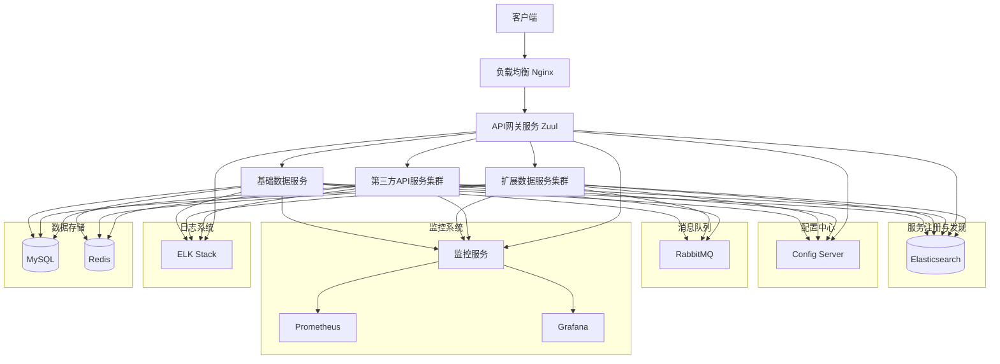

根据知识库中的信息，我总结了一个具体可行的设计方案。这个方案基于Spring Boot 1.5.22版本，采用微服务架构，包含以下几个主要服务：

1. 基础数据服务 (Basic Data Service, BDS)
2. 扩展数据服务集群 (Extended Data Service Cluster, EDSC)
3. 第三方API服务集群 (Third-party API Service Cluster, TPSC)
4. API网关服务 (API Gateway Service, AGS)
5. 监控服务 (Monitoring Service, MS)

各服务的功能、集成的组件和中间件如下：

1. 基础数据服务 (BDS)
   功能：提供基础数据管理和查询功能
   组件：Spring Boot 1.5.22, Spring Cloud Edgware.SR6, Eureka Client, Config Client, Hystrix, Feign
   中间件：MySQL 5.7.x, Redis 3.2.x

2. 扩展数据服务集群 (EDSC)
   功能：提供扩展数据的采集、处理和分析功能
   组件：Spring Boot 1.5.22, Spring Cloud Edgware.SR6, Eureka Client, Config Client, Hystrix, Feign
   中间件：MySQL 5.7.x, Redis 3.2.x, Elasticsearch 6.8.x

3. 第三方API服务集群 (TPSC)
   功能：提供第三方数据的集成和供给功能
   组件：Spring Boot 1.5.22, Spring Cloud Edgware.SR6, Eureka Client, Config Client, Hystrix, Feign
   中间件：MySQL 5.7.x, Redis 3.2.x

4. API网关服务 (AGS)
   功能：提供路由、负载均衡、认证授权等功能
   组件：Spring Boot 1.5.22, Spring Cloud Edgware.SR6, Zuul 1.3.1, Eureka Client, Config Client, Hystrix
   中间件：Redis 3.2.x

5. 监控服务 (MS)
   功能：提供系统监控和告警功能
   组件：Spring Boot 1.5.22, Spring Cloud Edgware.SR6, Eureka Client, Config Client, Spring Boot Admin 1.5.7, Zipkin Server 2.21.x
   中间件：Prometheus 2.19.x, Grafana 7.1.x

整体架构还包括以下组件和中间件：

- 服务注册与发现：Eureka Server
- 配置中心：Spring Cloud Config Server
- 消息队列：RabbitMQ 3.7.x
- 日志收集与分析：ELK Stack (Elasticsearch 6.8.x, Logstash 6.8.x, Kibana 6.8.x)
- 负载均衡：Nginx 1.17.x

以下是整体架构的Mermaid图表：

这个设计方案基于Spring Boot 1.5.22和相应的Spring Cloud版本，提供了一个完整的微服务架构。它包括了核心的业务服务、API网关、服务注册与发现、配置中心、消息队列、监控系统和日志系统等组件，可以满足大多数微服务应用的需求。