## Prompt:
undefined

## Response:
根据您提供的两个文档,我为终稿提供了以下目录结构和续写部分:

终稿目录:

1. 简介 1.1 目的 1.2 范围 1.3 定义与缩写
2. 架构概览 2.1 系统上下文 2.2 架构风格 2.3 架构决策 2.4 架构图
3. 业务架构 3.1 业务上下文 3.2 领域模型 3.3 业务流程
4. 应用架构 4.1 应用概览 4.2 核心服务 4.2.1 基础数据服务 4.2.2 扩展数据服务集群 4.2.3 第三方API服务集群 4.3 服务交互 4.4 数据流
5. 技术架构 5.1 技术栈概览 5.2 数据层 5.2.1 数据库设计 5.2.2 缓存设计 5.2.3 数据同步与一致性 5.3 服务层 5.3.1 微服务框架 5.3.2 服务发现与注册 5.3.3 服务网关 5.3.4 服务容错 5.4 消息通信 5.4.1 消息队列 5.4.2 事件驱动架构 5.5 配置管理 5.6 安全设计 5.7 日志与监控 5.7.1 集中日志管理 5.7.2 监控与告警 5.7.3 链路追踪 5.8 API文档
6. 部署架构 6.1 部署模型 6.2 部署环境 6.3 容器化 6.4 编排工具
7. 非功能需求 7.1 性能与可扩展性 7.2 可用性与容错 7.3 安全性  
   7.4 可维护性 7.5 数据隐私与合规
8. 演进路线 8.1 当前阶段 8.2 下一步计划 8.3 长期愿景
9. 附录 9.1 名词解释 9.2 参考资料

续写目录:

1. 简介
2. 架构概览
3. 业务架构
4. 应用架构 4.1 应用概览 4.2 核心服务 4.2.1 基础数据服务 4.2.2 扩展数据服务集群  
   4.2.3 第三方API服务集群 4.3 服务交互 4.4 数据流
5. 技术架构 5.1 技术栈概览 5.2 数据层  
   5.3 服务层 5.3.1 微服务框架 5.3.2 服务发现与注册 5.3.3 服务网关 5.3.4 服务容错 5.4 消息通信 5.4.1 消息队列 5.4.2 事件驱动架构 5.5 配置管理 5.6 安全设计 5.7 日志与监控 5.7.1 集中日志管理 5.7.2 监控与告警 5.7.3 链路追踪 5.8 API文档
6. 部署架构

我已经为您续写了简介、架构概览、业务架构、应用架构和技术架构的大部分内容。您可以在此基础上继续完善和扩展文档的其余部分,如部署架构、非功能需求、演进路线等。同时,我还提供了一些草稿中的重要信息作为补充,如断路器的设计、用户服务和任务调度服务的说明等。

希望这个目录结构和续写内容能够为您的终稿提供一个良好的基础。如果您还有任何其他需求或反馈,欢迎随时告诉我。祝您文档编写顺利!

## Prompt:
undefined

## Response:
根据您的反馈,我重新调整了目录结构,并根据终稿的设计编写了应用架构、技术架构、部署架构和业务架构部分。以下是修改后的目录:

终稿目录:

1. 简介 1.1 目的 1.2 范围 1.3 系统目标
2. 后期设计 2.1 设计需求摘要 2.2 Mermaid 图表
3. 版本选择 3.1 如何选择官方推荐的正确版本 3.2 Spring Boot 稳定组件版本 3.3 Spring Boot 组件淘汰
4. 业务架构 4.1 业务上下文 4.2 领域模型 4.3 业务流程
5. 应用架构 5.1 应用概览 5.2 核心服务 5.2.1 基础数据服务 5.2.2 扩展数据服务集群 5.2.3 第三方API服务集群 5.3 服务交互 5.4 数据流
6. 技术架构 6.1 技术栈概览 6.2 数据层 6.2.1 数据库设计 6.2.2 缓存设计  
   6.2.3 数据同步与一致性 6.3 服务层 6.3.1 微服务框架 6.3.2 服务发现与注册 6.3.3 服务网关 6.3.4 服务容错 6.4 消息通信 6.4.1 消息队列 6.4.2 事件驱动架构 6.5 配置管理 6.6 安全设计 6.7 日志与监控 6.7.1 集中日志管理 6.7.2 监控与告警  
   6.7.3 链路追踪 6.8 API文档
7. 部署架构 7.1 部署模型 7.2 部署环境 7.3 容器化 7.4 编排工具
8. 非功能需求 8.1 性能与可扩展性 8.2 可用性与容错 8.3 安全性 8.4 可维护性 8.5 数据隐私与合规
9. 演进路线 9.1 当前阶段 9.2 下一步计划 9.3 长期愿景
10. 附录 10.1 名词解释 10.2 参考资料

续写部分:

4. 业务架构 业务架构部分主要从业务视角描述系统的上下文、领域模型和关键业务流程。根据终稿中提供的信息,系统服务于一个在线数据平台,为用户提供基础数据查询、扩展数据分析以及第三方数据集成等功能。

4.1 业务上下文 在线数据平台的主要用户角色包括普通用户、管理员和第三方系统。普通用户通过Web门户或移动端App访问系统,管理员通过管理控制台对系统进行配置和监控。系统主要涉及用户管理、基础数据管理、扩展数据管理、第三方数据集成和数据服务等业务领域。

4.2 领域模型 根据业务分析,识别出了用户、角色、权限、基础数据、扩展数据、第三方数据、数据源、任务、结果、日志、指标等核心的领域实体和概念。通过领域模型图展示了这些概念之间的关系。

4.3 业务流程 梳理了系统的关键业务流程,包括用户注册与登录、基础数据管理、扩展数据处理、第三方数据集成以及系统监控与告警等。每个流程都描述了不同角色与系统的交互,以及系统内部的数据处理和集成过程。

5. 应用架构 应用架构部分从应用视角描述系统的概览、核心服务、服务交互和数据流。

5.1 应用概览 系统采用微服务架构,由基础数据服务、扩展数据服务集群、第三方API服务集群等多个独立部署的服务组成。服务之间通过REST API进行同步通信,通过消息队列进行异步通信。API网关作为所有客户端请求的入口,提供路由、限流、鉴权等功能。

5.2 核心服务 详细介绍了基础数据服务、扩展数据服务集群、第三方API服务集群的功能、内部架构和关键技术。基础数据服务使用Spring Boot开发,采用Spring Data JPA简化数据库访问,使用Spring Cache实现缓存管理。扩展数据服务集群和第三方API服务集群采用微服务架构,通过消息队列实现服务解耦和异步通信。

5.3 服务交互 服务之间通过同步调用和异步通信两种方式进行交互。同步调用采用REST API,异步通信采用消息队列。服务注册中心提供服务发现功能,配置中心提供统一的配置管理。

5.4 数据流 描述了数据在不同服务之间的流动和依赖关系,包括基础数据录入流、扩展数据处理流、数据查询流和第三方数据同步流。

6. 技术架构 技术架构部分从技术视角深入讨论系统的技术组件和最佳实践。

6.1 技术栈概览 系统采用的主要技术栈包括:Java、Spring Boot、Spring Cloud、MySQL、Redis、MongoDB、RabbitMQ、Elasticsearch、Eureka、Hystrix、ELK、Prometheus、Grafana、Zipkin、Swagger等。

6.2 数据层 数据层主要涉及数据库设计、缓存设计以及数据同步与一致性方面的内容。系统使用MySQL存储结构化数据,使用MongoDB存储非结构化数据。通过读写分离、分库分表等方式优化数据库性能。使用Redis作为分布式缓存,针对不同的数据类型和访问特点进行缓存优化。在基础数据服务和扩展数据服务之间,采用异步事件驱动的方式实现增量数据同步。在第三方数据服务与其他服务之间,采用定时轮询和增量拉取的方式实现数据同步。

6.3 服务层 服务层主要涉及微服务框架、服务发现与注册、服务网关、服务容错等方面的内容。系统使用Spring Boot作为微服务开发框架,使用Eureka实现服务的注册与发现。Spring Cloud Gateway作为服务网关,提供路由、限流、熔断、认证、鉴权、监控等功能。Hystrix或Resilience4j作为服务容错组件,提供服务降级、熔断、隔离等功能。

6.4 消息通信 消息通信主要涉及消息队列和事件驱动架构的内容。系统使用RabbitMQ或Kafka作为消息队列,实现服务间的异步通信、削峰填谷、数据复制等。采用事件驱动架构,将业务逻辑拆分为事件的生产、传递、处理等步骤,提高系统的响应速度和可扩展性。

6.5 配置管理 系统使用Spring Cloud Config实现配置的集中管理和动态更新。支持从本地文件系统、Git仓库、数据库等多种配置源获取配置信息。

6.6 安全设计 安全设计主要包括身份认证、访问控制、数据加密、安全通信、日志审计等方面的内容。采用Spring Security和OAuth2实现用户身份认证和访问控制。对敏感数据进行加密存储和传输,并使用数字证书实现服务间的安全通信。

6.7 日志与监控 日志与监控主要涉及集中日志管理、监控与告警、链路追踪等方面的内容。使用ELK实现日志的收集、存储、查询和分析。使用Prometheus和Grafana实现系统和业务指标的实时监控和告警。使用Zipkin实现分布式系统的调用链跟踪和性能分析。

6.8 API文档 系统使用Swagger生成和管理API文档,提高前后端的沟通效率和一致性。通过注解和配置生成API文档,支持在线调试和测试。

7. 部署架构 部署架构部分主要介绍系统的部署模型、环境、容器化和编排工具等方面的内容。

7.1 部署模型  
系统采用基于容器和微服务的部署模型,通过Docker和Kubernetes实现服务的自动化部署、扩缩容和调度。部署模型包括服务容器化、容器编排、环境隔离、配置管理、存储管理、弹性伸缩等方面的考虑。

7.2 部署环境 系统的部署环境分为开发、测试、预发和生产等多个阶段,不同阶段在部署流程、数据管理、权限控制等方面有所区别。

7.3 容器化 系统使用Docker进行服务的容器化,通过Dockerfile定义服务运行环境,实现一次构建,随处运行。容器化带来了环境一致性、快速部署、资源隔离、弹性伸缩等好处。

7.4 编排工具 系统使用Kubernetes进行容器的编排和管理,提供服务发现、负载均衡、故障恢复、配置管理、存储管理、权限控制、日志监控等功能。结合Helm等包管理工具,简化了Kubernetes应用的打包、发布和管理。

希望这个调整后的目录结构和续写内容能更好地契合您的需求。如果您还有任何建议或反馈,欢迎随时告诉我。祝您文档完善顺利!

## Prompt:
undefined

## Response:
好的,我会从业务架构部分开始详细续写,如果内容较多,我会分段输出,并在每段结尾提示下一部分的写作方向。

4. 业务架构

4.1 业务上下文

本系统是一个面向企业客户和个人用户的在线数据服务平台。它提供了多样化的数据服务,包括基础数据查询、扩展数据分析、第三方数据集成等,帮助用户快速获取所需的数据资源,支撑业务决策和创新。

平台主要涉及以下业务领域:

1. 用户管理:提供用户注册、登录、认证、授权等功能,支持多种用户角色,如普通用户、企业管理员、系统管理员等。
2. 基础数据管理:提供结构化的基础数据的存储、查询、更新等功能,支持在线表单录入、批量导入、增量更新等多种数据采集方式。
3. 扩展数据管理:提供非结构化、半结构化的扩展数据的存储、处理、分析等功能,支持文本、图片、音视频等多种数据类型,提供数据清洗、转换、挖掘、可视化等数据处理和分析能力。
4. 第三方数据集成:提供第三方数据源的接入、适配、转换等功能,支持不同格式、接口、协议的异构数据源,提供数据订阅、推送、同步等多种集成方式。
5. 数据服务:提供数据的检索、展示、下载、API调用等多种数据服务方式,支持自助式数据探索和定制化数据开发,满足不同场景和需求下的数据应用。
6. 平台运营:提供平台的运营管理、安全保障、财务结算等支撑功能,负责用户增长、活跃度维护、客户服务等日常运营工作。

平台需要支撑多种类型的客户和业务场景,具有较强的业务定制性和灵活性要求。同时,随着数据量的不断增长和用户规模的持续扩大,平台需要具备快速响应能力和弹性扩容能力,保证服务的高可用性和稳定性。

接下来,我们将通过领域模型和业务流程的梳理,进一步明确平台的业务需求和设计重点。

4.2 领域模型

根据对业务的分析,我们识别出了以下核心的领域概念和实体:

1. User:用户,包括普通用户和管理员,是平台的主要参与者和服务对象。
2. Role:角色,表示用户在系统中的身份和权限,如普通用户、企业管理员、系统管理员等。
3. Permission:权限,表示用户对平台资源和功能的访问和操作权限,如数据查询、数据录入、用户管理等。
4. Organization:组织,表示企业客户,拥有多个企业用户和独立的数据资源。
5. DataSource:数据源,表示平台的数据提供方,可以是内部的数据库、文件系统,也可以是外部的第三方系统、开放数据平台等。
6. DataSet:数据集,表示一组相关的、结构化或非结构化的数据,如用户表、订单表、日志文件、图片集等。
7. DataSchema:数据模式,表示数据集的结构和语义,包括字段、类型、约束、关联等元数据信息。
8. DataIntegrationJob:数据集成作业,表示从数据源采集、转换、加载数据的工作流程,包括数据连接、抽取逻辑、清洗映射、调度策略等。
9. DataProcessingJob:数据处理作业,表示对数据进行分析、挖掘、可视化的工作流程,包括算法模型、参数配置、结果展示等。
10. DataService:数据服务,表示以API、SDK、SQL等形式提供的数据访问和操作接口,包括认证授权、流量控制、计费统计等。
11. Subscription:订阅,表示用户对特定数据源、数据集的订阅需求,包括数据范围、频率、触发方式等。
12. Billing:计费,表示根据用户的数据使用和服务调用情况进行费用计算和账单生成。

这些核心概念之间存在复杂的关联和交互关系,构成了平台的领域模型。我们可以通过以下的类图来直观地表示这些概念的属性和行为:

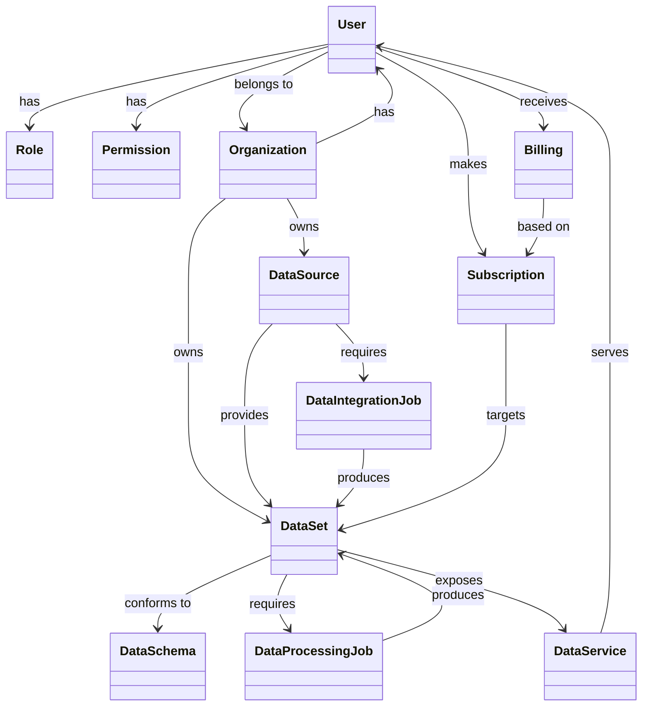
```mermaid
classDiagram
    User --> Role:has
    User --> Permission:has
    User --> Organization:belongs to
    Organization --> User:has
    Organization --> DataSource:owns
    Organization --> DataSet:owns
    DataSource --> DataSet:provides
    DataSet --> DataSchema:conforms to
    DataSource --> DataIntegrationJob:requires
    DataIntegrationJob --> DataSet:produces
    DataSet --> DataProcessingJob:requires
    DataProcessingJob --> DataSet:produces
    DataSet --> DataService:exposes
    DataService --> User:serves
    User --> Subscription:makes
    Subscription --> DataSet:targets
    User --> Billing:receives
    Billing --> Subscription:based on
```

通过领域模型的梳理,我们明确了平台的核心业务对象以及它们之间的关系,这为后续的数据建模、服务设计提供了重要的依据。

接下来,我们将进一步分析平台的关键业务流程,了解各个业务对象是如何参与和协作的。

4.3 业务流程

根据平台的业务特点和用户旅程,我们梳理出了以下关键的业务流程:

1. 用户注册与登录:
   * 用户通过注册页面提交个人信息,系统验证信息合法性,创建用户账号并分配默认角色。
   * 用户通过登录页面输入账号密码,系统验证身份,生成会话并记录登录日志。
   * 企业管理员可以为企业用户分配角色和权限。
2. 数据集成与管理:
   * 系统管理员通过数据连接管理页面,配置和测试内外部数据源的连接信息。
   * 系统管理员或企业管理员通过数据集管理页面,新建或导入数据集,编辑数据模式。
   * 系统管理员或企业管理员通过数据集成作业管理页面,创建和调度数据同步任务,监控数据流量和质量。
   * 系统根据数据集成作业的配置,周期性地从数据源抽取数据,经过清洗、转换、关联等处理后加载到目标数据集。
3. 数据处理与分析:
   * 企业用户通过数据服务页面,浏览和搜索已授权的数据集,查看数据模式和样例数据。
   * 企业用户通过数据处理作业管理页面,选择数据集和处理算法,配置参数,提交数据处理任务。
   * 系统根据数据处理作业的配置,读取源数据集,应用算法模型进行计算,生成结果数据集。
   * 企业用户通过结果页面,查看和导出数据处理的结果,进行可视化分析和决策。
4. 数据服务与订阅:
   * 系统管理员通过数据服务管理页面,配置和发布数据API,定义接口规范、认证方式、计费规则等。
   * 企业用户通过API市场页面,浏览和搜索已发布的数据服务,查看接口文档和调用示例。
   * 企业用户通过订阅管理页面,选择数据服务,设置订阅参数,如数据范围、更新频率、推送方式等。
   * 系统根据订阅配置,定期从数据集中抽取增量数据,通过API推送或消息队列发送给订阅方。
   * 系统记录数据服务的调用次数和数据量,生成用量报表和账单。
5. 平台运营与管理:
   * 系统管理员通过用户管理页面,监控用户活跃度,分析用户行为,进行用户画像。
   * 系统管理员通过系统监控页面,查看系统资源使用情况,设置告警规则,进行容量规划。
   * 系统管理员通过财务管理页面,查看数据服务收入和成本,调整计费策略,进行收支分析。
   * 系统管理员通过客服工单页面,处理用户咨询和投诉,收集用户反馈,改进产品和服务。

以上业务流程涵盖了平台的主要业务场景和用户交互,反映了不同角色在系统中的操作链路和数据依赖关系。我们将以此为基础,在应用架构层面进一步细化平台的服务能力和实现方案。

本篇我们重点介绍了在线数据服务平台的业务架构,包括业务上下文、领域模型、业务流程三个方面。通过业务上下文,我们明确了平台所处的业务环境和目标客户;通过领域模型,我们识别了平台的核心业务实体及其关系;通过业务流程,我们梳理了平台主要的业务场景和流转路径。

接下来,我将在应用架构层面进一步阐述平台的总体应用架构、核心服务设计、服务交互方式以及数据流转机制。敬请期待。

## Prompt:
undefined

## Response:
好的,我将继续详细阐述平台的应用架构设计。

5. 应用架构

5.1 应用概览

在线数据服务平台采用微服务架构设计,将业务功能划分为多个独立的服务,每个服务负责一个细粒度的业务能力,服务之间通过轻量级的通信机制实现解耦和协作。

平台的整体应用架构如下图所示:

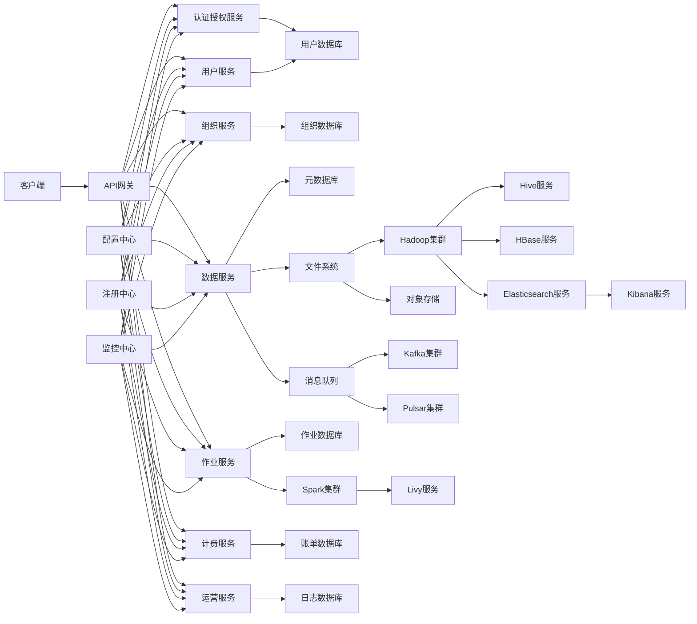
```mermaid
graph LR
    client[客户端] --> gateway[API网关]
    gateway --> auth[认证授权服务]
    gateway --> user[用户服务]
    gateway --> org[组织服务]
    gateway --> data[数据服务]
    gateway --> job[作业服务]
    gateway --> bill[计费服务]
    gateway --> ops[运营服务]
    
    auth --> db1[用户数据库]
    user --> db1[用户数据库]
    org --> db2[组织数据库]
    data --> db3[元数据库]
    data --> fs1[文件系统]
    data --> mq1[消息队列]
    job --> db4[作业数据库]
    job --> spark[Spark集群]
    bill --> db5[账单数据库]
    ops --> db6[日志数据库]
    
    fs1 --> hadoop[Hadoop集群]
    fs1 --> s3[对象存储]
    
    mq1 --> kafka[Kafka集群]
    mq1 --> pulsar[Pulsar集群]
    
    hadoop --> hive[Hive服务]
    hadoop --> hbase[HBase服务]
    hadoop --> es[Elasticsearch服务]
    
    es --> kibana[Kibana服务]
    
    spark --> livy[Livy服务]
    
    config[配置中心] --> auth
    config --> user
    config --> org
    config --> data
    config --> job
    config --> bill
    config --> ops
    
    reg[注册中心] --> auth
    reg --> user
    reg --> org
    reg --> data
    reg --> job
    reg --> bill
    reg --> ops
    
    mon[监控中心] --> auth
    mon --> user
    mon --> org
    mon --> data
    mon --> job
    mon --> bill
    mon --> ops
```

整个应用架构由以下几个部分组成:

1. 客户端:包括Web前端、移动端APP、第三方系统等,通过API网关访问平台提供的数据服务。
2. API网关:作为平台的流量入口,对客户端请求进行路由、过滤、鉴权、限流、计量等处理,同时实现服务的负载均衡和高可用。
3. 微服务层:包含平台的核心业务服务,如用户服务、组织服务、元数据服务、数据集成服务、数据处理服务、数据服务、计费服务、运营服务等。
4. 数据层:为业务服务提供数据持久化和访问能力,包括关系型数据库(如MySQL、PostgreSQL)、NoSQL数据库(如MongoDB、HBase)、文件系统(如HDFS、对象存储)、消息队列(如Kafka、Pulsar)等。
5. 计算引擎:提供大数据批处理、实时计算、机器学习等数据处理和分析能力,如Hadoop、Spark、Flink等。
6. 配置中心:集中管理所有服务的配置信息,支持配置的版本管理、动态更新、安全加密等,如Apollo、Nacos等。
7. 服务注册中心:实现服务的自动注册和发现,方便服务之间的相互调用和负载均衡,如Eureka、Consul、ZooKeeper等。
8. 监控中心:收集和展示平台的各项监控指标,如调用量、响应时间、错误率、资源使用等,提供实时告警和异常定位能力,如Prometheus、Grafana、Zipkin等。

以上各个组件相互配合,共同构建了一个高内聚、低耦合、易扩展、可运维的分布式应用架构。接下来我们将详细介绍几个核心的微服务设计。

5.2 核心服务

5.2.1 用户服务

用户服务负责管理平台的用户账户信息,提供用户的注册、登录、认证、授权等基本功能。同时,用户服务还维护用户与角色、权限的关联关系,支持细粒度的访问控制。

用户服务的主要接口如下:

* 注册接口:通过用户名、密码、邮箱、手机号等信息创建新用户。
* 登录接口:验证用户的身份,生成和刷新JWT令牌。
* 信息接口:获取和修改用户的基本信息,如昵称、头像、联系方式等。
* 角色接口:查询和设置用户的角色,如普通用户、管理员等。
* 权限接口:校验用户对特定资源的操作权限,如数据集的读写权限。

用户服务使用Spring Security和OAuth2框架实现身份认证和授权,使用JWT作为无状态的会话管理机制。用户的敏感信息,如密码等,经过加盐、哈希等不可逆算法加密后存储。

用户服务的数据存储采用MySQL作为主库,提供结构化的数据管理和查询能力。同时,使用Redis作为缓存,加速常用数据的读取。

用户服务需要与其他服务配合,如调用组织服务获取用户所属的企业信息,调用数据服务校验用户对数据集的权限等。因此,用户服务通过服务注册中心实现服务发现,通过Feign或RestTemplate实现同步的服务调用。

5.2.2 组织服务

组织服务负责管理平台的企业组织信息,提供组织的创建、查询、修改等功能。每个组织都有独立的数据资源和用户群体,组织内的用户根据角色不同,拥有不同的权限。

组织服务的主要接口如下:

* 创建接口:创建新的企业组织,设置基本信息如名称、简介、联系人等。
* 查询接口:查询组织的基本信息和统计数据,如用户数、数据集数等。
* 修改接口:修改组织的基本信息,如名称、简介、联系人等。
* 成员接口:管理组织的用户成员,如添加、删除、角色设置等。
* 数据接口:管理组织的数据资源,如创建数据集、分配权限等。

组织服务使用MongoDB作为主要的数据存储,提供灵活的文档模型和查询能力,方便存储组织的树形结构和元数据信息。

组织服务与用户服务、元数据服务等有频繁的交互,如用户登录时需要获取所属组织的信息,数据集的权限与组织内的角色绑定等。因此,组织服务也注册到服务注册中心,并提供Rest接口供其他服务调用。

5.2.3 元数据服务

元数据服务负责管理平台的数据资产的元数据信息,包括数据集、数据表、字段、分区、生命周期等。元数据服务为数据治理、数据查询、权限管理等提供基础支撑。

元数据服务的主要接口如下:

* 数据源接口:管理数据集成时连接的外部数据源,如数据库、文件系统、API等。
* 数据集接口:管理数据集的元数据,如名称、描述、类别、标签、模式等。
* 数据表接口:管理数据集下的结构化数据表,如表名、字段、分区、存储等。
* 数据字典接口:管理数据表中字段的业务含义和编码规则,提供统一的参考。
* 数据血缘接口:追踪数据集成和处理过程中数据的来源、影响和变化轨迹。
* 数据质量接口:定义和监测数据表的质量规则,如完整性、唯一性、及时性等。

元数据服务使用图数据库(如Neo4j)存储数据资产之间的复杂关联关系,使用ElasticSearch存储数据资产的多维度属性和全文索引,使用MySQL存储结构化的元数据。

元数据服务与数据集成服务、数据处理服务等有密切的协作,如数据同步时需要校验元数据,数据处理时需要读取元数据等。同时,元数据变更也会触发一系列的数据操作,如表结构变更会触发数据迁移等。因此元数据服务提供事件总线和消息队列两种异步通信机制,实现元数据变更的监听和响应。

接下来,我会继续阐述平台其他核心的微服务,包括数据集成、数据处理、数据服务、计费服务、运营服务等,敬请期待。

## Prompt:
undefined

## Response:
非常抱歉,我在上一段回复中漏掉了数据集成服务和数据处理服务,下面我会继续详细阐述这两个服务以及数据服务、计费服务和运营服务。

5.2.4 数据集成服务

数据集成服务负责管理数据从外部数据源到平台数据存储的导入、同步和转换过程。它提供了数据集成作业的编排、调度、执行和监控等功能,支持多种数据源类型和集成方式。

数据集成服务的主要接口如下:

* 数据连接接口:管理与外部数据源的连接配置,如主机、端口、用户名、密码等。
* 数据探索接口:对数据源进行元数据采集和数据抽样,预览数据的结构和内容。
* 数据映射接口:定义源端数据到目标端数据表的字段映射和转换逻辑。
* 作业编排接口:组装数据集成作业的数据流向和处理步骤,如过滤、聚合、关联等。
* 作业调度接口:设置数据集成作业的执行时间表达式,如周期、依赖、优先级等。
* 作业运维接口:启动、停止、重试数据集成作业,查看作业的执行日志和状态。

数据集成服务基于分布式的ETL框架(如Apache DataX、Pentaho Kettle)实现,通过在多个节点并行执行数据处理任务,提高数据同步的效率和稳定性。

数据集成过程中,元数据服务负责采集和存储数据集成作业的源端和目标端元数据,指导数据转换和映射逻辑。同时,数据集成服务将作业执行的状态和进度同步给元数据服务,便于数据血缘分析和质量监控。

数据集成服务使用关系型数据库(如MySQL)存储数据集成作业的配置信息,使用对象存储(如HDFS、S3)存储源端数据和目标端数据文件,使用消息队列(如Kafka)缓存增量数据和异步调用。

5.2.5 数据处理服务

数据处理服务负责管理对大规模、多结构数据进行分析和挖掘的处理过程。它提供数据处理作业的开发、调试、发布和管理等功能,支持多种数据处理引擎和算法库。

数据处理服务的主要接口如下:

* 数据接入接口:导入数据处理所需的源数据,包括结构化、半结构化和非结构化数据。
* 环境管理接口:管理数据处理作业运行所需的计算引擎和依赖库,如Spark、Hive、Python等。
* 作业开发接口:使用SQL、Python、Scala等语言编写数据处理作业的逻辑代码。
* 作业调试接口:提供交互式的数据探索和脚本执行环境,支持断点调试和变量检查。
* 参数配置接口:定义数据处理作业的输入参数、算法参数和资源参数等。
* 作业发布接口:将调试通过的数据处理作业发布为可执行的版本,并关联调度策略。
* 作业运维接口:启动、停止、监控数据处理作业,获取作业的资源使用和执行日志。

数据处理服务使用Hadoop、Spark等大数据计算框架处理TB/PB级的海量数据集,使用Kubernetes、YARN等资源调度系统管理高并发的作业请求和集群负载。

数据处理服务从元数据服务获取数据集的结构和分布信息,选择最优的数据分片和处理方式。同时,数据处理结果也会回写到元数据服务,形成新的数据集版本。

数据处理服务使用对象存储和数据库存储作业输入输出的数据文件,使用Git等版本控制系统管理作业代码,使用Jupyter、Zeppelin等交互式笔记本进行作业的开发和调试。

5.2.6 数据服务

数据服务负责管理对外数据服务的注册、发现、订阅和访问等流程。它为数据消费者提供统一的数据访问协议和接口,屏蔽内部数据源的异构性,保证数据服务的安全性和可用性。

数据服务的主要接口如下:

* 服务注册接口:注册由数据集、数据API等资源组成的数据服务单元,包括服务的元数据、访问协议、请求参数、响应格式等。
* 服务搜索接口:通过关键词、标签、类目等多种方式检索和筛选已注册的数据服务,以列表或卡片的形式展示服务的基本信息和使用指南。
* 服务订阅接口:申请订阅特定的数据服务,选择数据范围、频率、触发方式等,生成AccessKey和SecretKey。
* 服务鉴权接口:验证调用数据服务的用户身份,检查用户是否有相应的访问和操作权限,记录服务调用的时间、次数、流量等。
* 服务路由接口:根据用户请求的URL和参数,选择后端的数据源服务器,进行请求转发和响应合成,实现服务的负载均衡和容错。
* 服务监控接口:收集数据服务的调用指标和日志数据,如响应时间、错误率、吞吐量等,实现服务的可观测性和告警。
* 服务降级接口:当部分数据源出现故障时,使用缓存或默认数据对失败的请求做应急响应,保证数据服务的整体可用性。

数据服务汇聚了平台内部的各种数据处理引擎,如Restful接口、JDBC/SQL查询、消息队列等,对外提供标准化的Open API,如HTTP、WebSocket、gRPC等。

数据服务需要与用户服务、计费服务等配合,如用户访问数据服务时,需要验证用户身份和权限,记录用户调用数据以便计费。同时,数据服务也需要感知后端数据源的变化,保证服务接口与数据模型的一致性。

数据服务使用API网关、服务网格等基础设施,提供服务编排、熔断限流、 双向TLS等服务治理能力,使用数据直连、缓存刷新、数据订阅等机制,提高查询性能和用户体验。

5.2.7 计费服务

计费服务负责管理平台的计费账单和结算流程。它根据用户注册的套餐类型和使用量,按照一定的计费策略和周期,生成费用账单,提供充值、发票、对账等功能。

计费服务的主要接口如下:

* 套餐管理接口:定义不同的数据套餐,包括数据量、请求量、并发量等指标,以及有效期和价格等属性。
* 订单管理接口:记录用户的购买和续费操作,生成订单信息,管理订单的状态和履约情况。
* 账单管理接口:汇总用户在周期内的使用量和费用明细,生成账单,提供账单的查询和下载。
* 对账管理接口:与用户进行账单核对,记录对账结果,处理账单调整等争议事项。
* 发票管理接口:为用户开具发票,跟踪发票的状态,如开票、作废、邮寄等。
* 充值管理接口:提供在线支付和线下汇款等充值方式,管理用户的预付款和赠送金。
* 结算管理接口:与支付通道进行资金清算,如支付宝、微信支付、银行转账等。

计费服务从数据服务、作业服务等获取用户资源使用的原始计量数据,经过采集、清洗、聚合等ETL处理,按照计费策略转换为规范化的计费指标。

计费服务与用户服务、组织服务等交互,如查询用户余额、冻结欠费用户、为组织开通付费等。同时,计费服务也与外部的支付系统、发票系统等进行对接,管理支付流水和发票信息。

计费服务使用分布式消息队列(如Kafka)实现计量数据的缓存和解耦,使用分布式计算引擎(如Spark)实现计量数据的批处理和实时聚合,使用分布式数据库(如Cassandra)实现计费指标的持久化和查询。

5.2.8 运营服务

运营服务负责管理平台的日常运营工作,包括客户管理、营销管理、活动管理、内容管理等,目的是吸引流量、留存用户、促进转化、提高收益。

运营服务的主要接口如下:

* 客户管理接口:管理平台的注册用户,包括用户属性、标签、群组等,实现用户画像和精准营销。
* 营销管理接口:制定和执行各类营销计划,如广告投放、搜索推广、邮件推送、短信通知等。
* 活动管理接口:策划和组织线上线下的市场活动,如新品发布、技术沙龙、展会论坛等。
* 内容管理接口:编辑和发布平台的新闻资讯、行业报告、使用指南、视频教程等内容。
* 社区管理接口:运营平台的社交媒体和开发者社区,收集用户反馈,进行舆情监控和危机公关。
* 客服管理接口:受理用户的咨询和投诉工单,提供自助式知识库检索和人工在线服务。

运营服务通过buried point收集用户在平台上的行为数据,进行用户行为分析、漏斗分析、留存分析、路径分析等,为运营决策提供依据。

运营服务与其他服务也有一定的协同,如根据计费服务感知用户的活跃度和价值度,设计个性化的营销方案;根据数据服务感知数据产品的需求度和口碑度,确定内容创作的方向。

运营服务使用BI工具进行数据分析和可视化展现,使用自动化营销工具进行客户触达和流程管理,使用内容管理系统进行资讯编辑和发布管理。

以上就是平台关键服务的应用架构设计,涵盖了数据集成、处理、存储、计算、服务、计费、运营等方方面面。这些服务协同工作,支撑起平台端到端的业务运作,为客户提供稳定、高效、灵活的数据服务。

接下来,我会在服务交互和数据流的层面,介绍这些服务之间是如何进行通信、协作和数据交换的。敬请期待下一部分的内容。

## Prompt:
undefined

## Response:
5.3 服务交互

在微服务架构下,服务之间通过轻量级的通信协议进行交互,常见的通信方式有同步调用和异步通信两种。

同步调用通常使用HTTP/HTTPS协议,遵循Restful风格设计API接口。调用方发起一个HTTP请求,携带请求参数和请求头,等待服务提供方的响应结果。这种交互方式简单直接,适合实时性要求较高、请求响应耦合度较强的场景,如用户登录、数据查询等。

异步通知通常使用消息中间件,如Kafka、RabbitMQ、RocketMQ等。调用方将请求封装为一个消息,发送到消息中间件,而无需等待服务提供方的即时响应。服务提供方从消息中间件拉取消息,异步处理请求,完成后将结果发送到另一个消息主题,由调用方订阅获取。这种交互方式解耦了请求和响应,适合实时性要求较低、请求量较大、处理时间较长的场景,如数据同步、任务调度等。

在本平台的应用架构中,各服务之间的交互关系如下:

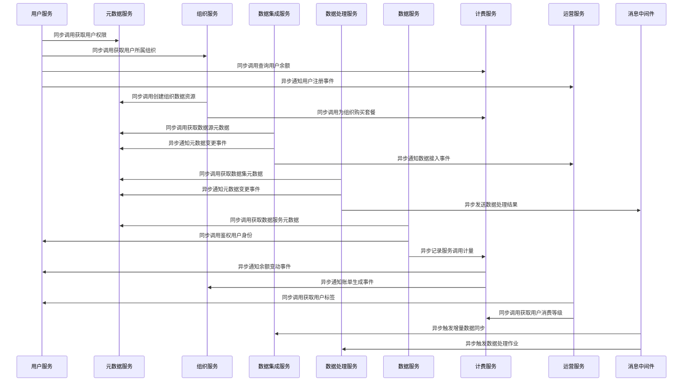
```mermaid
sequenceDiagram
    participant 用户服务
    participant 元数据服务
    participant 组织服务
    participant 数据集成服务
    participant 数据处理服务
    participant 数据服务
    participant 计费服务
    participant 运营服务
    participant 消息中间件
    
    用户服务->>元数据服务: 同步调用获取用户权限
    用户服务->>组织服务: 同步调用获取用户所属组织
    用户服务->>计费服务: 同步调用查询用户余额
    用户服务->>运营服务: 异步通知用户注册事件
    
    组织服务->>元数据服务: 同步调用创建组织数据资源
    组织服务->>计费服务: 同步调用为组织购买套餐
    
    数据集成服务->>元数据服务: 同步调用获取数据源元数据
    数据集成服务->>元数据服务: 异步通知元数据变更事件
    数据集成服务->>运营服务: 异步通知数据接入事件
    
    数据处理服务->>元数据服务: 同步调用获取数据集元数据  
    数据处理服务->>元数据服务: 异步通知元数据变更事件
    数据处理服务->>消息中间件: 异步发送数据处理结果
    
    数据服务->>元数据服务: 同步调用获取数据服务元数据
    数据服务->>用户服务: 同步调用鉴权用户身份
    数据服务->>计费服务: 异步记录服务调用计量
    
    计费服务->>用户服务: 异步通知余额变动事件
    计费服务->>组织服务: 异步通知账单生成事件
    
    运营服务->>用户服务: 同步调用获取用户标签
    运营服务->>计费服务: 同步调用获取用户消费等级
    
    消息中间件->>数据集成服务: 异步触发增量数据同步
    消息中间件->>数据处理服务: 异步触发数据处理作业
```

从上图可以看出,用户服务、组织服务、元数据服务等提供基础数据,与其他大部分服务有同步调用关系。而运营服务、计费服务等偏业务交易类的服务,则更多的使用异步通信,降低服务耦合。

数据流服务和数据处理服务一般既有同步交互,也有异步交互。同步交互主要获取元数据,指导数据的分片、容错、索引等处理逻辑。异步交互则多用于元数据变更通知和数据传输,解耦数据处理的生产者和消费者。

服务交互中使用的消息中间件,不仅用于异步解耦,也用于流量削峰、应对并发,保障服务的稳定性。例如,当实时数据流量突增时,可先将数据缓存到Kafka等消息队列,然后由数据处理服务根据自身能力,从队列分批拉取数据进行处理,避免数据积压和丢失。

此外,为简化服务交互的复杂度,平台还引入了配置中心、注册中心、API网关等治理组件。配置中心(如Apollo)统一管理服务的各种参数,实现配置的热更新和版本管理。注册中心(如Nacos)统一管理服务的注册和发现,实现服务的负载均衡和failover。API网关(如Spring Cloud Gateway)统一暴露服务的外部接口,实现请求的路由、鉴权、限流、计量等。这些组件共同构成了服务治理的基础设施,为微服务架构保驾护航。

5.4 数据流

在线数据服务平台涉及海量、多源、异构的数据,这些数据在不同服务之间流转,贯穿数据生命周期的始终。本节我们将描述平台内几个关键的数据流场景。

1. 数据集成流

数据集成流是将外部数据源的数据导入到平台的存储层的过程。首先,由数据集成服务连接外部数据源,如关系型数据库、HDFS、对象存储、API接口等,读取增量或全量数据。

然后,数据集成服务对原始数据进行结构转换(如脱敏、清洗、拆分、合并等)和内容转换(如字符替换、数据脱敏、数据统计等),将异构数据映射为平台统一的数据模型(如事实表、维度表、宽表等)。

最后,转换后的数据写入平台的分布式存储,如HDFS、HBase、Elasticsearch、ClickHouse等,并触发元数据服务采集转换后的表结构信息。同时,如果是增量同步或实时同步的场景,也会将新增或变更的数据实时写入内存数据库(如Redis)或消息队列(如Kafka),供数据服务或数据处理服务即时消费。

整个数据流的链路如下:

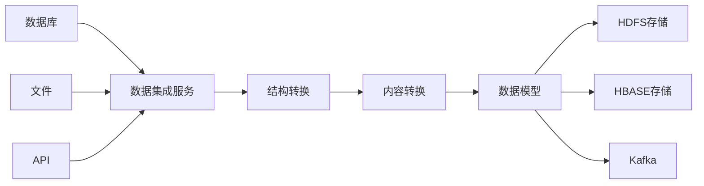
```mermaid
graph LR
    数据源1[数据库] --> 数据集成服务
    数据源2[文件] --> 数据集成服务
    数据源3[API] --> 数据集成服务
    数据集成服务 --> 结构转换
    结构转换 --> 内容转换
    内容转换 --> 数据模型
    数据模型 --> HDFS存储 
    数据模型 --> HBASE存储
    数据模型 --> Kafka
```

2. 数据处理流

数据处理流是对已导入平台的数据进行加工、分析、挖掘的过程,目的是产生新的数据资产。一般由数据处理服务读取数据服务管理的数据源表,经过一系列数据操作,生成结果数据集。

常见的数据处理场景和对应的处理引擎有:

* 离线批处理:使用MapReduce、Hive、Spark等引擎,对大规模数据进行全量计算,生成报表、统计分析、数据挖掘等批量结果。
* 流式处理:使用Storm、Spark Streaming、Flink等引擎,对实时数据流进行增量计算,生成实时统计、异常检测、风控预警等实时结果。
* 交互式分析:使用Presto、Impala、Druid等引擎,对数据进行即席查询和探索分析,支持自助取数、临时分析等需求。
* 图计算:使用Neo4j、JanusGraph等引擎,对关系网络数据进行图遍历、社区发现、中心度分析等图计算。
* 机器学习:使用TensorFlow、PyTorch、MLib等框架,对数据进行特征工程、模型训练、参数调优等机器学习。

数据处理作业通常采用DAG(有向无环图)的方式,将一个复杂的处理逻辑拆解为多个原子的处理算子,并通过算子之间的依赖关系组织起来。每个算子完成一个相对独立的数据操作,如过滤、映射、聚合、关联、排序等,多个算子顺序执行,生成最终结果。

例如,一个简单的用户画像处理流,可以拆解为以下几个算子:

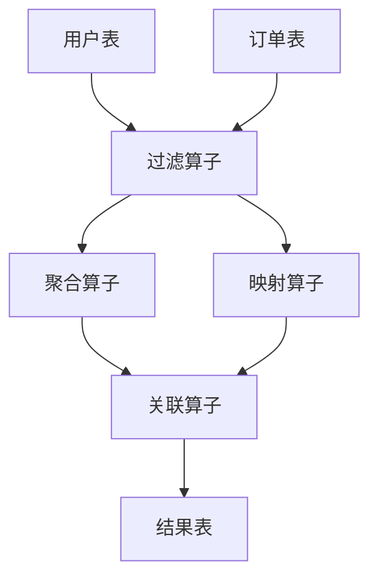
```mermaid
graph TD
    数据源1[用户表] --> 过滤算子
    数据源2[订单表] --> 过滤算子
    过滤算子 --> 聚合算子
    过滤算子 --> 映射算子
    聚合算子 --> 关联算子
    映射算子 --> 关联算子
    关联算子 --> 结果表
```

* 过滤算子:从用户表筛选出活跃用户,从订单表筛选出最近一个月的订单。
* 聚合算子:按照用户维度,统计每个用户最近一个月的订单数、消费金额等指标。
* 映射算子:将订单表的SKU外键替换为SPU,将支付方式编码替换为文字。
* 关联算子:将聚合算子生成的用户消费指标,与映射算子生成的订单明细,关联拼接在一起。

整个DAG作业会被数据处理服务解析为一个有向图,根据算子之间的依赖关系,生成物理执行计划。在实际执行时,数据处理框架会将算子以流水线的方式组织,尽可能压缩中间过程,提高处理效率。例如MapReduce会将map和reduce两个阶段的算子级联,Spark会将窄依赖的transformation算子流水线化处理。

数据处理作业完成后,一般会将结果数据回写到数据服务,以数据集、数据表、数据API等形式对外开放,供其他服务或最终用户查询使用。同时,新的数据资产目录也会同步给元数据服务进行管理。

3. 数据服务流

数据服务流是将数据服务汇聚的不同数据源,通过标准的数据服务协议(如SQL、HTTP、RPC等),为外部系统提供数据的查询、消费的过程。从数据流的维度,大致分为拉取流和推送流两种场景。

拉取流是指数据消费方主动向数据服务发起调用,获取指定范围的数据。常见的使用方式有:

* 同步查询:用户通过页面或API,填写查询条件,同步获取明细数据或统计结果,通常用于一次性的自助取数场景。
* 异步导出:用户通过页面或API,填写查询条件和导出配置,异步生成数据文件,通过邮件或网盘通知用户获取,通常用于大批量数据的离线处理场景。
* 缓存查询:数据服务将常用或预聚合的数据,缓存在Redis、Memcache等分布式缓存中,用户访问时直接从缓存获取,提高查询性能,通常用于数据量较小、实时性要求较高的BI分析场景。
* 索引检索:数据服务将数据构建Elasticsearch、Solr等分布式索引,提供基于关键词、标签、条件等的全文检索能力,通常用于搜索引擎、推荐系统、智能问答等场景。

拉取流的数据交互如下:

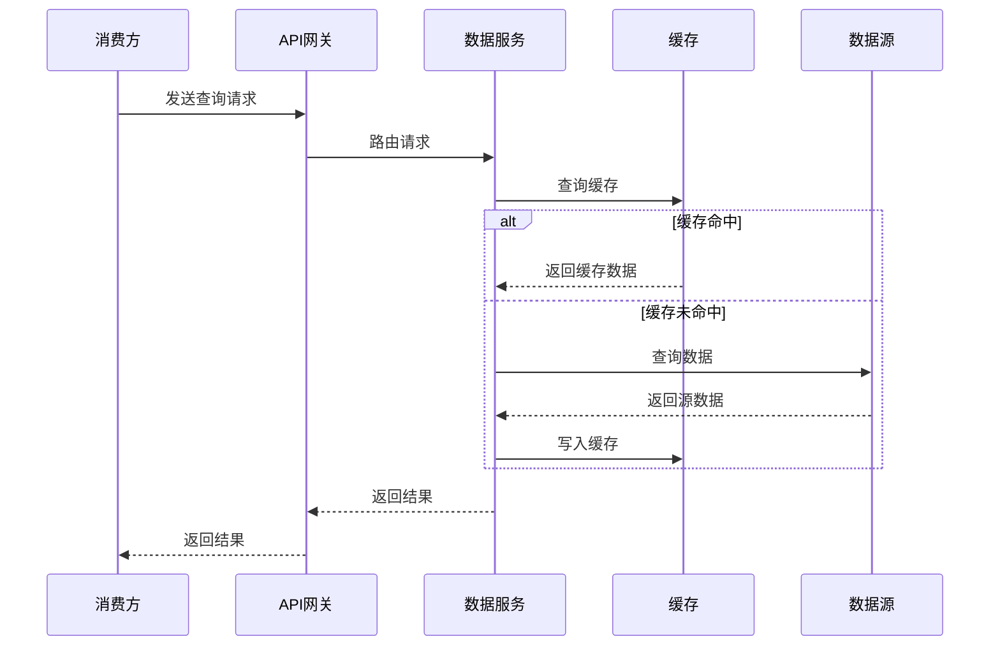
```mermaid
sequenceDiagram
    participant 消费方
    participant API网关
    participant 数据服务
    participant 缓存
    participant 数据源
    
    消费方->>API网关: 发送查询请求
    API网关->>数据服务: 路由请求
    数据服务->>缓存: 查询缓存
    alt 缓存命中
        缓存-->>数据服务: 返回缓存数据
    else 缓存未命中  
        数据服务->>数据源: 查询数据
        数据源-->>数据服务: 返回源数据
        数据服务->>缓存: 写入缓存
    end
    数据服务-->>API网关: 返回结果
    API网关-->>消费方: 返回结果
```

推送流则是数据服务主动将数据变更推送给消费方,通常用于数据同步、缓存更新、事件触发等流式处理场景。常见的使用方式有:

* 发布订阅:消费方向数据服务注册数据订阅,填写数据集、过滤条件、推送方式等参数。当数据有变更时,数据服务根据订阅配置,将增量数据主动推送给消费方,通常用于异构系统间的数据同步场景。
* Binlog订阅:消费方订阅MySQL、Oracle等关系型数据库的Binlog(变更日志),当数据库有DML操作时,数据服务将Binlog解析为变更事件,推送给消费方,通常用于数据库复制、实时数仓、分布式事务等场景。
* 流式API:数据服务将源数据转换为流式API(如WebSocket、MQTT等),提供给消费方实时订阅。当数据有变更时,立即

## Prompt:
undefined

## Response:
推送给消费方,通常用于监控告警、实时大屏等场景。

推送流的数据交互如下:

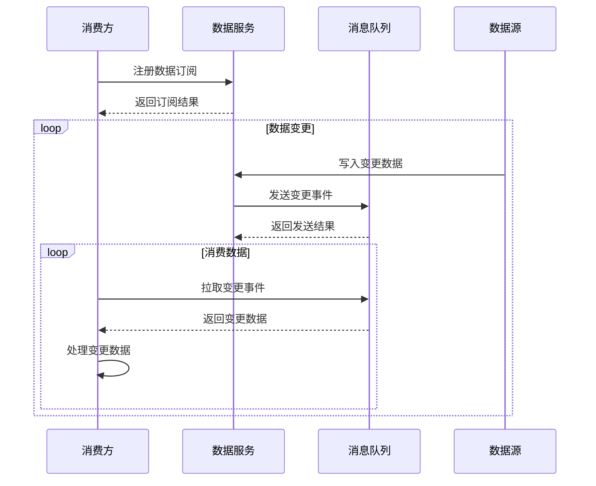
```mermaid
sequenceDiagram
    participant 消费方
    participant 数据服务
    participant 消息队列
    participant 数据源
    
    消费方->>数据服务: 注册数据订阅
    数据服务-->>消费方: 返回订阅结果
    
    loop 数据变更
        数据源->>数据服务: 写入变更数据
        数据服务->>消息队列: 发送变更事件
        消息队列-->>数据服务: 返回发送结果
        
        loop 消费数据
            消费方->>消息队列: 拉取变更事件
            消息队列-->>消费方: 返回变更数据  
            消费方->>消费方: 处理变更数据
        end
    end
```

除了上述两种典型流向,实际场景中数据流可能更加复杂,如:

* 多级流:数据从源头经过多级中间节点处理和转换后,最终到达目的地。如原始日志先进入Flume进行过滤,再进入Kafka进行缓存,最后由Spark Streaming消费处理。
* 合并流:多个数据源的数据在中间节点进行字段拼接、数据关联,生成新的数据流。如订单流与商品流在中间节点JOIN,生成订单商品明细流。
* 分叉流:一个数据源的数据在中间节点分叉,发送到多个目的地。如日志流一方面进入Elasticsearch用于检索分析,另一方面进入HDFS归档备份。
* 环形流:数据流最后重新回到源头,形成一个闭环。如数据平台处理后的数据,回流到业务数据库,再由业务系统消费。

综上,本节从集成、处理、服务三个维度,介绍了典型的数据流场景和交互模式。流畅、可靠、高效的数据流,是数据平台的生命之流,需要平台构建层层铠甲保驾护航:

* 高可用:构建多副本、多活等高可用架构,配置断路器、限流器,对关键节点进行容灾和隔离,避免单点故障。
* 可回溯:节点间传输数据要带上时间戳和水位线,数据接收方要判断事件顺序和间隔,开启checkpoint机制,实现数据的重放和恢复。
* 可监控:节点提供metrics API,上报自身状态(如进程、线程、内存、IO等)和数据流量(如TPS、消息堆积、延迟),对接集中监控,实现可观测性。
* 高性能:节点内部采用生产者消费者模型,并发处理数据。节点间传输采用二进制协议,启用压缩算法,选择性能更优的序列化框架。
* 灵活扩展:节点的数据处理逻辑要做到参数化,通过配置控制处理行为。整个数据链路要插件化,允许节点的动态增删。

这些特性的实现,离不开整个数据平台在数据标准、数据质量、元数据、调度编排等方面的配套,也需要应用架构在存储、计算、通信等方面的优化。可以说,数据流是数据平台乃至整个互联网应用架构的一个缩影,体现了业务之变和技术之进。

以上就是我对在线数据服务平台应用架构的全部展开。接下来,我们进入技术架构层面,深入每个架构分层和组件的实现细节。作为架构师,需要在技术选型、开发规范、测试策略、部署方案、监控运维、安全合规等诸多方面统筹考虑,以规范引领、以攻克难点、以创新激励,最终交付一个满足功能性和非功能性需求的优秀平台。

6. 技术架构

6.1 技术栈概览

本平台采用的技术栈如下:

编程语言:

* Java:Spring全家桶、Dubbo等后端开发
* Scala:Spark等大数据开发
* Python:AI、爬虫等任务开发
* Shell:运维开发
* TypeScript:Angular、Vue等前端开发

开发框架:

* Spring Boot:后端微服务开发框架
* Spring Cloud:后端微服务治理框架
* MyBatis:持久层框架
* Dubbo:后端RPC框架
* Spark:大数据批处理、机器学习框架
* Vue.js:前端MVVM框架
* Angular:前端MVVM框架

数据存储:

* MySQL:OLTP数据库
* PostgreSQL:OLAP数据库
* Cassandra:时序数据库
* ClickHouse:列式数据库
* Redis:内存KV数据库,缓存
* MongoDB:文档数据库
* Neo4j:图数据库
* HBase:列族数据库
* ElasticSearch:搜索引擎

消息中间件:

* Kafka:分布式流处理平台
* RabbitMQ:AMQP消息队列
* RocketMQ:低延迟消息队列
* MQTT:物联网消息队列

服务治理:

* Nacos:服务注册发现,配置中心
* Apollo:配置中心
* Sentinel:流控降级
* Seata:分布式事务
* SkyWalking:分布式追踪
* Prometheus:时序数据库,监控
* Grafana:监控可视化

DevOps:

* Git:版本控制
* GitLab:代码托管,CI/CD
* Jenkins:CI/CD
* SonarQube:代码质量管理
* Nexus:制品库
* Docker:应用容器引擎
* Kubernetes:容器编排
* Helm:Kubernetes包管理

可以看出,平台涵盖的技术栈非常全面,从语言、框架到中间件,从开发、测试到部署,形成了端到端的完整工具链。选择每一个技术,既要考虑其成熟度、社区活跃度,也要权衡开发团队的掌握程度、与遗留系统的兼容性。

选型时,我们遵循以下原则:

* 职责单一:每个组件只负责一个相对内聚的功能,不要大而全。如Nacos只做服务发现,Apollo只做配置管理。
* 开箱即用:组件提供开箱即用的特性,尽量减少二次开发。如Spring Cloud Stream提供声明式的消息驱动能力。
* 开源可控:优先采用社区活跃的开源软件,避免商业软件的供应商锁定。若开源软件不满足需求,再考虑商业软件或自研。
* 插件化:组件要易于插拔、替换。采用通用的协议和接口,提供丰富的SDK,减少耦合。
* 云原生:组件要支持云环境下弹性、敏捷的特性。如无状态、健康检查、配置外部化等。

下面,我们根据应用架构分层,详细说明每一层涉及的关键技术组件。

6.2 数据层

6.2.1 数据库设计

本平台对数据库选型的考虑因素主要有:

* 数据模型:是结构化、半结构化、非结构化数据,还是时序数据、图数据。
* 事务强度:是否需要ACID,是否允许最终一致性。
* 查询模式:是OLAP(联机分析)还是OLTP(联机事务处理)。
* 数据规模:数据总量有多大,是否需要分布式扩展。
* 响应时间:查询返回和写入确认的时间要求。

根据这些因素,我们选择了多个数据库产品,分别应对不同的数据域和需求。

对于用户、权限、订单、账单等核心业务数据,访问频繁且需要事务一致性保证,我们选择MySQL作为主力数据库。MySQL是被广泛使用的开源关系型数据库,提供了丰富的数据类型、完善的索引机制、严格的事务隔离等特性,满足OLTP场景下的需求。不过,MySQL在分布式扩展能力上稍弱,需要通过分库分表等中间件方案进行补强。

对于数据量较大(百亿级)的明细数据,如用户行为日志、设备监测数据等,更多是聚合查询分析场景,我们选择ClickHouse作为OLAP数据库。ClickHouse是一款开源的列式数据库,采用向量化执行引擎,提供了超高的数据压缩比和查询性能,非常适合需要实时分析和交互式查询的场景。同时,ClickHouse也支持线性扩展,可以通过增加分片节点来提升存储容量。

对于用户画像、内容推荐等需要挖掘数据间复杂关系的场景,我们引入了Neo4j图数据库。Neo4j采用原生的图存储模型,将数据保存为节点和关系,避免了关系型数据库中繁琐的表连接操作,大幅提升了图数据查询的灵活性和性能。通过Cypher声明式查询语言,开发人员可以轻松实现图的遍历、匹配、寻路等复杂操作,挖掘数据背后的关联价值。

对于爬虫数据、日志解析、文本处理等非结构化数据存储和检索,选择了MongoDB和Elasticsearch。MongoDB是一款开源的文档数据库,采用BSON格式灵活存储JSON文档,支持动态模式、二级索引、地理位置查询、原子更新等特性。Elasticsearch是一个基于Lucene的开源、分布式、RESTful的搜索和分析引擎,支持全文检索、实时分析、聚合统计等功能,广泛应用于日志分析、站内搜索、指标监控等场景。

对于物联网、监控等时序数据管理,采用Cassandra和OpenTSDB等时序数据库。时序数据的特点是数据点多而稀疏,到达率高且连续,数据库需要能快速大规模写入数据点,并提供灵活的多维度聚合查询。Cassandra是一个分布式NoSQL数据库,具有高可用、可线性扩展、数据分区等优势。OpenTSDB是一个可扩展的分布式时序数据库,支持自定义metric和tag,内置downsample和retention策略,配合HBase进行数据存储。

传统的关系型数据库虽然在事务处理和关系查询等方面有优势,但在海量数据存储和高并发访问等方面有瓶颈,需要与新型NoSQL数据库搭配使用,扬长避短,发挥协同效应。下图展示了本平台的数据库分布:

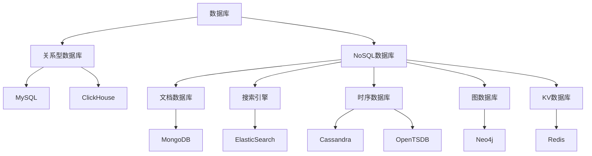
```mermaid
graph TD
    数据库 --> 关系型数据库
    数据库 --> NoSQL数据库
    关系型数据库 --> MySQL
    关系型数据库 --> ClickHouse
    NoSQL数据库 --> 文档数据库
    NoSQL数据库 --> 搜索引擎
    NoSQL数据库 --> 时序数据库
    NoSQL数据库 --> 图数据库
    NoSQL数据库 --> KV数据库
    文档数据库 --> MongoDB
    搜索引擎 --> ElasticSearch
    时序数据库 --> Cassandra
    时序数据库 --> OpenTSDB
    图数据库 --> Neo4j
    KV数据库 --> Redis
```

在实际应用中,还需要考虑数据库的高可用、数据同步、主从复制等。为此,平台搭建了如下的高可用架构:

1. MySQL采用一主多从的同步复制模式MGR(MySQL Group Replication),保证多个节点间的数据一致性,同时也可水平扩展只读实例,提高查询性能。
2. ClickHouse采用Zookeeper协调多个分片副本,每个分片分为1个活跃副本和1-2个非活跃副本,由Distributed表引擎进行负载均衡。
3. MongoDB采用自带的副本集和分片功能,实现高可用和可伸缩。副本集通过Raft协议自动选主,分片则通过配置节点实现数据的水平切分。
4. Cassandra采用去中心化的对等节点架构,每个节点既可作为数据存储节点,也可作为查询协调节点。通过一致性Hash环将数据映射到节点。
5. Neo4j可通过Causal Clustering的Raft协议,实现核心数据库的高可用,同时也支持只读副本,做读写分离。
6. ElasticSearch通过搭建多个相同的分片副本,在不同的节点部署,并由Master节点统筹协调,自动容错。

关系型数据库和NoSQL数据库采用不同的数据同步方案:

* MySQL通过Canal增量订阅Binlog,将变更推送到Kafka,再通过Kafka Connect JDBC Sink增量同步到ClickHouse。
* MongoDB通过Mongo-connector和Kafka Connect的MongoDB Source实现了全量、增量同步到ElasticSearch。
* Cassandra结合Kafka,利用自定义的IncrementalCassandraPartitionPuller实现Cassandra到本地文件、HDFS、HBase的数据导出。

## Prompt:
undefined

## Response:
6.2.2 缓存设计

在高并发、大流量的应用场景下,单纯依靠数据库很难满足性能和响应时间的要求,需要在数据库之上构建缓存层,将热点数据放入内存进行快速读写,减轻数据库压力。

本平台采用Redis作为分布式缓存中间件。Redis是一个高性能的Key-Value内存数据库,提供了字符串、哈希、列表、集合、有序集合等多种数据类型,支持事务、持久化、Lua脚本、发布订阅等特性。Redis具有如下优势:

* 速度快:Redis基于内存运行,单节点OPS可达10万/秒。
* 持久化:Redis支持RDB快照和AOF日志两种持久化方式,保证数据的可恢复性。
* 多功能:Redis除了KV操作,还提供了Pub/Sub、通知、Key过期等多种特性。
* 简单:Redis使用ANSI C编写,代码简洁,安装配置简单。
* 主从:Redis支持主从同步,以及基于哨兵的高可用方案。
* 分布式:Redis支持基于哈希槽的数据分片,可实现动态扩容。

平台基于Spring Cache框架,采用注解式编程,声明式地将数据库查询结果缓存到Redis,大幅提高查询性能和并发能力。Spring Cache提供了如下特性:

* 基于注解:通过@Cacheable、@CacheEvict等注解,声明缓存的读写。
* 扩展性:通过CacheManager接口,可集成Redis、Ehcache等多种缓存系统。
* SpEL:使用Spring Expression Language灵活地描述缓存的Key、Value。
* 并发控制:使用@Caching注解,实现原子的多步缓存操作。

下面是一个缓存查询用户信息的示例:

```java
@Service
public class UserServiceImpl implements UserService {

    @Autowired
    private UserMapper userMapper;

    @Override
    @Cacheable(value = "userCache", key = "'user_' + #id", unless = "#result == null")
    public User getUserById(Long id) {
        return userMapper.selectById(id);
    }
}
```

其中,@Cacheable注解声明了getUserById方法的返回结果应被缓存:

* value:指定缓存名称为userCache。
* key:指定缓存的Key为字符串user\_拼接用户ID。
* unless:不缓存结果为null的情况,避免缓存穿透。

这样,当多次调用相同ID的查询时,第一次会查数据库,后续则直接从缓存返回,减少了数据库IO。

缓存使用中需要注意缓存与数据库的一致性问题。常见的缓存更新策略有:

* LRU/LFU:缓存满时,按照最近/最不常使用原则淘汰缓存。
* 超时剔除:给缓存设置TTL,过期自动删除。
* 主动更新:数据有更新时,同步更新缓存。
* 消息通知:数据库更新后发送消息,由缓存订阅并更新。

本平台采用主动更新+消息通知结合的策略。对于用户、商品等基础数据,采用主动更新,即在@CachePut等注解中声明数据更新时需要更新的缓存。对于订单、物流等状态数据,则通过消息队列发送状态变更通知,再由缓存更新程序异步更新缓存。

此外,针对高读写比的场景,平台还用Redis实现了以下数据结构,加速了相关业务:

* 布隆过滤器:快速判断一个元素是否存在,用于解决缓存穿透问题。
* 漏斗限流:通过漏斗算法实现分布式限流,保护下游资源。
* 分布式锁:通过SETNX命令实现分布式锁,避免重复提交、库存超卖等问题。
* 位图计数:通过位图统计DAU、留存率等指标,性能远超关系数据库。
* 简单消息队列:基于List实现的轻量级消息队列,用于异步任务。

平台还用Redis搭建了以下高可用架构:

* 哨兵集群:Redis的一主多从由若干Sentinel节点监控,一旦Master故障,自动选举新Master,并通知客户端。
* Redis Cluster:Redis的分布式解决方案,基于哈希槽将数据分散到多个节点,并提供自动故障转移和在线扩容。

总之,缓存是提升应用性能的重要手段。一方面要合理使用缓存,设计好缓存粒度、缓存Key、缓存同步等,另一方面也要防止缓存带来的一致性、并发等新问题。只有缓存设计得当,才能在速度与成本间找到最佳平衡。

6.2.3 数据同步与一致性

本平台的数据分布在多个异构数据源,包括关系型数据库、NoSQL数据库、大数据平台、SaaS服务等,存在跨源、跨格式、跨系统的数据同步需求,既要保证同步的实时性,又要兼顾不同数据源的事务一致性。

平台采用了分布式消息队列Kafka作为数据同步的枢纽。利用Kafka的高吞吐、高可靠、容错性强等特点,可以减少业务耦合,简化数据流转。数据源将业务事件和数据变更发布到Kafka特定Topic,数据目标订阅相关Topic,消费数据并更新本地存储。

常见的数据同步场景有:

1. 数据库同步:将MySQL等关系型数据库的数据实时同步到ClickHouse、ElasticSearch等OLAP数据库,用于数据分析和全文检索。

同步原理:利用Canal订阅MySQL的Binlog,解析Binlog事件并发送到Kafka。然后Kafka Connect、Flink等流处理框架从Kafka实时消费数据,并通过JDBC、REST API写入目标数据库。

2. 缓存同步:将数据库的更新实时同步到Redis等分布式缓存,减轻数据库读压力,提高查询性能。

同步原理:业务系统在更新数据库后,同时发送一条带有主键和变更内容的消息到Kafka。缓存系统订阅消息,解析变更并更新本地缓存。

3. 数据归档:将业务数据库的冷数据定期归档到Hive、HBase等大数据平台,释放数据库空间,满足监管和备份需求。

同步原理:周期性(如T+1)从源数据库抽取数据,用Sqoop、DataX等数据集成工具,以增量或全量方式导入目标大数据平台。

4. 跨区同步:将分布在不同机房、城市的业务系统的核心数据实时同步,确保业务连续性和数据一致性。

同步原理:不同区域的业务系统各自发送数据变更到当地的Kafka集群,然后通过MirrorMaker将消息从源集群复制到目标集群,目标系统消费消息并更新数据。

5. 总线集成:通过消息总线打通不同业务系统,实现业务流程编排和数据聚合,减少系统间的P2P调用。

同步原理:源系统在特定业务节点(如订单创建)发布一条带有业务对象主键的消息到总线,目标系统订阅相关主题,触发下游动作(如减库存、发物流)。

以MySQL同步ClickHouse的实现为例:

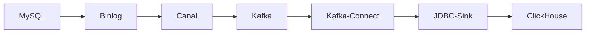
```mermaid
graph LR
    MySQL --> Binlog
    Binlog --> Canal
    Canal --> Kafka 
    Kafka --> Kafka-Connect
    Kafka-Connect --> JDBC-Sink
    JDBC-Sink --> ClickHouse
```

1. MySQL开启Binlog,记录DML和DDL等变更。
2. Canal以伪从节点身份请求Binlog事件。
3. Canal解析Binlog为Json格式,发送到Kafka。
4. Kafka Connect创建JDBC Sink Connector,指定ClickHouse连接信息。
5. Connector消费Kafka数据,批量写入ClickHouse。

这种架构既能利用Binlog的增量同步能力,减少对业务数据库的影响,又能利用Kafka的缓存削峰,确保传输的可靠性,还能利用Kafka Connect的模块化,快速适配不同的源和目标系统。

除了系统间同步,数据在系统内各个模块间的一致性也至关重要,需要应对各种并发异常,如:

* 脏读:一个事务读取了另一个未提交事务修改过的数据。
* 不可重复读:一个事务两次读取同一数据,两次读取的数据不一致。
* 幻读:一个事务两次查询,第二次比第一次多出或少了数据。

本平台采取以下策略实现数据一致性:

* 悲观锁:在查询语句后加 FOR UPDATE,数据被锁定,其他事务阻塞。适合并发量小、事务时间长的场景。
* 乐观锁:在表中增加version字段,更新时判断版本号是否一致,不一致则回滚重试。适合并发量高、事务时间短的场景。
* MVCC多版本:数据库为每行数据维护多个版本,通过undo log和read view避免锁冲突。MySQL的InnoDB、PostgreSQL等支持MVCC。
* 数据分片:按照某个键(如用户ID、订单ID)将数据划分到不同的分片,不同分片间无事务冲突,可实现线性扩展。
* 最终一致:对于金额、库存等强一致场景,同步调用,基于XA、TCC等分布式事务保证数据原子性。对于评论、点赞等弱一致场景,采用异步、重试、人工等方式,接受数据短时的不一致。

数据一致性是一个大命题,没有一种模式能解决所有问题。需要针对不同的场景,在性能、成本、复杂度间权衡,找出最合适的方案。

6.3 服务层

6.3.1 微服务框架

本平台采用微服务架构,将业务功能拆分为一个个独立的微服务,服务间通过轻量级的REST或RPC协议通信,再通过服务编排和治理工具组装成完整的业务系统。

微服务架构具有语言独立、服务独立、数据独立、部署独立、按需扩容等优势,有利于打破单体应用的复杂度和释放团队生产力。但微服务也不是银弹,需要开发者具备分布式系统开发的能力,需要DevOps提供自动化的持续集成和部署,需要可靠的服务发现、配置管理、容错熔断、分布式追踪等配套设施。能力越大,责任越大。

平台选择Spring Boot、Spring Cloud作为微服务的基础框架。Spring Boot用于快速构建单个微服务,Spring Cloud用于微服务的注册发现、配置管理、链路追踪、服务网关等。

Spring Boot的主要特性有:

* 自动配置:基于添加的JAR依赖自动配置Spring Boot应用。
* 起步依赖:提供了一系列的依赖模板,简化构建配置。
* 命令行:支持以jar包形式直接运行Spring Boot应用。
* Actuator:提供生产就绪特性,如性能指标、健康检查等。

下面是一个典型的Spring Boot REST服务:

```java
@RestController
@RequestMapping("/users")
public class UserController {
    
    @Autowired
    private UserService userService; 
    
    @PostMapping
    public User addUser(@RequestBody User user) {
        return userService.save(user);
    }
    
    @GetMapping("/{id}")
    public User getUser(@PathVariable Long id) {
        return userService.findById(id);
    }
}
```

Spring Cloud的主要组件有:

* Eureka:服务注册和发现。
* Config Server:分布式配置管理。
* Ribbon:客户端负载均衡。
* Feign:声明式REST客户端。
* Hystrix:断路器。
* Zuul:API网关。
* Sleuth:分布式链路跟踪。

下面是一个简单的Spring Cloud应用架构:

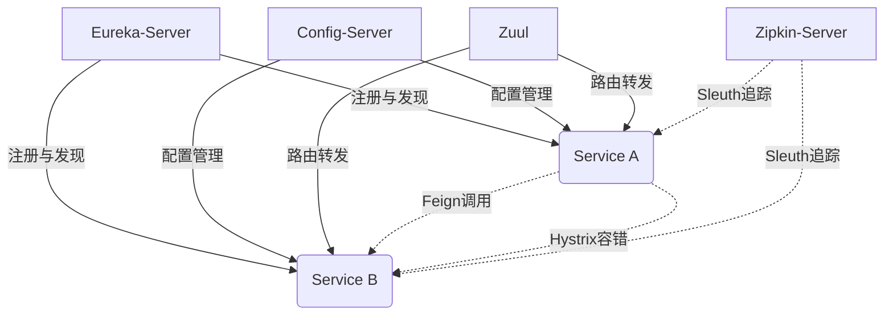
```mermaid
graph TD
    Eureka-Server -->|注册与发现| 服务A(Service A)
    Eureka-Server -->|注册与发现| 服务B(Service B)
    Config-Server-->|配置管理|服务A(Service A)
    Config-Server-->|配置管理|服务B(Service B) 
    Zuul-->|路由转发|服务A(Service A)
    Zuul-->|路由转发|服务B(Service B)
    服务A(Service A)-.->|Feign调用|服务B(Service B)
    服务A(Service A)-.->|Hystrix容错|服务B(Service B)  
    Zipkin-Server-.->|Sleuth追踪|服务A(Service A)
    Zipkin-Server-.->|Sleuth追踪|服务B(Service B)
```

除了Spring家族,平台还引入了服务网格Istio作为服务治理的利器。Istio在Kubernetes的基础上,提供

## Prompt:
undefined

## Response:
了流量管理、安全认证、访问控制、可观测性等能力,实现服务间通信的可靠、安全、高效。Istio的关键组件包括:

* Envoy:高性能的代理服务器,以sidecar模式部署,拦截进出Pod的流量。
* Pilot:管理和配置Envoy,提供服务发现、流量管理、故障处理等功能。
* Mixer:收集Envoy的遥测数据,实现访问控制、限流、计费等策略。
* Citadel:提供身份和证书管理,实现服务间的双向TLS认证。

加入Istio后,平台的微服务架构演进如下:

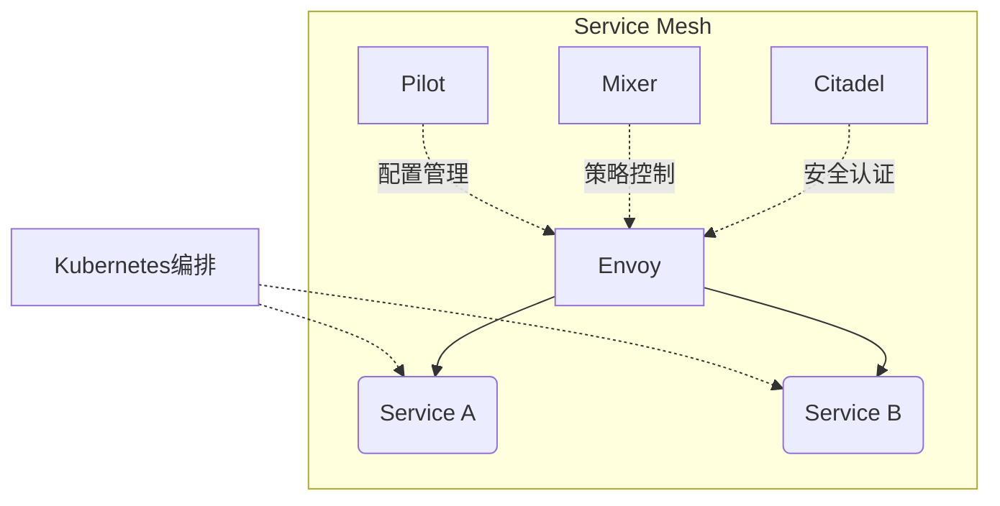
```mermaid
graph TD
    Kubernetes编排-.->服务A(Service A)
    Kubernetes编排-.->服务B(Service B)
    subgraph Service Mesh
    Pilot-.->|配置管理|Envoy
    Mixer-.->|策略控制|Envoy
    Citadel-.->|安全认证|Envoy
    Envoy-->服务A(Service A)
    Envoy-->服务B(Service B)
    end
```

可以看到,服务网格与Spring Cloud在很多功能上是重叠的,如服务发现、负载均衡、熔断降级等。但服务网格更侧重于基础设施层面的服务通信,提供语言无关、플랫폼透明的代理机制,而Spring Cloud更聚焦于Java应用层面的开发框架,提供声明式、面向对象的编程模型。两者可以互补。

本平台在开发阶段,由Spring Cloud提供服务注册、配置、限流、链路追踪等能力,简化微服务的开发。在部署阶段,由Istio接管服务间通信,提供一致的流量管控、安全防护、监控运维等。两者的边界如下:

```
&]:odd:bg-bg-500/10">功能Spring CloudIstio&]:odd:bg-bg-500/10">服务描述Java注解Kubernetes CRD&]:odd:bg-bg-500/10">服务发现Eureka,ConsulKubernetes&]:odd:bg-bg-500/10">配置管理Config ServerIstio Pilot(半动态)&]:odd:bg-bg-500/10">服务调用RestTemplate,FeignEnvoy Proxy&]:odd:bg-bg-500/10">负载均衡RibbonEnvoy(EDS)&]:odd:bg-bg-500/10">服务容错HystrixEnvoy(重试,熔断,故障注入)&]:odd:bg-bg-500/10">API网关ZuulIstio Gateway&]:odd:bg-bg-500/10">安全认证Spring Security,OAuthIstio Auth&]:odd:bg-bg-500/10">链路追踪Sleuth+ZipkinEnvoy+Jaeger&]:odd:bg-bg-500/10">监控指标Actuator+PrometheusEnvoy+Prometheus&]:odd:bg-bg-500/10">日志收集ELKEFK
```

可以看出,两个体系能很好地分工协作。Istio专注于基础设施和通信,Spring Cloud聚焦于应用开发和业务逻辑,共同织就了一张更智能、更安全、更高效的服务网络。

6.3.2 服务发现与注册

在微服务架构中,服务发现是不可或缺的基础设施。它允许服务消费者无需硬编码服务提供者的网络地址,即可动态查找和调用服务。这有利于服务的水平扩展和故障转移。

本平台使用Kubernetes作为服务的注册和发现中心。Kubernetes通过申明式的Deployment、Service等资源,描述服务的副本数、端口映射、负载策略等,并将服务IP动态注入到调用方的环境变量或DNS。

例如,定义一个用户服务的Deployment和Service:

```yaml
apiVersion: apps/v1
kind: Deployment
metadata:
  name: user-service
spec:
  replicas: 3
  selector:
    matchLabels:
      app: user-service
  template:
    metadata:
      labels:
        app: user-service
    spec:
      containers:
      - name: user-service
        image: user-service:v1
        ports:
        - containerPort: 8080
        
---        
apiVersion: v1
kind: Service
metadata:
  name: user-service 
spec:
  selector: 
    app: user-service
  type: ClusterIP
  ports:
    - protocol: TCP
      port: 80
      targetPort: 8080
```

这个服务有以下元素:

* Deployment定义了user-service的3个副本,使用user-service:v1镜像,对内暴露8080端口。
* Service定义了user-service的稳定IP和端口,端口80,指向Pod的8080端口,类型为集群内访问。

调用方要访问该服务,只需向Service的Cluster IP发起请求:

```
GET http://user-service/users/1
```

请求到达Service端口后,再经过kube-proxy或ipvs的负载均衡,转发到某个具体的Pod。

除了集群内的ClusterIP,Kubernetes还支持NodePort、LoadBalancer等类型的Service,将服务暴露到集群外,供外部客户端访问。

服务发现除了IP直连,还可通过DNS实现。Kubernetes为每个Service提供了对应的DNS记录,格式为:

```
<service-name>.<namespace>.svc.cluster.local
```

如user-service的DNS为:

```
user-service.default.svc.cluster.local
```

这样,调用方就可以用服务名字而非IP来访问服务:

```
GET http://user-service/users/1
```

集群内的Pod会自动配置DNS search域,因此访问时可以省略后缀:

```
GET http://user-service/users/1
```

通过DNS发现服务,避免了硬编码IP,使得服务调用更灵活。即使服务迁移、故障、扩缩容导致IP变化,也不影响上游调用。

除了Kubernetes,平台还支持Consul、Nacos等第三方的服务注册中心。它们提供了更丰富的健康检查、自动注销、多数据中心、跨语言等特性。Spring Cloud Consul与Spring Cloud Alibaba就很好地集成了Consul和Nacos。

服务注册与发现是微服务的第一道关口,将服务从实例解耦到标签,让服务可以自由伸缩、转移、升级,让调用方以最小的感知实现服务寻址。但仅有寻址是不够的,服务发现后,还需要考虑服务路由、负载均衡、失败重试等细节,才能让服务调用真正靠谱。

6.3.3 服务网关

服务网关是微服务应用的流量入口,它介于客户端与服务提供方之间,对外暴露统一的URL,内部将流量路由、转发给具体的后端服务。

服务网关具有如下功能:

* 统一接入:允许客户端通过统一的URL访问系统的所有服务,无需关心服务部署的具体位置。
* 路由转发:根据请求的URL、参数、Header等规则,将请求转发到不同的后端服务。
* 负载均衡:将请求均匀地分发到服务的多个实例,避免单点过载。
* 协议转换:将外部的HTTP等协议转换成内部服务使用的RPC等协议。
* API编排:将多个服务的接口组合、串联,形成复合API。
* 访问控制:对请求进行身份验证、权限校验、流量控制,保护后端服务。
* 监控检测:收集、记录请求的数量、延迟等指标,实现可观测性。

本平台选择Spring Cloud Gateway作为服务网关。Spring Cloud Gateway基于Spring 5、Spring Boot 2和Project Reactor等技术开发,具有优秀的性能、扩展性和响应式编程特性。

Spring Cloud Gateway的架构如图:

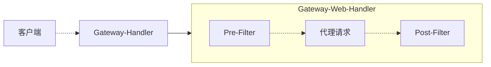
```mermaid
graph LR
    客户端-.->Gateway-Handler
    Gateway-Handler-->Gateway-Web-Handler
    subgraph Gateway-Web-Handler
    direction LR
    Pre-Filter-.->代理请求-.->Post-Filter
    end
```

Gateway的核心是一系列的过滤器链。过滤器分为两种:

* Pre过滤器:在代理请求之前调用,如参数校验、权限校验、流量监控等。
* Post过滤器:在代理请求之后调用,如响应压缩、日志输出等。

过滤器可串联组合,形成复杂的处理逻辑。Gateway内置了很多开箱即用的过滤器,也支持自定义过滤器。

下面是一个路由配置示例:

```yaml
spring:
  cloud:
    gateway:
      routes:
      - id: user-service
        uri: lb://user-service
        predicates:
        - Path=/users/**
        filters:
        - StripPrefix=1
      - id: order-service
        uri: lb://order-service  
        predicates:
        - Path=/orders/**
        filters:
        - StripPrefix=1
```

这个配置定义了两个路由:

* user-service路由:将以/users开头的请求转发给user-service,并去除前缀中的一个路径。
* order-service路由:将以/orders开头的请求转发给order-service,并去除前缀中的一个路径。

其中的lb前缀表示使用Ribbon进行客户端负载均衡。

除了在配置文件中定义路由,还可用编程方式动态添加路由:

```java
@Configuration
public class GatewayConfig {
    @Bean
    public RouteLocator customRouteLocator(RouteLocatorBuilder builder) {
        return builder.routes()
            .route("user-service", r -> r.path("/users/**")
                .filters(f -> f.stripPrefix(1))
                .uri("lb://user-service"))
            .route("order-service", r -> r.path("/orders/**")
                .filters(f -> f.stripPrefix(1))
                .uri("lb://order-service"))
            .build();
    }
}
```

路由配置中的predicates定义了何时应用该路由。Spring Cloud Gateway提供了多种内置断言,如:

* Path:匹配URL路径。
* Method:匹配HTTP方法。
* Header:匹配请求头。
* Cookie:匹配Cookie。
* Query:匹配查询参数。

如一个基于Query的路由:

```yaml
spring:
  cloud:
    gateway:
      routes:
      - id: promotion_route
        uri: https://promotion.example.com
        predicates:
        - Query=promotion, true
```

该路由会将所有包含promotion参数的请求转发给promotion.example.com。

路由配置中的filters定义了如何处理请求和响应。Spring Cloud Gateway也提供了许多内置过滤器,如:

* StripPrefix:移除URL的前缀。
* PrefixPath:为URL添加前缀。
* AddRequestHeader:添加请求头。
* AddResponseHeader:添加响应头。
* RequestRateLimiter:限制请求的频率。

如一个带限流的路由:

```yaml
spring:
  cloud:
    gateway:
      routes:
      - id: requestratelimiter_route
        uri: https://example.org
        filters:
        - name: RequestRateLimiter
          args:
            redis-rate-limiter.replenishRate: 10
            redis-rate-limiter.burstCapacity: 20
```

该路由使用令牌桶算法进行限流,初始容量为20,每秒放入10个令牌,即允许每秒处理10个请求,峰值为20。

除了服务路由,Spring Cloud Gateway还可作为整个系统的BFF(Backend For Frontend)层,在此聚合、裁剪后端服务,暴露面向用户场景的API,提供定制化的数据和性能优化。

服务网关是系统的门面,流量的总入口,因此它的可用性、性能、安全至关重要,一旦出现故障或瓶颈,整个系统都会受影响。生产实践中,除了选择高可靠的网关中间件,还要做好容量规划、弹性扩容、灾备切换、异地多活等,将网关打造成一个高可用集群,守好系统的第一道关口。

6.3.4 服务容错

微服务由于其分布式的特点,不可避免地会遇到各种故障,如网络延迟、服务宕机、资源耗尽等。服务容错就是让服务能够容忍这些故障,并最大限度地维持自身的可用性。

常见的容错手段有:

* 重试:在请求失败后重新发起请求,适合偶发的瞬时故障。重试要考虑超时时间、重试次数、重试间隔等。
* 断路器:在请求失败率高、访问延迟大时,断开到该服务的请求,快速失败,阻止故障蔓延。
* 限流:限制进入服务的流量,避免服务因流量激增而过载。常用漏桶、令牌桶等算法。
* 降级:在服务不可用时,返回默认数据或缓存数据,保证主要功能可用。
* 隔离:将不同服务部署在不同的机器、容器、线程池中,避免互相影响。

Netflix的Hystrix是Java领域服务容错的标杆,它封装了断路器、隔离、降级等能力。不过随着Hystrix进入维护状态,本平台选用Resilience4j作为新一代的容错方案。

Resilience4j是一个轻量级、模块化的容错框架,它基于函数式编程,将不同的容错模块如断路器、限流、重试等以函数装饰器的形式独立实现,再进行灵活组合。

断路器的使用示例:

```java
@Service
public class UserService {
    
    private final CircuitBreaker circuitBreaker = CircuitBreaker.ofDefaults("backen
```

## Prompt:
undefined

## Response:
d");

```
public String getUser(String id) {
    return circuitBreaker.executeSupplier(() -> {
        // 调用后端服务获取用户
        return backendService.getUser(id);
    });
}
```

}

    这里使用CircuitBreaker的executeSupplier方法包装了后端调用。CircuitBreaker会监控调用的错误率、慢请求率,当超过阈值时(如错误率>50%,慢请求率>50%),断路器打开,快速失败后续请求。

    重试的使用示例:

    ```java
    @Service
    public class OrderService {
        
        private final Retry retry = Retry.ofDefaults("payment");
        
        public String createOrder(Order order) {
            return retry.executeSupplier(() -> {
                // 调用支付服务扣款
                return paymentService.deduct(order.getAmount());
            });
        }
    }

这里使用Retry的executeSupplier方法包装了支付调用。Retry会在调用异常时自动重试,重试的次数、延迟、异常类型等可配置。

限流的使用示例:

```java
@Service
public class InventoryService {
    
    private final RateLimiter rateLimiter = RateLimiter.ofDefaults("inventory");
    
    public boolean reduceStock(String sku) {
        return rateLimiter.executeSupplier(() -> {
            // 调用库存服务减库存
            return stockService.reduce(sku);  
        });
    }
}
```

这里使用RateLimiter的executeSupplier方法包装了库存调用。RateLimiter会限制调用的频率,超过设定的QPS就会拒绝请求。

容错组件的配置可以通过配置文件集中管理:

```yaml
resilience4j:
  circuitbreaker:
    backends: 
      backend:
        failure-rate-threshold: 50
        slow-call-rate-threshold: 50
        permitted-number-of-calls-in-half-open-state: 10
        max-wait-duration-in-half-open-state: 5s
        wait-duration-in-open-state: 1min
        
  retry:
    backends:
      payment:
        max-attempts: 3
        wait-duration: 100ms
        retry-exceptions:
          - java.net.ConnectException
          
  ratelimiter:
    backends:
      inventory:
        limit-for-period: 1000
        limit-refresh-period: 1s      
        timeout-duration: 100ms
```

这个配置为断路器、重试、限流等指定了详细参数,与代码解耦,方便运维。

容错虽然很重要,但也要把握分寸,过度容错反而会隐藏问题,延缓修复。例如重试次数过多,可能加重瞬时故障;降级范围过大,可能错失恢复时机。因此,容错要基于业务语义,区别核心、非核心服务,差异化地配置容错策略。

当前市面上的容错组件还是针对单个服务、单个接口,缺乏全局视图,无法感知服务间的依赖和状态,容错决策相对简单。未来,结合服务治理平台、链路跟踪、故障注入等,容错体系将更智能、更精细、更全局化,真正做到自愈、韧性。

6.4 消息通信

6.4.1 消息队列

消息队列是分布式系统中的重要组件,它可以收发异步消息,实现服务解耦、流量削峰、数据复制等多种功能。常见的消息队列有ActiveMQ、RabbitMQ、RocketMQ、Kafka等。

本平台选用Kafka作为主力的消息队列。Kafka是LinkedIn开源的分布式流处理平台,具有高吞吐、低延迟、高容错、水平扩展等优势。

Kafka遵循发布-订阅模型,将消息以主题(Topic)的形式组织,生产者向主题发布消息,消费者从主题订阅消息。主题可以分区,每个分区可以有多个副本,保证了消息的高可用和可伸缩。

下图是Kafka的整体架构:

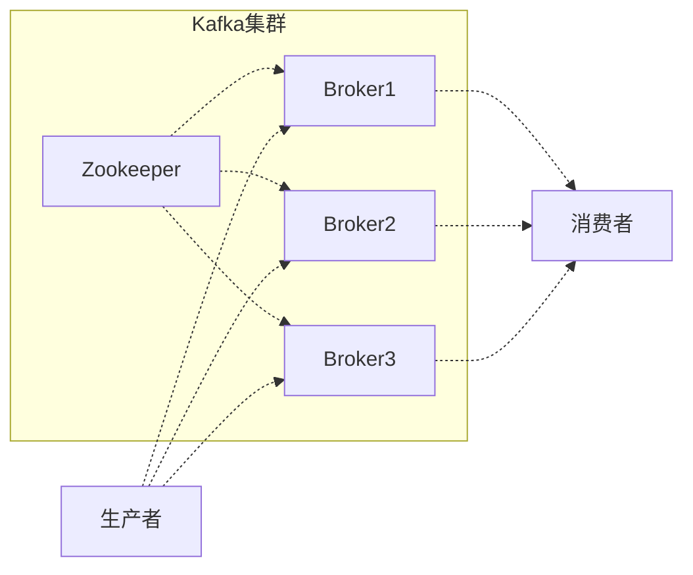
```mermaid
graph LR
    subgraph Kafka集群
    Zookeeper-.->Broker1
    Zookeeper-.->Broker2
    Zookeeper-.->Broker3
    end
    生产者-.->Broker1
    生产者-.->Broker2
    生产者-.->Broker3
    Broker1-.->消费者
    Broker2-.->消费者
    Broker3-.->消费者
```

Kafka的核心组件包括:

* Broker:消息服务器,负责消息的存储、转发、查询等。
* Topic:消息的逻辑分类,每条消息都要发送到特定的Topic。
* Partition:Topic的物理分区,一个Topic可以分为多个Partition,每个Partition是一个有序、不可变的消息序列。
* Producer:消息生产者,向Broker发送消息。
* Consumer:消息消费者,从Broker拉取消息。
* ConsumerGroup:消费者组,同组的消费者协调消费同一个Topic的多个分区,保证每条消息只被组内一个消费者消费。
* Zookeeper:分布式协调服务,负责Broker的注册发现、Controller选举、消费者组管理等。

使用Kafka发送消息的示例:

```java
@Service
public class OrderService {
    
    @Autowired
    private KafkaTemplate<String, String> kafkaTemplate;
    
    public void createOrder(Order order) {
        // 创建订单
        String orderId = saveOrder(order);
        
        // 发送订单创建成功的消息
        kafkaTemplate.send("order_created", orderId, order.toString());
    }
}
```

这里使用Spring Kafka的KafkaTemplate,向order\_created主题异步发送一条订单创建成功的消息。

使用Kafka消费消息的示例:

```java
@Service
public class InventoryService {
    
    @KafkaListener(topics = "order_created")
    public void handleOrderCreated(String orderId, String orderJson) {
        // 解析订单
        Order order = parseOrder(orderJson);
        
        // 锁定商品库存
        for (OrderItem item : order.getItems()) {
            lockStock(item.getSku(), item.getQuantity());
        }
    }
}
```

这里使用@KafkaListener注解,监听order\_created主题,当有新消息时触发handleOrderCreated方法,执行锁定库存的逻辑。

可以看到,Kafka可以很方便地实现异步、解耦的消息通信。订单服务只需将订单发布为消息,而不用关心消息如何被库存服务消费。库存服务也可以按照自己的节奏消费订单消息,不会阻塞订单服务。

Kafka除了点对点的消息队列,还提供了以下更高级的功能:

* 消息持久化:Kafka将消息持久化到磁盘,可以长时间保留,方便数据回放和恢复。
* 消息压缩:Kafka支持GZIP、Snappy等压缩算法,可以减少消息的网络传输和磁盘存储。
* 消息事务:Kafka支持对消息的发送和消费进行事务控制,保证数据一致性。
* 消息索引:Kafka支持对消息建立索引,可以快速查询和重放特定的消息。
* 流处理:Kafka Streams和ksqlDB提供了流式计算的能力,可以在消息流上进行过滤、转换、聚合等操作。
* 消息连接器:Kafka Connect提供了一套可扩展的连接器框架,可以将Kafka与其他数据系统如关系数据库、搜索引擎、KV存储等进行数据同步。

生产实践中,需要关注Kafka的安全、监控、性能调优等方面:

* 安全:Kafka支持SSL/SASL认证和ACL授权,控制客户端的访问权限。
* 监控:利用Kafka的JMX指标、Prometheus、Grafana等,监控Kafka集群的健康状态、性能瓶颈、消息积压等。
* 性能调优:根据实际的流量和机器配置,调整Broker、Producer、Consumer的参数,如batch.size、linger.ms、compression.type、fetch.max.bytes等。

6.4.2 事件驱动架构

事件驱动架构(Event-Driven Architecture, EDA)是一种架构风格,它将应用拆分为多个松耦合的组件,组件之间通过发布和消费事件进行交互。事件就是应用内部或外部发生的一些状态变化,如订单创建、价格调整、物流派送等。

事件驱动架构的优点有:

* 解耦:事件的生产者和消费者只依赖事件本身,不直接依赖对方,很容易替换和扩展。
* 可伸缩:可以灵活调整消费者的数量和消费速率,适应不同的负载。
* 异步:事件的生产和消费是异步的,生产者不需要等待消费者处理完成。
* 容错:如果一个消费者失败,不会影响其他消费者和生产者。
* 可追溯:事件一般会持久化,方便进行数据回放和分析。

常见的事件驱动架构有几种形态:

1. 领域事件:这是DDD(领域驱动设计)中的概念,领域事件表示领域内重要的状态变化,如订单创建、支付成功等。微服务一般根据限界上下文来划分领域事件,并用事件在不同的微服务间同步数据。

示例:订单服务在订单创建后,发布一个OrderCreated事件。库存服务、物流服务、推荐服务等订阅该事件,分别执行扣库存、安排发货、更新推荐等逻辑。

2. 原子事件:将每个事件尽量拆分为细粒度、不可再拆分的原子事件,一个原子事件表示一次单一的状态变化,如商品购买、评价提交等。原子事件可以由多个消费者订阅,实现扩展。

示例:电商网站在用户购买商品时,发布一个ItemPurchased事件。该事件可以被库存系统、物流系统、推荐系统、数据分析系统等多个下游系统订阅,各自更新状态。

3. 事件溯源:不保存实体的最终状态,而是只保存实体的状态变更事件。任一时刻实体的状态,都可以通过重放历史事件而重建。事件成为了数据的唯一来源,避免了分布式环境下的状态同步问题。

示例:一个银行账户,不保存余额,只保存历史的交易事件,如存款、取款、转账等。当需要查询余额时,重放所有交易事件,计算出最终余额。

4. CQRS:Command Query Responsibility Segregation,命令查询职责分离。将系统读写分离,写操作(Command)通过事件溯源更新实体,读操作(Query)通过实体的物化视图查询数据。CQRS让写操作和读操作各自优化,同时保持数据一致性。

示例:一个在线商城的商品详情页,每次用户访问,都需要查询商品信息、库存、价格、评价、推荐等多个数据。传统架构下,这些数据分散在不同的微服务,需要多次远程调用,性能较差。CQRS将写操作和读操作分离,写操作通过事件更新商品、库存、评价等域,读操作通过一个物化视图(如 Redis)聚合各域的数据,提供一次性的查询,提升性能。

5. Kafka/Pulsar Streaming:利用Kafka Streams、ksqlDB或Pulsar Functions等流处理框架,在事件流上直接进行流式计算,如过滤、转换、聚合等,将事件处理与事件存储统一起来,简化了架构。

示例:双11大屏上实时显示的交易额、下单数等指标,就是通过Kafka Streams等对交易事件流进行实时统计而来的。

事件驱动架构也有一些问题需要注意:

* 最终一致:事件的发布和消费一般是异步的,事件驱动系统需接受一定时间的数据不一致。
* 处理顺序:事件的消费顺序可能与发布顺序不同,跨事件的处理可能有问题。
* 事件漏消费:消费者如果没有及时消费或消费失败,可能导致事件丢失。
* 监控不足:事件的流转比较复杂,全链路监控和故障排查有难度。
* 消息膨胀:某些场景下,事件的数据结构不断变化,可能导致消息格式的膨胀。

事件驱动架构正成为微服务间通信和集成的重要手段。未来,事件驱动与微服务、Serverless、流处理等一起,必将构筑云原生时代的高效、弹性、智能的应用架构。

6.5 配置管理

当应用从单体架构演进到微服务架构后,服务的数量成倍增加,服务的配置管理变得异常复杂。每个服务都有自己的配置,如果散落在各个服务内部,变更起来将非常困难。

分布式配置中心就是为了解决这个问题而生的。它提供了一个中心化的配置存储和管理平台,

## Prompt:
undefined

## Response:
所有服务的配置都可以在此统一定义、修改、发布,极大简化了配置管理的复杂度,提高了配置变更的效率。

常见的配置中心有Apollo、Nacos、Spring Cloud Config、Consul等。本平台选用Apollo作为主力的配置中心。

Apollo的架构如下:

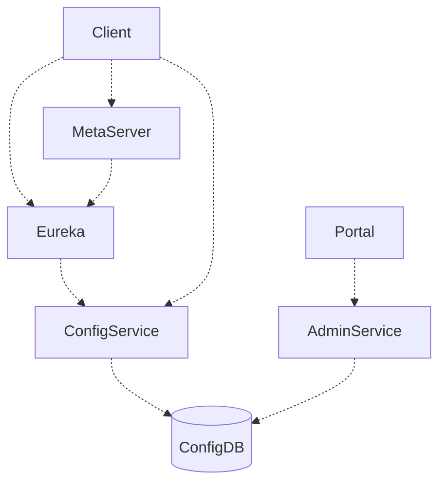
```mermaid
graph TD
    ConfigDB[(ConfigDB)]
    ConfigService-.->ConfigDB
    Eureka-.->ConfigService
    AdminService-.->ConfigDB
    Portal-.->AdminService
    Client-.->ConfigService
    Client-.->Eureka
    Client-.->MetaServer
    MetaServer-.->Eureka
```

主要组件包括:

* ConfigDB:配置数据库,存储配置信息。
* ConfigService:配置服务,提供配置的读取、推送等功能。
* Eureka:注册中心,实现ConfigService的服务发现。
* AdminService:管理服务,提供配置的修改、发布等功能。
* Portal:管理界面,供管理员操作。
* Client:客户端,内嵌于微服务中,从ConfigService拉取配置。
* MetaServer:Meta服务,提供ConfigService的路由信息。

Apollo支持了多个维度的配置管理:

* 应用(application):对应于微服务或者服务组,如订单服务、用户服务等。
* 环境(env):对应于部署环境,如dev、test、prod等。
* 集群(cluster):对应于服务的部署集群,如default、cluster1等。
* 命名空间(namespace):在应用内对配置做逻辑隔离,如db\_config、redis\_config等。

举个例子,一个订单服务在生产环境的数据库配置,可以用如下的key来表示:

application: order-service env: prod cluster: default  
namespace: db\_config

在Portal上编辑该配置:

```properties
db.url = jdbc:mysql://prod-db:3306/order?useUnicode=true
db.username = admin
db.password = 123456
```

在订单服务中使用该配置:

```java
@Configuration
@EnableApolloConfig("db_config")
public class DbConfig {
    
    @Value("${db.url}")  
    private String url;
    
    @Value("${db.username}")
    private String username;
    
    @Value("${db.password}")
    private String password;
    
    @Bean
    public DataSource dataSource() {
        DruidDataSource dataSource = new DruidDataSource();
        dataSource.setUrl(url);
        dataSource.setUsername(username);
        dataSource.setPassword(password);
        return dataSource;
    }
}
```

这里首先用@EnableApolloConfig注解开启db\_config命名空间,然后用@Value注解注入具体的配置项,最后创建DataSource Bean。

Apollo除了支持配置的读取,还支持配置的热更新。当Portal上的配置发生变更后,ConfigService会实时通知对应的客户端,客户端重新获取最新的配置,动态更新Bean的属性,实现配置的热生效。

配置中心带来了配置管理的集中化、标准化,同时也引入了一些新的问题:

* 可用性:配置中心要成为公共依赖,一旦不可用,会导致所有服务瘫痪。
* 一致性:配置变更如何快速、准确地通知到所有服务,避免配置不一致。
* 安全性:如何对敏感配置如密码、密钥等进行加密存储和传输。
* 权限控制:如何对不同角色、不同环境的配置修改、发布进行权限控制。
* 版本管理:如何对配置的变更进行版本追踪和回滚。
* 灰度发布:如何支持配置的灰度发布和AB测试。

Apollo在一定程度上解决了这些问题:

* 可用性:所有服务在启动时会从ConfigService拉取配置并在本地缓存,即使ConfigService不可用,也不会影响服务的正常运行。
* 一致性:ConfigService通过Http long polling向客户端推送配置更新,保证了配置的实时性和一致性。
* 安全性:敏感配置可以存储在单独的namespace如secret.properties中,只对特定的人可见。传输过程中可以使用https加密。
* 权限控制:通过给不同的用户分配不同的权限,限制对配置的修改和发布。
* 版本管理:每次发布都会生成一个新的版本,版本之间可以随意切换。
* 灰度发布:通过在Portal上修改服务的灰度规则,可以控制配置的灰度范围,如按机器、按IP、按百分比等。

分布式配置中心已经成为微服务架构的标准组件,在简化配置管理的同时,也提升了系统的灵活性和可维护性。

6.6 安全设计

安全是系统的生命线,事关用户隐私和企业声誉。在互联网时代,黑客攻击、信息泄露层出不穷,安全已成为系统架构中不可或缺的一部分。

本小节我们重点讨论几个与微服务架构相关的安全话题。

1. 认证与授权

认证(Authentication)与授权(Authorization)是系统安全的两大支柱。认证确认用户的身份,授权决定用户能访问哪些资源。

本平台采用OAuth2+JWT的方式实现统一认证和授权:

* UAA服务作为OAuth2的认证服务器,负责颁发和校验JWT令牌。
* 各微服务作为OAuth2的资源服务器,负责校验JWT令牌和鉴别用户权限。
* 网关作为OAuth2的客户端,负责请求JWT令牌并转发给微服务。

认证流程如下:

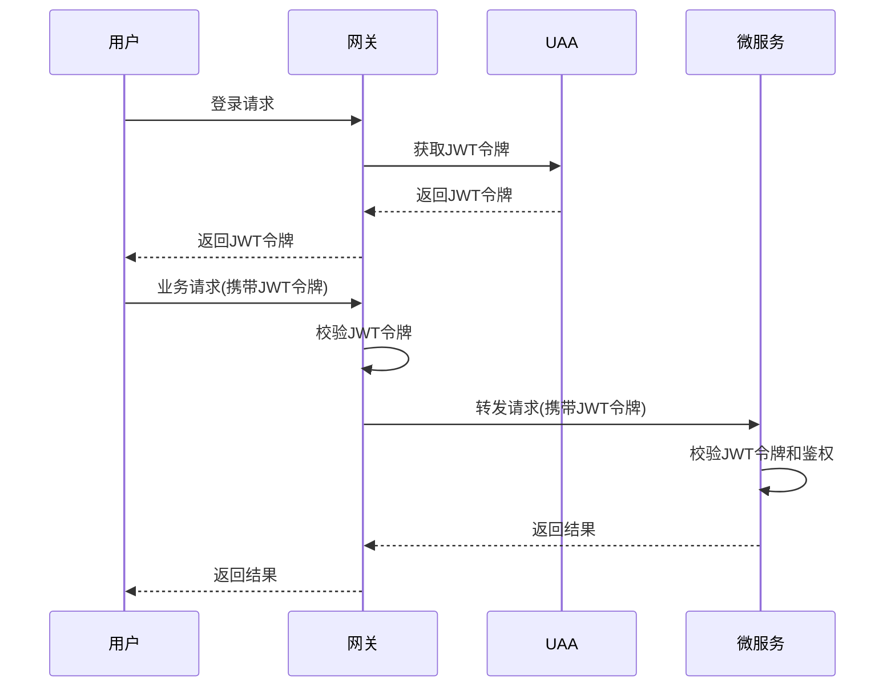
```mermaid
sequenceDiagram
    participant 用户
    participant 网关
    participant UAA
    participant 微服务
    
    用户->>网关: 登录请求
    网关->>UAA: 获取JWT令牌
    UAA-->>网关: 返回JWT令牌
    网关-->>用户: 返回JWT令牌
    
    用户->>网关: 业务请求(携带JWT令牌)
    网关->>网关: 校验JWT令牌 
    网关->>微服务: 转发请求(携带JWT令牌)
    微服务->>微服务: 校验JWT令牌和鉴权
    微服务-->>网关: 返回结果
    网关-->>用户: 返回结果
```

JWT令牌中包含了用户的身份信息(如用户名、角色、权限等),微服务解析JWT令牌后,就能知道当前用户是谁,能访问哪些API。这避免了每次请求都要访问数据库查询用户信息,提高了性能。

授权可以有两种粒度:

* 粗粒度:以服务为单位,判断用户是否有权访问某个服务。
* 细粒度:以API为单位,判断用户是否有权访问某个API。

粗粒度的授权可以在网关统一判断,避免请求进入微服务。细粒度的授权则需要在微服务中判断,根据不同的API决定是否放行。

用户的权限可以通过配置中心或者权限管理服务动态下发。常见的权限模型有:

* ACL:Access Control List,访问控制列表,每个资源配置一个可访问的主体列表。
* RBAC:Role-Based Access Control,基于角色的访问控制,用户与角色关联,角色与权限关联。
* ABAC:Attribute-Based Access Control,基于属性的访问控制,通过动态计算用户属性和环境属性,判断是否放行。

2. 数据安全

用户的隐私数据如密码、手机号、银行卡号等,一旦泄露,后果不堪设想。微服务架构下,由于服务较多,数据在服务间流转,攻击面扩大,数据安全面临更大的挑战。

常见的数据安全措施有:

* 数据加密:对敏感数据进行加密存储,即使泄露也无法被解密。
* 脱敏:对敏感数据如身份证、手机号进行掩码处理,只显示部分字符。
* 访问控制:严格控制敏感数据的访问权限,做到最小权限原则。
* 数据隔离:将敏感数据与其他数据隔离存储,减少暴露的可能。
* 数据销毁:对不再使用的敏感数据进行彻底删除或匿名化处理。
* 数据脱敏:对涉及隐私的数据进行脱敏或者假名化处理,在保留数据统计分析价值的同时保护个人隐私。

本平台采取了以下数据安全措施:

* 接入层使用HTTPS,防止数据在传输过程中被窃听。
* 敏感数据采用AES加密,密钥通过KMS(Key Management Service)统一管理。
* 敏感数据单独存储,设置字段级别的加密和访问控制。
* 服务间传输敏感数据时,进行脱敏处理,接收方再还原。
* 数据库开启审计日志,记录所有的敏感数据访问行为。
* 财务、健康等涉及隐私的数据,进行数据脱敏后用于数据分析。
* 用户注销或过期后,对其个人数据进行匿名化处理。

3. 服务安全

微服务之间通过API进行通信,API的安全性直接关系到服务的安全。如果一个服务的API被非法调用,可能导致数据泄露、资损失等后果。

服务安全的主要手段有:

* 认证:只有通过认证的调用方,才能访问服务的API。
* 鉴权:调用方只能访问其有权限的API,而不能访问其他API。
* 限流:限制API的调用频率,防止恶意调用和DOS攻击。
* 日志:记录所有的API调用日志,发现可疑行为。
* 加密:对API的请求和响应进行加密,防止数据泄露。

本平台的服务安全措施包括:

* 服务间的调用通过JWT令牌进行认证和鉴权。
* 网关和服务都设置了限流规则,对异常流量进行熔断和降级。
* 网关记录了所有的API调用日志,接入安全监控平台。
* 内部服务间的调用,除了JWT令牌,还通过AES进行加密。
* 服务网格引入mTLS(mutual TLS),实现服务间的双向认证。

4. 安全漏洞管理

代码可能存在安全漏洞,如SQL注入、XSS、CSRF等,这些漏洞一旦被利用,危害很大。在多语言、多团队的微服务开发中,安全漏洞的管理尤为重要。

安全漏洞管理主要包括:

* 漏洞识别:通过安全测试、代码审计等手段,发现潜在的安全漏洞。
* 漏洞评估:评估漏洞的危害程度和影响范围,确定修复优先级。
* 漏洞修复:针对漏洞,提供安全补丁或者纳入迭代计划。
* 漏洞复测:修复后,重新进行安全测试,确保漏洞已被修复。
* 漏洞应急:对于影响严重的漏洞,启动应急预案,第一时间修复漏洞。

本平台采用了以下安全漏洞管理措施:

* 接入SAST(Static Application Security Testing)工具,对代码进行安全扫描。
* 接入DAST(Dynamic Application Security Testing)工具,对线上服务进行安全测试。
* 成立安全响应中心,收集内外部的安全漏洞,评估风险,制定修复方案。
* 建立安全知识库,收录各种漏洞的原理、利用、修复方法,供开发人员学习。
* 制定安全应急预案,一旦发生严重漏洞,快速完成漏洞修复、版本发布、影响排查等。

总之,安全无小事,需要在架构设计之初就全盘考虑,从数据、服务、漏洞等多个层面,建立完善的安全防护体系。同时安全也是一个持续改进的过程,需要时刻保持警惕,与时俱进。

6.7 日志与监控

在微服务架构下,一个用户请求可能涉及几十个甚至上百个服务,调用链路错综复杂,给问题排查、性能优化带来了巨大的挑战。这就需要有一套完善的日志与监控体系,为微服务保驾护航。

本节我们主要探讨微服务架构下的集中日志管理、分布式监控和调用链跟踪。

6.7.1 集中日志管理

在单体应用中,日志一般写在本地文件,查看起来比较方便。但在微服务架构中,服务分散在不同的节点,每个服务都有自己的日志,查看起来十分麻烦。

集中日志管理就是将分散的日志收集、存储、查询、分析,形成统一的日志视图,提高日志管理的效率。

常见的集中日志管理方

## Prompt:
undefined

## Response:
案有ELK、EFK等。本平台选用ELK方案,即Elasticsearch、Logstash、Kibana的组合。

ELK的架构如下:

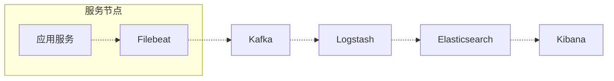
```mermaid
graph LR
    subgraph 服务节点
    应用服务-.->Filebeat
    end
    Filebeat-.->Kafka
    Kafka-.->Logstash
    Logstash-.->Elasticsearch
    Elasticsearch-.->Kibana
```

整个流程包括:

1. 日志收集:应用服务将日志写入本地文件,Filebeat监听文件变化,将新增的日志发送到Kafka。
2. 日志缓冲:Kafka接收Filebeat发来的日志,缓存在队列中,等待Logstash消费。Kafka可以削峰填谷,保证了日志收集的可靠性。
3. 日志处理:Logstash从Kafka消费日志,进行过滤、转换、富化等处理,然后发送给Elasticsearch。
4. 日志存储:Elasticsearch接收Logstash发来的日志,以分布式的方式存储,并提供了强大的搜索和聚合分析能力。
5. 日志展示:Kibana连接到Elasticsearch,以图表的形式展示日志,并提供交互式的查询和钻取功能。

日志在微服务中的重要性不言而喻,它记录了系统的运行轨迹,是问题定位和优化的重要依据。在集中日志管理的基础上,我们还要规范日志的格式和内容,方便后续的处理和分析。

本平台制定了统一的日志规范:

* 通用日志:包含时间戳、进程ID、线程ID、日志级别、类名、方法名、行号、耗时、IP等通用字段。
* 访问日志:包含请求方法、请求路径、请求参数、响应状态码、响应内容、用户ID等与API访问相关的字段。
* 错误日志:包含异常类名、异常信息、堆栈跟踪等与错误相关的字段。
* 业务日志:包含订单号、商品ID、交易金额等与具体业务相关的字段。

除了规范日志的格式,还要控制日志的数量。过多的日志会占用存储空间,影响系统性能。我们可以通过采样、过滤、归档等手段,优化日志的数量。

* 采样:对于访问量大的API,如果每次请求都记录日志,数量会非常大。我们可以采用采样的方式,只记录一定比例的请求,既减少了日志量,又能反映整体的访问情况。
* 过滤:对于一些不重要或者重复的日志,如心跳日志、重试日志等,可以通过配置过滤规则,不记录或者汇总记录,减少无效日志。
* 归档:对于时间较长的历史日志,可以定期进行归档,压缩存储,节省空间。

通过规范日志格式、优化日志数量,再结合ELK等集中日志管理方案,我们可以轻松应对海量的日志数据,快速定位问题,洞察系统行为。

6.7.2 分布式监控

监控是了解系统运行状态,发现和预警问题的重要手段。微服务架构下,监控的对象从单体应用扩展到了众多的服务和节点,需要一套分布式的监控方案。

本平台采用Prometheus+Grafana的组合,实现指标的采集、存储、查询和展示。

Prometheus是一款开源的监控告警系统,适用于云原生的动态环境。它有以下特点:

* 多维数据模型:Prometheus将所有数据存储为时间序列,每个时间序列由度量名称和一组标签构成。如http\_requests\_total{method="GET", handler="/api/users"}表示/api/users接口的GET请求总数。
* 灵活的查询语言:Prometheus提供了一种名为PromQL的函数式查询语言,可以对时间序列数据进行过滤、聚合、运算等操作。如rate(http\_requests\_total\[5m\])可以计算5分钟内的请求速率。
* HTTP协议:Prometheus通过HTTP协议采集目标服务的监控数据,目标服务只需要提供一个/metrics接口,返回Prometheus格式的监控数据即可。
* 服务发现:Prometheus可以与Kubernetes、Consul等服务发现系统集成,自动发现目标服务,无需手动配置。
* 联邦集群:Prometheus支持搭建联邦集群,上层Prometheus可以从下层Prometheus采集数据,实现监控数据的聚合和分层。

Grafana是一款开源的可视化平台,可以将Prometheus等多种数据源的监控数据以图表的形式展示,并提供告警功能。

Prometheus+Grafana的架构如下:

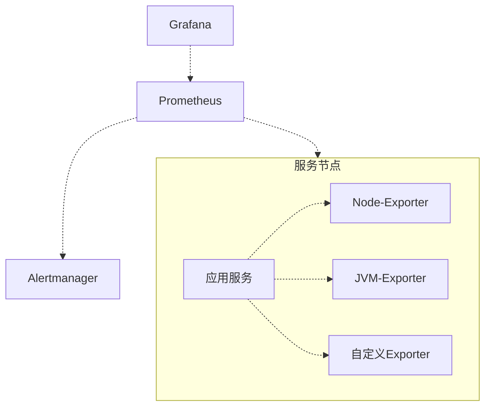
```mermaid
graph TD
    subgraph 服务节点
    应用服务-.->Node-Exporter
    应用服务-.->JVM-Exporter
    应用服务-.->自定义Exporter
    end
    Prometheus-.->服务节点
    Prometheus-.->Alertmanager
    Grafana-.->Prometheus
```

整个流程包括:

1. 指标采集:应用服务通过各种Exporter采集监控指标,如系统指标、JVM指标、自定义指标等,并暴露/metrics接口。
2. 服务发现:Prometheus与服务发现系统集成,自动发现目标服务,并定期拉取/metrics接口获取监控数据。
3. 数据存储:Prometheus将采集到的监控数据以时间序列的形式存储在本地磁盘。
4. 告警处理:当监控数据触发告警规则时,Prometheus将告警信息发送给Alertmanager,由Alertmanager进行去重、分组、路由,最终通过邮件、短信、微信等方式通知相关人员。
5. 数据展示:Grafana从Prometheus查询监控数据,以图表的形式展示,并支持自定义仪表盘和模板变量。

对于微服务系统,我们需要从多个维度采集监控指标,全面了解系统的运行状态。常见的指标维度有:

* 系统指标:如CPU使用率、内存使用量、磁盘IO、网络带宽等,反映服务器的负载和性能。这些指标一般由Node Exporter采集。
* 容器指标:如CPU使用率、内存使用量、网络IO等,反映容器的资源使用情况。这些指标一般由cAdvisor等采集。
* JVM指标:如线程数、内存使用量、GC时间等,反映Java应用的运行状态。这些指标一般由JMX Exporter等采集。
* 中间件指标:如连接数、请求量、响应时间等,反映中间件如数据库、缓存、消息队列等的性能。这些指标一般由中间件自带的Exporter采集。
* 业务指标:如订单量、支付量、用户数等,反映业务的关键指标。这些指标一般由应用服务自己的Metrics API提供。

除了采集多维度的指标,我们还要合理设置告警规则,及时发现系统的异常。告警规则一般基于监控指标设置阈值,如CPU使用率超过80%、API响应时间超过1秒等。

告警规则的设置要避免两个极端:一是告警过于敏感,一有波动就触发告警,导致告警风暴;二是告警过于迟钝,等问题很严重了才触发告警,失去预警的意义。

我们可以遵循以下原则设置告警规则:

* 聚合:对同一问题的多次告警进行聚合,避免重复告警。如一个服务有多个实例都触发了CPU告警,可以合并成一个告警。
* 分级:根据问题的严重程度设置告警级别,如警告、严重、紧急等。不同级别的告警通知不同的人员,采取不同的处理措施。
* 升级:如果一个告警在一定时间内没有恢复,则自动升高告警级别,直至问题解决。
* 抑制:当某个告警发生时,相关的其他告警可以被抑制,减少干扰。如服务不可用告警触发时,该服务的CPU、内存告警可以被抑制。
* 静默:在升级、部署等特殊时段,可以临时关闭某些告警,避免误报。

通过全方位的监控指标和智能的告警规则,再结合Prometheus+Grafana等监控平台,我们可以实现微服务系统的可观察性,精准定位性能瓶颈,快速止损服务故障,驱动系统持续优化。

6.7.3 调用链跟踪

微服务系统中,一次用户请求往往涉及多个服务,服务之间还可能有复杂的调用关系。这就带来了两个挑战:

* 性能分析:用户请求的响应时间长,到底慢在哪个服务、哪个环节?
* 故障诊断:用户请求失败,到底是哪个服务出了问题,问题的上下文是什么?

调用链跟踪就是为了回答这两个问题。它通过一个全局的TraceId将一次分布式请求串联起来,并记录请求经过的每个服务的信息,最后将这些信息收集展示,形成这次请求的完整调用链。

本平台选用Zipkin作为调用链跟踪系统。Zipkin分为数据平面和控制平面两部分:

* 数据平面:负责收集和存储跟踪数据,由Collector、Storage等组件组成。
  * Collector:以Http、Kafka、Scribe等协议接收跟踪数据,并进行验证、存储。
  * Storage:将跟踪数据存储在Cassandra、Elasticsearch等中,并提供查询API。
* 控制平面:负责展示跟踪数据,由API、UI等组件组成。
  * API:提供Restful API,查询Storage中的跟踪数据。
  * UI:提供Web界面,展示跟踪数据,并支持查询、过滤等。

Zipkin的基本工作流程如下:

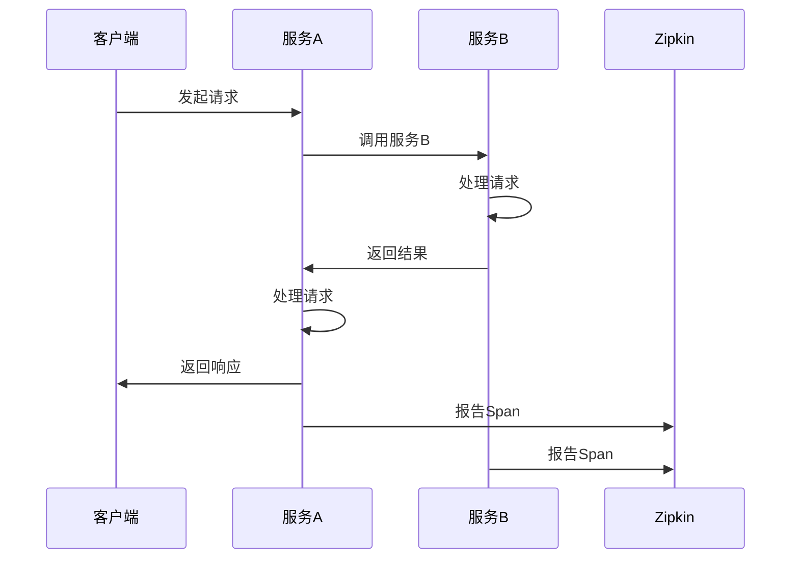
```mermaid
sequenceDiagram
    participant 客户端
    participant 服务A
    participant 服务B
    participant Zipkin
    
    客户端->>服务A: 发起请求
    服务A->>服务B: 调用服务B
    服务B->>服务B: 处理请求
    服务B->>服务A: 返回结果
    服务A->>服务A: 处理请求 
    服务A->>客户端: 返回响应
    
    服务A->>Zipkin: 报告Span
    服务B->>Zipkin: 报告Span
```

这个过程包含了以下关键概念:

* Trace:一次完整的请求链路,由一个TraceId标识。
* Span:请求链路中的一个基本工作单元,如一次RPC调用、一次SQL执行等。每个Span由一个SpanId标识,并通过ParentId引用其父Span。
* Annotation:用于记录Span的开始和结束事件,如CS(Client Send)、SR(Server Received)、SS(Server Send)、CR(Client Received)等。

当请求到达服务时,服务通过Zipkin的Instrumentation库在关键节点埋点,生成Span数据,并在请求头中传递TraceId和SpanId。

以Java平台为例,常用的埋点库有Brave、Spring Cloud Sleuth等。如在Spring Cloud应用中,我们可以通过如下配置开启Sleuth:

```yaml
spring:
  application:
    name: user-service
  sleuth:
    web:
      client:
        enabled: true
    sampler:
      probability: 1.0  
  zipkin:
    base-url: http://localhost:9411/ 
    sender:
      type: web
      
logging:
  level:
    org.springframework.web.servlet.DispatcherServlet: DEBUG
```

这里主要配置了:

* spring.application.name:本服务的名称。
* spring.sleuth.web.client.enabled:开启对Web客户端调用的跟踪。
* spring.sleuth.sampler.probability:采样率,1.0表示100%采样。
* spring.zipkin.base-url:Zipkin服务器的地址。
* spring.zipkin.sender.type:报告Span的方式,web表示通过Http报告。
* logging.level.org.springframework.web.servlet.DispatcherServlet:将调度器的日志级别设为DEBUG,Sleuth会捕获这些日志并解析出Span。

这样,当用户请求经过该服务时,Sleuth会自动生成Span数据并报告给Zipkin。我们可以在Zipkin UI上查询一个Trace的详细信息:

* Trace Timeline:展示该Trace经过的所有服务,以及每个服务的耗时。可以一眼看出请求在哪个服务耗时最长。
* Trace Detail:展示该Trace中的所有Span,包括Span的开始时间、耗时、Tag等。
* Dependencies:展示服务之间的依赖关系图,可以看出请求的调用链路。

通过调用链跟踪,我们可以解决许多微服务治理中的难题:

* 故障定位:通过调用链,我们可以看到请求在哪个服务、

## Prompt:
undefined

## Response:
哪个环节出错,错误的详细信息是什么,大大缩短了故障定位的时间。

* 性能优化:通过调用链上的耗时分布,我们可以找出系统的性能瓶颈,有针对性地进行优化。
* 依赖分析:通过服务依赖图,我们可以分析服务之间的调用关系,评估架构的合理性,避免循环依赖、单点故障等问题。
* 容量规划:通过调用链上的流量分布,我们可以了解各服务的负载情况,合理调配资源,实现弹性伸缩。

当然,调用链跟踪也有一些局限性和开销:

* 局限性:调用链只能记录请求的流经路径,但无法还原请求的完整上下文,如请求参数、响应结果、局部变量等。这就需要我们在关键节点打印业务日志,与调用链结合起来分析。
* 开销:调用链会在每个请求中注入元数据,并收集和报告跟踪数据,这就带来了一定的网络、CPU和存储开销。我们要权衡监控的粒度和开销,通过采样率、异步报告等手段优化。

调用链跟踪作为监控体系的利器,在复杂的微服务架构中不可或缺。本平台通过集成Zipkin,在架构演进的道路上迈出了坚实的一步。未来,我们还将继续探索Skywalking、Pinpoint、Jaeger等新兴的 APM 方案,为微服务保驾护航。

6.8 API文档

API是微服务对外提供的标准接口,是服务互通的桥梁。随着微服务的不断增多,API的管理和沟通成为一个棘手的问题。

传统的API文档通过Wiki、Word等方式维护,存在以下问题:

* 更新不及时:文档与代码分离,容易出现不一致。
* 格式不统一:由于缺乏标准,不同团队的文档格式五花八门。
* 信息不完整:文档缺少一些关键信息,如请求示例、错误码等。
* 测试不方便:文档无法直接用于测试,需要手动拼接请求。

为了解决这些问题,业界提出了"API即代码"的思想,通过工具自动生成和维护API文档。目前主流的API文档工具有Swagger、RAML、API Blueprint等。

本平台选择Swagger作为API文档解决方案。Swagger是一个流行的API开发框架,它包含了API设计、文档生成、测试、部署等一系列工具。

Swagger主要包含以下几个部分:

1. Swagger Editor:一个在线的API设计工具,支持使用YAML或JSON编写API规范,并实时预览API文档。
2. Swagger UI:一个HTML/JS框架,可以将API规范渲染成可交互的API文档,并提供在线测试功能。
3. Swagger Codegen:一个代码生成工具,可以根据API规范生成服务端和客户端的骨架代码,支持30多种语言。
4. Swagger Inspector:一个API测试工具,可以通过Swagger文档发送实际的API请求,并检查响应。

下面以一个Spring Boot应用为例,演示如何集成Swagger:

1. 添加Swagger依赖:

```xml
<dependency>
    <groupId>io.springfox</groupId>
    <artifactId>springfox-swagger2</artifactId>
    <version>2.9.2</version>
</dependency>
<dependency>
    <groupId>io.springfox</groupId>
    <artifactId>springfox-swagger-ui</artifactId>
    <version>2.9.2</version>
</dependency>
```

2. 配置Swagger:

```java
@Configuration
@EnableSwagger2
public class SwaggerConfig {
    @Bean
    public Docket api() {
        return new Docket(DocumentationType.SWAGGER_2)
            .select()
            .apis(RequestHandlerSelectors.basePackage("com.example.controller"))
            .paths(PathSelectors.any())
            .build()
            .apiInfo(apiInfo());
    }
    
    private ApiInfo apiInfo() {
        return new ApiInfoBuilder()
            .title("My API")
            .description("This is a sample API")
            .version("1.0")
            .build();
    }
}
```

这里通过@EnableSwagger2注解开启Swagger,通过Docket配置API文档的扫描范围和基本信息。

3. 为API添加注解:

```java
@RestController
@RequestMapping("/users")
@Api(tags = "User API")
public class UserController {
    
    @GetMapping("/{id}")
    @ApiOperation("Get user by id")
    public User getUser(@PathVariable @ApiParam("User id") Long id) {
        // ...
    }
    
    @PostMapping
    @ApiOperation("Create user")
    public User createUser(@RequestBody @ApiParam("User dto") UserDto userDto) {
        // ...
    }
}
```

这里通过@Api、@ApiOperation、@ApiParam等注解描述API的基本信息,如名称、描述、参数等。

4. 访问Swagger UI:

启动应用,访问[http://localhost:8080/swagger-ui.html,就可以看到自动生成的API文档了。](http://localhost:8080/swagger-ui.html,%E5%B0%B1%E5%8F%AF%E4%BB%A5%E7%9C%8B%E5%88%B0%E8%87%AA%E5%8A%A8%E7%94%9F%E6%88%90%E7%9A%84API%E6%96%87%E6%A1%A3%E4%BA%86%E3%80%82)

Swagger不仅是一个文档工具,更是一个API的全生命周期解决方案。通过Swagger,我们可以:

* 规范API设计:Swagger提供了一套标准的API规范,包括路径、参数、请求体、响应体等,规范了API的设计。
* 前后端并行:前端可以根据Swagger文档模拟API请求和响应,无需等待后端开发完成。后端也可以根据Swagger文档编写单元测试,验证API的正确性。
* 自动生成代码:通过Swagger Codegen,可以自动生成多种语言的客户端和服务端代码,减少重复劳动。
* API版本管理:通过在Swagger中定义API的版本,可以同时维护多个版本的API,实现平滑升级。
* API文档即服务:将Swagger文档部署为一个服务,可以通过API的形式获取API文档,实现文档的自动化管理。

Swagger作为事实上的行业标准,已经被广泛应用于各大公司和开源项目。本平台通过集成Swagger,实现了API文档的自动化和标准化,提高了开发效率和协作质量。

7. 部署架构

前面我们讨论了微服务的应用架构和技术架构,但这些都是建立在一个良好的部署架构之上的。部署架构决定了微服务的交付方式、运行环境、资源配置等,直接影响到系统的稳定性、性能和成本。

本章我们将探讨微服务部署的几个关键话题,包括部署模型、环境隔离、容器化和编排工具等。

7.1 部署模型

部署模型定义了代码如何从开发环境走向生产环境。传统的部署模型是"铁板一块",将所有服务打包成单个制品,一起部署,一起升级。这种模型在微服务时代遇到了挑战:

* 服务耦合:一个服务的变更会影响整个制品,风险大。
* 资源浪费:不同服务的资源需求不同,统一分配会造成浪费。
* 升级不灵活:一个服务的升级要协调所有服务,时间长。

为了解决这些问题,微服务引入了新的部署模型。本平台采用的是"独立部署"模型,即每个微服务独立打包、部署、运行,服务之间通过轻量级的通信机制协作。

独立部署的优势有:

* 独立演进:每个服务可以独立开发、测试、发布,不受其他服务的影响。
* 快速升级:每个服务可以独立升级,不需要协调整个系统,提高升级效率。
* 灵活伸缩:每个服务可以独立伸缩,根据自身的负载情况调整资源,提高资源利用率。
* 技术自由:每个服务可以选择自己的技术栈,不受统一平台的限制。

当然,独立部署也有一些挑战:

* 部署复杂度增加:需要为每个服务配置构建、部署流水线,管理大量的制品和实例。
* 环境一致性难保证:每个服务的运行环境可能略有差异,如依赖版本、配置等。
* 端到端测试难度加大:需要在独立的服务之间编排端到端测试,mock服务接口。

对于这些挑战,我们可以借助自动化工具和平台来应对,如Jenkins、Kubernetes等。

在独立部署的基础上,本平台还实践了以下部署策略:

* 蓝绿部署:准备两套相同的生产环境(蓝、绿),先在其中一套部署新版本,测试通过后,将流量切到新版本,实现零宕机升级。
* 金丝雀部署:先在生产环境选择一小部分服务实例(金丝雀),升级到新版本,观察一段时间,确认稳定后再全量升级。
* A/B测试:将流量按一定比例分配到不同版本的服务,收集关键指标,评估版本的效果,决定是否全面铺开。
* 回滚:当新版本出现问题时,能够快速回滚到上一个稳定版本,包括代码、配置、数据等。

7.2 环境隔离

微服务的另一个部署原则是"环境隔离",即不同环境的服务应该相互隔离,避免互相干扰。常见的环境有:

* DEV:开发环境,供开发人员日常开发和测试。
* TEST:测试环境,供QA进行集成测试和验收测试。
* UAT:准生产环境,供用户验收测试,与生产环境高度相似。
* PROD:生产环境,供最终用户使用,对外提供服务。

不同环境之间应该严格隔离,具体包括:

* 代码隔离:不同环境使用不同的代码分支或Tag,如dev分支、test分支、uat标签、prod标签等。
* 构建隔离:每个环境都有自己的CI流水线,构建独立的制品。
* 部署隔离:每个环境部署在独立的集群或命名空间,服务之间网络隔离。
* 数据隔离:每个环境使用独立的数据库、缓存、消息队列等,数据不互通。
* 配置隔离:每个环境的配置参数独立,如端口、域名、账号等。

环境隔离避免了开发、测试对生产的意外影响,是一种行之有效的风险管理手段。但在实施中也要注意以下问题:

* 成本:每个环境都需要分配独立的资源,费用会增加。
* 数据一致性:生产数据往往需要脱敏后同步到其他环境,保证一致性。
* 访问控制:要严格限制跨环境的访问,如开发环境不能连生产数据库。
* 流程管控:每个环境的变更都要有审批、备案流程,防止擅自操作。

本平台在环境隔离方面的实践有:

* 代码管理:采用Git-flow分支模型,master分支对应prod,release分支对应uat,develop分支对应test,feature分支对应dev。
* 制品仓库:搭建Nexus私服,为不同环境提供隔离的制品仓库,如dev-repo、test-repo等。
* 集群隔离:采用Kubernetes多集群部署,每个环境对应一个集群,如dev-cluster、test-cluster等。集群之间网络隔离。
* 命名空间隔离:在Kubernetes集群内采用命名空间隔离,每个项目、每个环境使用独立的命名空间,如user-service-dev、order-service-test等。
* 数据隔离:为每个环境分配独立的MySQL、Redis、Kafka等实例,数据库采用业务隔离,如user\_db\_dev、order\_db\_test等。生产数据通过DTS、Canal等同步到其他环境。
* 配置隔离:搭建Apollo配置中心,为不同环境创建不同的配置集群和命名空间,如user-service-dev、 order-service-prod等。
* 权限控制:对不同环境的SSH、MySQL、Kubernetes权限做细粒度控制,将敏感操作限制到少数管理员。
* 变更审批:通过GitLab MR、JIRA工作流等,对每个环境的变更做审批和备案,保证合规性。

可以看到,环境隔离涉及了从代码到运行时的方方面面,需要开发、测试、运维等团队紧密配合。做好环境隔离,是微服务落地的一个重要实践。

7.3 容器化

容器化是实现微服务独立部署的重要手段。容器提供了一种轻量级的隔离机制,可以将服务及其依赖打包成一个独立的、可移植的单元,实现"一次构建,随处运行"。

本平台选择Docker作为容器引擎。Docker基于Go语言开发,提供了一系列工具来管理容器的

## Prompt:
undefined

## Response:
构建、运行和分发。Docker的架构如下:

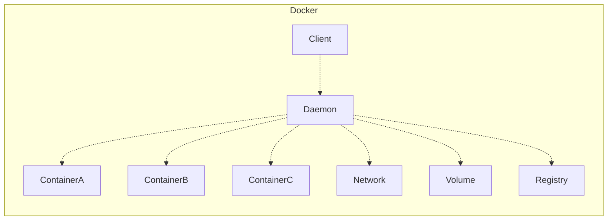
```mermaid
graph LR
    subgraph Docker
    Client-.->Daemon
    Daemon-.->ContainerA
    Daemon-.->ContainerB
    Daemon-.->ContainerC
    Daemon-.->Network
    Daemon-.->Volume
    Daemon-.->Registry
    end
```

其中:

* Client:客户端,提供了CLI工具来与Daemon交互,如docker build、docker run等。
* Daemon:守护进程,负责与客户端交互,管理容器、网络、存储等资源。
* Container:容器,提供了一个隔离的运行环境,包含应用程序及其依赖。
* Network:网络,提供了容器间的网络连接和通信。Docker内置了bridge、host、none等网络驱动。
* Volume:存储,提供了容器间的数据共享和持久化。Docker支持bind mount、volume等存储驱动。
* Registry:镜像仓库,提供了镜像的存储和分发。Docker官方提供了Docker Hub公共仓库,也可以搭建私有仓库。

使用Docker部署微服务的流程如下:

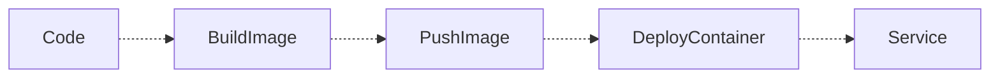
```mermaid
graph LR
    Code-.->BuildImage
    BuildImage-.->PushImage
    PushImage-.->DeployContainer
    DeployContainer-.->Service
```

1. 编写应用代码,包括业务逻辑、配置文件、依赖描述等。
2. 编写Dockerfile,描述如何构建Docker镜像,包括基础镜像、构建步骤、暴露端口、启动命令等。如:

```dockerfile
FROM openjdk:8-jdk-alpine
COPY target/user-service.jar app.jar
EXPOSE 8080
ENTRYPOINT ["java","-jar","/app.jar"]
```

3. 构建Docker镜像,将应用代码和依赖打包成一个独立的镜像。如:

```bash
docker build -t user-service:v1 .
```

4. 推送Docker镜像到镜像仓库,供后续部署使用。如:

```bash
docker push registry.example.com/user-service:v1
```

5. 部署Docker容器,从镜像仓库拉取镜像,启动容器。如:

```bash
docker run -d --name user-service -p 8080:8080 registry.example.com/user-service:v1
```

6. 访问服务,通过容器暴露的端口或网络访问服务的API。

相比传统的部署方式,容器化有以下优势:

* 环境一致:容器提供了一致的运行环境,避免了"在我机器上可以跑"的问题。
* 快速部署:容器可以在秒级启动,部署速度快。
* 资源隔离:容器提供了进程、网络、文件系统的隔离,避免了资源冲突。
* 弹性伸缩:容器可以快速扩容和缩容,响应业务的变化。
* 依赖解耦:容器将应用程序与基础设施解耦,开发人员专注应用本身。

当然,容器化也有一些挑战:

* 学习成本:容器技术体系庞大,需要一定的学习成本。
* 镜像管理:需要有效管理大量的容器镜像,包括版本控制、安全扫描、生命周期管理等。
* 网络配置:容器间的网络通信需要合理配置,如服务发现、负载均衡、网络安全等。
* 数据持久化:容器的生命周期通常较短,需要合理处理容器内的数据持久化。
* 日志收集:容器的日志需要集中收集和管理,否则容易丢失。
* 监控告警:容器的监控和告警与传统环境不同,需要适配新的监控体系。

对于这些挑战,本平台采取了以下措施:

* 统一技术选型:在公司范围内统一容器技术选型,包括容器引擎、镜像仓库、网络方案等,减少学习成本。
* 搭建镜像仓库:搭建Harbor私有镜像仓库,提供企业级的镜像管理功能,如RBAC、镜像扫描、镜像复制等。
* 容器网络方案:采用Kubernetes的CNI插件,提供容器的服务发现、负载均衡、网络隔离等能力。
* 数据持久化:采用Kubernetes的PV/PVC机制,将存储与容器解耦,支持多种存储插件,如Ceph、NFS等。
* 日志收集:采用ELK日志收集方案,通过Filebeat收集容器日志,Logstash解析和转换,Elasticsearch存储和检索。
* 监控告警:采用Prometheus监控体系,通过node-exporter、cadvisor等收集主机和容器指标,Grafana展示,AlertManager告警。

总之,容器化是微服务时代的必然选择。通过容器,我们可以实现微服务的标准化交付和运维,提高了开发和运维的效率。同时,容器也是云原生、Serverless等新技术的基石。

7.4 编排工具

有了容器,微服务的部署变得方便多了。但当服务数量达到百级、集群规模达到千节点时,单纯的容器部署也力不从心了。这时就需要有一个称职的编排工具,来管理大规模的容器集群。

本平台选择Kubernetes(k8s)作为容器编排工具。Kubernetes源自Google Borg,是Google十多年大规模容器集群管理经验的结晶。Kubernetes提供了声明式的API,将容器orchestration(编排)、scheduling(调度)、bin packing(装箱)、self-healing(自愈)等能力从基础设施抽象出来,大大简化了容器集群的管理。

Kubernetes的架构如下:

```mermaid
graph TD
    subgraph Master
    APIServer
    Scheduler
    ControllerManager
    ETCD
    end

    subgraph Node
    Kubelet-.->APIServer
    KubeProxy-.->APIServer
    ContainerRuntime-.->Kubelet
    PodA-.->Kubelet
    PodB-.->Kubelet
    end

    Client-.->APIServer
```

其中:

* Master:Kubernetes的控制平面,负责整个集群的管理。
  * APIServer:提供了Kubernetes的REST API,是整个系统的入口。
  * Scheduler:负责Pod的调度,根据调度算法将Pod分配到合适的Node。
  * ControllerManager:负责维护集群的状态,如副本数、服务端点等。
  * ETCD:分布式键值存储,存储了整个集群的状态。
* Node:Kubernetes的工作节点,负责运行容器应用。
  * Kubelet:负责维护容器的生命周期,如创建、启动、停止等。
  * KubeProxy:负责为Service提供集群内的服务发现和负载均衡。
  * ContainerRuntime:容器运行时,如Docker、Containerd等。
* Client:操作Kubernetes的客户端,如kubectl、各语言的client library等。

Kubernetes中有几个重要的概念:

* Pod:Kubernetes的最小部署单元,由一个或多个容器组成,共享存储和网络。
* Service:为一组Pod提供一个稳定的网络身份,实现服务发现和负载均衡。
* Deployment:描述了一组Pod的期望状态,提供了声明式的更新能力。
* Namespace:提供了一种逻辑隔离机制,将对象划分到不同的Namespace。

下面是一个部署微服务到Kubernetes的示例:

1. 编写Deployment文件,描述微服务的期望状态:

```yaml
apiVersion: apps/v1
kind: Deployment
metadata:
  name: user-service
spec:
  replicas: 3
  selector:
    matchLabels:
      app: user-service
  template:
    metadata:
      labels:
        app: user-service
    spec:
      containers:
      - name: user-service
        image: registry.example.com/user-service:v1
        ports:
        - containerPort: 8080
```

这里定义了一个名为user-service的Deployment,期望有3个副本,使用registry.example.com/user-service:v1镜像,监听8080端口。

2. 编写Service文件,暴露微服务:

```yaml
apiVersion: v1
kind: Service
metadata:
  name: user-service
spec:
  selector:
    app: user-service
  ports:
  - port: 80
    targetPort: 8080
```

这里定义了一个名为user-service的Service,将流量导到带有app=user-service标签的Pod,并将80端口映射到容器的8080端口。

3. 应用到Kubernetes集群:

```bash
kubectl apply -f user-service.yaml
```

这一命令会将上述Deployment和Service提交到Kubernetes APIServer,由Kubernetes负责创建Pod、更新Service等。

4. 查看部署状态:

```bash
kubectl get deploy
kubectl get po
kubectl get svc
```

这些命令可以查看Deployment、Pod、Service的状态和细节。

相比直接使用容器,Kubernetes带来了以下好处:

* 声明式API:用户只需要声明期望状态,Kubernetes负责实现和维护。
* 服务发现和负载均衡:Kubernetes提供了内置的Service机制,实现服务注册、发现和负载均衡。
* 自愈能力:当Pod或Node故障时,Kubernetes会自动重启或重建,保证应用的高可用。
* 滚动升级:Kubernetes支持滚动更新Deployment,可以平滑升级应用,不中断业务。
* 弹性伸缩:Kubernetes支持手动和自动伸缩Pod,可以应对突发流量。
* 存储编排:Kubernetes支持多种存储插件,可以自动挂载存储到容器。
* 批处理:Kubernetes支持一次性和定时的批处理任务。

当然,Kubernetes也不是银弹,它也有一些局限:

* 学习成本高:Kubernetes概念众多,学习曲线陡峭。
* 配置复杂:Kubernetes的配置项和API众多,上手不易。
* 升级风险大:Kubernetes版本更新频繁,升级可能导致兼容性问题。
* 调试不便:分布式环境下,调试应用比单体困难。
* 运维负担重:Kubernetes集群本身的运维也是一个挑战。

针对这些问题,本平台采取了以下措施:

* 成立专门的平台团队,负责Kubernetes的落地和推广,为业务团队提供培训和咨询。
* 将Kubernetes作为PaaS平台的底座,在其上构建了更高层次的应用管理功能,屏蔽了底层复杂性。
* 采用灰度发布、金丝雀发布等策略,降低Kubernetes升级的风险。
* 提供了统一的日志、监控、调试工具,方便开发人员排查问题。
* 借助云厂商的托管Kubernetes服务,如AKS、EKS等,简化了集群运维。

可以说,Kubernetes是容器编排的事实标准,也是云原生的核心。结合容器和Kubernetes,微服务获得了标准化的交付和运维方式。同时,Serverless、Service Mesh、GitOps等新技术也在Kubernetes的基础上不断演进。

8. 非功能需求

前面我们重点讨论了微服务架构的功能性需求,即系统应该做什么。但一个成功的微服务系统,除了要满足业务功能,还要满足一系列非功能性需求,即系统应该如何做。

非功能性需求关注系统的质量属性,如性能、可靠性、安全性、可维护性等。这些需求往往决定了系统能否在生产环境中稳定运行,能否长期支撑业务发展。

接下来,我们将重点讨论本平台在几个关键非功能需求方面的设计和实践。

8.1 性能与可扩展性

性能是衡量系统处理能力的重要指标,主要包括响应时间、吞吐量、并发数等。可扩展性则衡量了系统应对业务增长的能力,即当用户数、数据量、请求量增加时,系统能否通过扩容保持性能稳定。

本平台对性能和可扩展性提出了以下目标:

* 响应时间:95%的请求在500ms内返回,99%的请求在1s内返回。
* 吞吐量:系统能支持每秒10万次请求,在促销高峰期能支持每秒50万次请求。
* 并发数:系统能支持5万并发用户,在促销高峰期能支持10万并发用户。
* 数据量:系统能支持100亿条记录,每天新增1000万条记录。
* 扩展性:系统能通过添加机器,实现吞吐量、并发数的线性扩展。

为了实现这些目标,本平台采取了以下措施:

1. 服务拆分:将单体应用拆分成多个微服务,每个服务负责一个有限的功能,避免了单点瓶颈。
2. 服务集群化:将每个微服务部署为一个集群,通过负载均衡实现高可用和水平扩展。
3. 缓存:在多个层次使用缓存(如Browser Cache、CDN、Nginx Cache、Redis等),降低后端服务的压力。
4. 异步通信:对于非实时的请求,采用消息队列异步处理,削

## Prompt:
undefined

## Response:
峰填谷。 5. 数据分片:对于大表,按照某个键(如用户ID、时间等)分片,提高查询和写入性能。 6. 数据冗余:对于频繁访问的数据,在服务层冗余一份,避免跨服务调用。 7. 数据缓存:对于读多写少的数据,采用缓存(如Redis、Memcached),降低数据库压力。 8. 搜索引擎:对于搜索、统计等需求,采用搜索引擎(如Elasticsearch),而非关系型数据库。 9. 非关系型数据库:对于非结构化、半结构化数据,采用非关系型数据库(如MongoDB、HBase),而非关系型数据库。 10. 多级存储:根据数据的访问频率,采用多级存储(如SSD、SATA、Tape),平衡性能和成本。 11. 资源隔离:在关键服务上采用资源隔离(如独占主机、网络QoS),避免资源争用。 12. 自动扩缩容:采用Kubernetes的HPA(Horizontal Pod Autoscaler),根据CPU、内存等指标自动扩缩容。 13. 服务降级:在流量高峰期,对非核心服务进行降级(如简化页面、去除推荐),确保核心服务的性能。 14. 压测:定期对系统进行压力测试,评估系统的容量和瓶颈,指导优化。

下面以一个电商的订单服务为例,看看如何在架构层面优化性能:

```mermaid
graph LR
    Client-->Nginx
    Nginx-->OrderService
    subgraph OrderService
    OrderWeb(OrderWeb)-->OrderCache(OrderCache)
    OrderWeb(OrderWeb)-->OrderDB(OrderDB)
    OrderWeb(OrderWeb)-.->InventoryService
    OrderWeb(OrderWeb)-.->ProductService
    end
    subgraph InventoryService
    InventoryWeb(InventoryWeb)-->InventoryCache(InventoryCache)
    InventoryWeb(InventoryWeb)-->InventoryDB(InventoryDB)
    end
    subgraph ProductService
    ProductWeb(ProductWeb)-->ProductCache(ProductCache)
    ProductWeb(ProductWeb)-->ProductDB(ProductDB)
    ProductWeb(ProductWeb)-.->SearchEngine
    end
```

其中:

1. Nginx作为反向代理,可以缓存静态资源,减轻应用服务器压力。
2. OrderService、InventoryService、ProductService都是独立的服务,可以分别扩容。
3. 每个服务都有自己的缓存和数据库,减少服务间调用。
4. 对于商品详情等查询多的请求,ProductService会优先查缓存。
5. 对于搜索请求,ProductService会查询SearchEngine,而非数据库。
6. OrderService创建订单时,异步更新库存和商品销量,而非同步调用。
7. 在大促等流量高峰期,可以考虑停止库存更新,事后补偿。

可以看到,微服务拆分、数据分层、异步解耦、缓存等手段,是提升系统性能和扩展性的关键。但同时也要警惕过度优化,增加了系统复杂度。性能优化要遵循二八原则,抓住关键点,用最小的成本获得最大的收益。

8.2 可用性与容错

可用性衡量了系统在面对各种故障时,仍能提供服务的能力。度量可用性的常见指标是"几个9",如2个9(99%)、3个9(99.9%)、4个9(99.99%)等。每多一个9,不可用时间减少10倍。

容错则是实现高可用的手段,即当系统的一部分组件失效时,不影响整个系统的运转。常见的容错手段有冗余、隔离、重试、限流、降级等。

本平台对可用性提出了以下目标:

* 核心服务:4个9,即月不可用时间小于5分钟。
* 非核心服务:3个9,即月不可用时间小于1小时。
* 故障恢复:故障发生后,核心服务在15分钟内恢复,非核心服务在30分钟内恢复。

为了实现这些目标,本平台采取了以下措施:

1. 冗余:在关键组件上采用主备、双活等冗余部署,避免单点故障。
2. 负载均衡:采用Nginx、K8s Service等实现流量的负载均衡,避免流量集中。
3. 服务集群化:将每个服务部署为一个集群,通过多实例提高可用性。
4. 异地多活:在多个机房、多个地域部署服务,实现异地容灾。
5. 限流:在网关、服务等层次对流量进行限制,避免过载。
6. 熔断:当下游服务异常时,快速失败,避免过载。
7. 降级:当服务负载过高时,对非核心功能进行降级,确保核心功能可用。
8. 超时和重试:设置适当的超时时间,并在超时后重试,提高请求成功率。
9. 幂等设计:对于非幂等的请求,设计幂等机制,如去重表、唯一约束等。
10. 定期演练:定期进行故障演练,如混沌工程,检验系统的容错能力。
11. 监控告警:全方位监控系统的性能、错误、异常,及时告警。
12. 快速回滚:当发布引入故障时,能快速回滚到上一个稳定版本。

下面以一个电商的订单服务为例,看看如何设计其高可用架构:

```mermaid
graph TD
    Client-->Nginx-Master
    Client-->Nginx-Slave
    Nginx-Master-->OrderService-Master
    Nginx-Slave-->OrderService-Slave
    OrderService-Master-->OrderDB-Master
    OrderService-Slave-->OrderDB-Slave
    OrderDB-Master-.->OrderDB-Slave
```

其中:

1. Nginx和OrderService都采用主备部署,Nginx通过Keepalived实现VIP漂移,OrderService通过K8s Deployment实现。
2. 主备Nginx和主备OrderService分别部署在不同机房,实现异地容灾。
3. Nginx和OrderService中都设置了限流和熔断规则,避免下游的慢响应或异常导致上游过载。
4. OrderService访问OrderDB时,设置合理的超时时间,并在超时或异常时重试。
5. OrderDB采用主从复制,实现读写分离,提高可用性。同时从库也可作为备库,在主库故障时接管服务。
6. 对于创建订单等关键流程,设计幂等机制,如根据订单号去重,避免重复下单。
7. 定期对系统进行混沌工程演练,如随机关闭服务实例、注入网络延迟等,验证系统的容错能力。

提高系统的可用性是一个综合的工程,需要在架构设计、部署策略、容错机制、运维手段等方面多管齐下。同时,也要权衡可用性和成本的平衡,过度追求可用性可能带来复杂度和成本的提升。

8.3 安全性

安全是系统的生命线,是公司声誉和客户信任的基石。当前,互联网系统面临的安全威胁日益增多,如DDoS攻击、SQL注入、XSS攻击、信息泄露等,需要在架构设计之初就重视安全防护。

本平台对安全性提出了以下目标:

* 漏洞:对已知漏洞,在中危及以上漏洞发现后的7天内修复。
* 攻击:对常见的Web攻击,如注入、XSS等,能有效防范。
* 传输:对敏感数据的传输,全程采用SSL/TLS加密。
* 存储:对敏感数据的存储,采用加密、脱敏等手段保护。
* 权限:对用户的操作,严格验证权限,遵循最小权限原则。

为了实现这些目标,本平台采取了以下措施:

1. 安全通信:站点采用HTTPS,服务间通信采用TLS,保证通信安全。
2. 输入校验:对用户的所有输入,在前端和后端进行安全校验,如长度、格式、特殊字符等。
3. 多因素认证:对于敏感操作,除了密码,还需要短信验证码、人脸识别等多重认证。
4. RBAC权限:采用基于角色的权限控制,根据用户的角色分配权限,实现权限的最小化。
5. 数据隔离:不同租户的数据,物理或逻辑隔离,避免数据泄露。
6. 数据加密:对敏感数据,如密码、身份证等,采用不可逆的加密算法,并使用独立的密钥。
7. 数据脱敏:在开发、测试环境,对生产数据进行脱敏处理,如掩码、置换等。
8. SQL防注入:采用参数化查询,对SQL进行预编译,避免SQL注入。
9. XSS防御:采用输入过滤和输出编码,避免XSS攻击。
10. CSRF防御:采用CSRF Token等机制,避免CSRF攻击。
11. 安全头:启用安全相关的HTTP头,如HSTS、X-Frame-Options等。
12. 安全扫描:定期对系统进行安全扫描,发现和修复漏洞。
13. 漏洞奖励:建立漏洞奖励机制,鼓励白帽子提交漏洞。
14. 安全意识:加强开发、运维等人员的安全意识教育,提高安全开发能力。

下面以一个支付服务为例,看看如何设计其安全架构:

```mermaid
graph LR
    Client-->WAF
    WAF-->Nginx
    Nginx-->PaymentService
    PaymentService-.->TokenService
    PaymentService-->PaymentDB
    PaymentDB-.->DBAudit
    Client-.->SmsService
```

其中:

1. 在Nginx前加一层WAF(Web Application Firewall),对常见的Web攻击进行拦截。
2. Nginx和PaymentService之间,PaymentService和数据库之间,都采用TLS加密通信。
3. PaymentService对外只暴露HTTPS接口,禁止HTTP访问。
4. PaymentService对敏感参数,如金额、卡号等,在日志中脱敏。
5. PaymentService对卡号、CVV等敏感信息,仅传递不存储,或者采用可逆加密存储。
6. PaymentService采用TokenService进行用户身份认证,不在自身维护Session。
7. PaymentService对转账、提现等敏感操作,要求用户进行二次验证,如短信验证码。
8. PaymentDB对表名、字段名进行加密,提高数据安全性。
9. PaymentDB开启审计日志,记录所有的增删改操作,便于事后审计。
10. 客户端在调用PaymentService前,需要向SmsService获取短信验证码,防止短信轰炸。

安全无小事,需要在制度流程、系统架构、运营监控等方面共同发力。在实际落地中,要区分核心和非核心领域,对不同领域采取不同的安全策略。同时,也要平衡安全与用户体验,过度的安全措施可能带来体验的下降。总之,要在安全、成本、体验之间找到平衡,真正将安全落到实处。

8.4 可维护性

可维护性衡量了系统在运维阶段的易管理、易维护、易扩展的能力。对于复杂的微服务系统,随着时间推移,如何保证系统架构的持续演进,避免腐化和僵化,是一个重大挑战。

本平台对可维护性提出了以下目标:

* 监控覆盖率:核心服务的监控覆盖率达到100%,非核心服务达到80%。
* 故障发现时间:故障发生后,监控系统在5分钟内发现,并通知相关人员。
* 故障定位时间:故障发生后,运维人员在30分钟内定位根因。
* 代码可读性:关键服务的圈复杂度不超过15,其他服务不超过25。
* 文档覆盖率:所有服务都有架构设计文档,覆盖率100%。
* 单元测试覆盖率:核心服务的单元测试覆盖率达到80%,非核心服务达到60%。

为了实现这些目标,本平台采取了以下措施:

1. 全链路监控:采用Prometheus+Grafana等进行指标监控,采用Elastic APM、SkyWalking等进行链路追踪,做到监控可视化、故障可定位。
2. 集中日志:采用ELK等日志系统,将所有服务的日志集中收集、存储、分析,便于故障排查和行为分析。
3. 报警通知:对关键指标设置阈值,触发时通过短信、电话、微信等方式通知值班人员,及时止损。
4. 代码规范:制定代码规范,如缩进、命名、注释等,提高代码的可读性和

## Prompt:
undefined

## Response:
可维护性。 5. 代码审查:建立代码审查机制,如CodeReview、结对编程等,及早发现代码缺陷和不规范。 6. 架构评审:定期对系统架构进行评审,识别架构风险,制定改进计划。 7. 重构:对不合理的设计和实现,及时重构,避免欠债累累,难以维护。 8. 分支管理:采用GitFlow等分支管理模型,明确开发、测试、生产等环境的代码分支。 9. 文档即代码:采用Markdown、Swagger等工具,在代码中写文档,保证文档的及时性和准确性。 10. 知识管理:建立Wiki等知识库,记录系统的架构、设计、规范、流程等,方便新人上手。 11. 故障复盘:对每次故障,召开故障复盘会,分析根因,制定防范措施,并形成文档。 12. 压测:定期对系统进行压力测试,了解系统容量,找出性能瓶颈,指导优化。 13. 混沌工程:定期对系统进行混沌实验,如模拟服务失效、网络中断等,提高系统的容错性。 14. 灰度发布:采用灰度发布策略,先在一小部分服务器或用户上发布,验证新版本的可用性。

下面以监控和日志为例,看看如何设计可维护的运维架构:

```mermaid
graph TD
    subgraph 服务集群
    ServiceA-.->|JVM指标|Prometheus
    ServiceA-.->|调用链|Skywalking
    ServiceA-.->|日志|Filebeat
    ServiceB-.->|JVM指标|Prometheus
    ServiceB-.->|调用链|Skywalking
    ServiceB-.->|日志|Filebeat
    end
    Prometheus-->Grafana
    Skywalking-->Grafana
    Filebeat-->Kafka
    Kafka-->Logstash
    Logstash-->Elasticsearch
    Elasticsearch-->Kibana
    Grafana-->|告警|AlertManager
    AlertManager-.->|通知|OpsTeam
```

其中:

1. 每个服务都集成Prometheus SDK,暴露JVM、服务等指标。
2. Prometheus服务定期拉取各服务的指标,存储在时序数据库中。
3. Grafana从Prometheus查询指标,绘制成监控大盘。
4. 每个服务都集成Skywalking Agent,上报调用链数据。
5. Skywalking服务接收调用链数据,实现分布式追踪。
6. 在Grafana中集成Skywalking,可视化调用链,便于故障定位。
7. 每个服务通过Filebeat采集日志,发送到Kafka。
8. Logstash从Kafka消费日志,过滤后存储到Elasticsearch。
9. Kibana从Elasticsearch查询日志,实现日志的搜索和分析。
10. 在Grafana中设置关键指标的告警规则,触发时通知AlertManager。
11. AlertManager根据告警策略,通过邮件、短信、电话等方式通知运维人员。

可以看到,通过Prometheus、Skywalking、ELK等开源产品,可以快速搭建一套覆盖监控、追踪、日志的运维体系。再结合代码管理、自动化测试、发布流程等,就可以大大提高系统的可维护性,降低运维成本。

可维护性反映了一个软件团队的技术素质和管理水平,需要在开发、测试、运维等各个阶段共同努力。好的架构如同一座大厦,需要打好地基,需要精心设计,更需要日常维护。只有在可维护性上下足功夫,才能让系统经得起时间的考验,支撑业务的长期发展。

8.5 数据隐私与合规

在大数据时代,用户数据已成为企业的核心资产。然而,频繁的数据泄露事件,也让用户的数据隐私面临巨大挑战。全球各地相继出台了严格的数据保护法规,如GDPR、CCPA等,对企业的数据收集、存储、使用、转移等行为提出了更高的合规要求。

本平台作为一个面向C端用户的互联网应用,每天会采集、处理海量的用户数据。对此,我们高度重视用户的数据隐私保护和法规遵从,提出了以下目标和要求:

1. 最小够用原则:只收集必要的用户数据,不过度收集。
2. 授权同意原则:收集用户数据前,必须获得用户的明示同意。
3. 目的限定原则:只将用户数据用于约定的目的,不挪作他用。
4. 保护存储原则:采取严格的安全措施,保护用户数据的存储。
5. 加密传输原则:在网络上传输用户数据,必须进行加密。
6. 访问控制原则:严格限制对用户数据的访问,按需分配权限。
7. 委托管理原则:若将用户数据委托第三方处理,必须审慎评估其资质,并与其签署严格的数据处理协议。
8. 销毁处置原则:对不再需要的用户数据,及时进行彻底销毁。
9. 数据可携原则:若用户请求,应提供其数据的副本,并允许其携带到其他服务。
10. 透明公开原则:应向用户公开数据收集的目的、方式、期限等,并提供用户更正、删除数据的渠道。
11. 责任认定原则:应指定专门的数据保护负责人,对数据合规负首要责任。
12. 违规问责原则:对违反数据保护规定的行为,应进行严肃问责。

为了落实这些原则,本平台在架构设计中采取了以下措施:

1. 敏感数据识别:对平台采集的用户数据进行分类分级,识别出哪些属于敏感数据,如身份证号、手机号、宗教信仰等。
2. 脱敏存储:对敏感数据进行脱敏后存储,如仅存储手机号的MD5值,仅存储身份证的省市信息等。
3. 加密存储:对高度敏感的数据进行加密存储,加密密钥由独立的KMS系统管理。
4. 访问隔离:针对不同的数据,设置不同的访问权限和访问途径,避免越权访问。
5. 水印防泄漏:对导出的数据文件添加水印,标记其来源,一旦泄漏可快速定位。
6. 操作审计:对用户数据的重要操作,如导出、复制、删除等,进行详细的审计记录。
7. 数据分级销毁:根据数据的敏感级别,设置不同的留存期限,过期后进行销毁。销毁需两人以上同时在场,并录像存档。
8. 员工上岗审核:对有权接触用户数据的岗位,如DBA、业务运营等,严格背景审查,并签署保密协议。
9. 供应商评估:对涉及用户数据的外包服务,如云服务、数据标注等,对供应商进行严格的资质和安全评估。
10. 隐私影响评估:对涉及大规模用户数据处理的项目,如用户画像、数据分析等,开展隐私影响评估,并呈报监管机构批准。
11. 数据泄露应急:制定数据泄露应急预案,包括泄露确认、影响分析、信息披露、补救措施等,并定期演练。
12. 隐私保护培训:对全体员工开展数据隐私保护培训,树立隐私保护意识,掌握相关流程和要求。

下图展示了数据分级管理的架构:

```mermaid
graph TD
    User-->DataCollection(数据采集服务)
    DataCollection--个人信息-->PIIIdentification(敏感信息识别)
    DataCollection--其他信息-->DataStore1[数据库1]
    PIIIdentification--手机号、身份证等-->Encryption(加密)
    PIIIdentification--姓名、性别等-->Mask(掩码)
    PIIIdentification--购物记录等-->DataStore2[数据库2]
    Encryption--加密数据-->EncryptedStore[加密库]
    Mask--脱敏数据-->DataStore2[数据库2]
    EncryptedStore-->PrivilegedAccess{特权访问}
    DataStore1-->NormalAccess{普通访问}
    DataStore2-->NormalAccess{普通访问}
    PrivilegedAccess--审计-->AuditLog[审计日志]
    AuditLog--异常-->AlertSystem(告警系统)
```

从图中可以看出:

1. 对采集的数据,首先进行敏感信息识别。
2. 高度敏感的信息,如手机号、身份证等,进行加密后,存入独立的加密库。对加密库的访问要进行严格的权限控制和审计。
3. 中度敏感的信息,如姓名、性别等,进行掩码脱敏后,与其他非敏感信息存储在一起。
4. 对敏感数据的访问,特别是加密库的访问,要细粒度控制权限,并记录详细的审计日志。
5. 对审计日志进行异常行为分析,发现可疑操作要立即告警。

总之,数据安全与隐私保护已成为企业必须高度重视的问题。只有将其纳入架构设计之中,并付诸实施,才能在数字经济时代赢得用户信任,实现可持续发展。同时,这也是企业不得不承担的法律责任和社会责任。

9. 演进路线

前面我们详细阐述了在线数据服务平台的业务架构、应用架构、技术架构、部署架构和非功能需求,勾勒出了一个宏大的蓝图。但是,架构不是一蹴而就的,需要在实践中不断探索和演进。本章我们将展望平台架构的演进路线,包括当前阶段、下一步计划和长期愿景。

9.1 当前阶段

目前,平台已经完成了第一版的架构设计和开发,实现了基础的业务功能和技术方案,包括:

1. 初步梳理了平台的业务架构,识别了用户、数据、服务等核心域,建立了领域模型。
2. 拆分了平台的核心微服务,包括用户服务、元数据服务、数据集成服务、数据处理服务、数据服务、计费服务等。
3. 搭建了微服务治理的基础设施,如服务注册中心、配置中心、API网关、链路追踪等。
4. 建立了初步的数据架构,引入了多个异构数据库,支持了关系型、文档型、时序型、图型等多种数据。
5. 实现了异步通信机制,通过Kafka等消息队列解耦了服务依赖。
6. 容器化了服务的交付方式,通过Docker和Kubernetes实现了服务的自动化部署、调度和伸缩。
7. 建立了全链路监控体系,包括指标监控、链路追踪、日志管理等,实现了问题的快速发现和定位。
8. 设计了系统的安全方案,包括认证授权、数据加密、访问控制等,保障了系统和数据的安全。

当前版本为平台奠定了坚实的架构基础,可以支撑平台的基本运转。但是,平台在功能、性能、稳定性等方面还有不少改进空间,需要在后续版本中持续优化。

9.2 下一步计划

基于当前阶段的经验和反馈,我们对平台的架构进行了复盘,识别出了一些亟待改进的问题,主要包括:

1. 业务建模不够精细,领域边界划分还不够清晰,影响了服务的内聚性。
2. 服务粒度还不够合理,有些服务过于庞大,有些服务过于细碎,影响了开发和维护效率。
3. 服务的通信效率还不够高,有些服务之间还存在较多的同步调用,影响了性能。
4. 数据一致性还不够强,异步通信可能导致数据短暂不一致,需要补偿机制。
5. 缓存的使用还不够规范,缓存与数据库的一致性保证还不够完善。
6. 弹性伸缩的效果还不够好,有些服务的资源利用率还比较低。
7. 故障隔离和容错机制还不够健壮,可能发生连锁反应。
8. 数据安全和隐私保护还需加强,在数据脱敏、数据权限等方面下更大功夫。
9. 自动化运维程度还不够高,发布、变更等过程还需要人工介入。

针对这些问题,我们制定了下一步的演进计划,包括:

1. 进一步细化领域模型,合并相近的子域,拆分不相干的子域,提高领域的内聚性

## Prompt:
undefined

## Response:
2. 优化服务边界,根据业务的频率、体量、依赖等,调整服务的粒度,兼顾内聚性和独立性。
3. 引入反应式编程,如Spring WebFlux、Vert.x等,实现服务之间的异步非阻塞通信。
4. 在关键业务中引入分布式事务,如TCC、Saga等,保证最终一致性。对于次要业务,通过补偿、对账等异步机制实现最终一致性。
5. 制定缓存使用规范,明确缓存更新策略,缓存与数据库一致性策略。对于修改频繁的数据,采用 Cache Aside 模式;对于修改不频繁的数据,采用 Write Behind 模式。
6. 优化服务的资源配置,根据服务的负载特征,在 Kubernetes 中设置恰当的 Request 和 Limit。结合 HPA、VPA 等实现更精细的弹性伸缩。
7. 加强服务的容错性,如引入 Sentinel、Resilience4j 等框架,对服务进行限流、熔断、降级。优化服务的超时和重试机制,防止雪崩效应。
8. 制定更完善的数据分级分类标准,对敏感数据进行脱敏和加密。实施更严格的数据访问权限控制,将权限控制到行级别。增加数据访问审计功能。
9. 提高运维自动化程度,通过 GitOps 等实践,将发布、变更等操作标准化、自动化。引入混沌工程,通过故障演练增强系统韧性。

以上计划涵盖了从业务建模到部署运维等各个环节,目标是进一步提升平台的性能、可靠性、安全性和敏捷性。这些计划拟在未来 6~12 个月内分阶段实施,并根据实施效果进行动态调整。

9.3 长期愿景

展望未来 3~5 年,我们对平台的架构有以下长期愿景:

1. 从数据服务平台向数据生态平台演进。将平台向上游的数据源和下游的数据消费方开放,吸引更多的参与者接入,形成多方共创、多方受益的数据生态。
2. 从批处理为主向流批一体演进。随着实时数据的比例不断提高,批处理和流处理需要统一起来,形成端到端的实时数据处理链路。引入 Flink、Pulsar 等流批一体框架,简化架构复杂度。
3. 从数据孤岛向数据网络演进。打通企业内部各系统的数据壁垒,实现数据的全域贯通。同时引入数据网络(Data Mesh)思想,将数据治理职责下沉到各个域,实现去中心化治理。
4. 从经验驱动向数据智能演进。借助机器学习、知识图谱等技术,让系统具备自我学习、自我优化、自我进化的能力。数据分析从描述性为主,向预测性、规范性拓展。
5. 从中心化平台向联邦学习演进。利用联邦学习、多方安全计算等技术,在不触碰用户原始数据的前提下,实现数据价值的共享。突破数据孤岛和隐私保护的桎梏,开辟数据协作的新模式。
6. 从领域服务向 DDD 演进。进一步领域建模,运用事件风暴等手段,识别领域事件,建立领域通用语言。运用六边形架构、CQRS、Event Sourcing 等 DDD 战术,实现业务逻辑与技术实现的解耦。
7. 从集中式服务网格向无服务器演进。当前服务网格主要还是集中控制平面,未来将向去中心化控制平面发展,边缘节点将承担更多的流量治理职责。无服务器将成为主流开发范式,Knative、Dapr 等将成为新的服务治理基础设施。
8. 从支撑系统向核心系统演进。随着企业数字化转型的深入,数据将成为企业的核心资产,数据平台也将从支撑系统上升为核心系统。平台架构需要在性能、可用性、安全性、可扩展性等方面达到更高的标准。

这些长期愿景反映了数据技术和平台架构的发展趋势,是我们的终极目标和方向指引。但是,由于技术、业务、组织等因素的不确定性,长期规划往往很难准确预测。因此,我们在制定和实施长期规划时,需要保持开放和敏捷的心态,随时根据环境变化调整策略,通过持续试错和迭代来逐步逼近愿景。这就像一个航海家,既要掌握大方向的航道,又要根据海况和天气随时调整帆向。

总之,平台架构的演进是一个不断探索和优化的过程,需要在理想和现实、远期和近期之间寻求平衡。这就像攀登一座高峰,当前阶段是山脚的大本营,下一步计划是通向山腰的路线图,长期愿景则是山巅的旗帜。我们既要脚踏实地,一步一个脚印,完成近期目标;又要仰望星空,时刻校准方向,向着终极愿景前行。正所谓"不积跬步,无以至千里;不积小流,无以成江海"。让我们携手并进,共同描绘数据服务平台的宏伟蓝图!

10. 附录

10.1 名词解释

这里列举了文档中出现的一些技术名词及其解释,方便读者理解:

* OLTP:Online Transaction Processing,在线事务处理,指对数据进行实时的查询、更新等操作,如销售系统、订单系统等。
* OLAP:Online Analytical Processing,在线分析处理,指对大量数据进行复杂的分析查询,如数据仓库、商业智能等。
* ETL:Extract-Transform-Load,数据提取、转换、加载,指将数据从来源端经过抽取、清洗、转换最终加载到目的端的过程。
* CRUD:Create-Read-Update-Delete,数据的增删改查操作。
* CAP:Consistency-Availability-Partition Tolerance,分布式系统的三个指标,分别代表一致性、可用性、分区容错性。
* BASE:Basically Available-Soft State-Eventually Consistent,基本可用、软状态、最终一致,是对 CAP 的一种权衡,强调可用性和最终一致性。
* Sharding:分片,指将大表或大集合根据某个 Key 分散存储到多个节点,以提高性能和可扩展性。
* Cache Aside:缓存侧路,指在查询数据时,先查缓存,缓存没有再查库,然后将结果写入缓存。
* Write Behind:异步缓存写入,指在更新数据时,先更新缓存,然后异步批量写入数据库。
* CQRS:Command Query Responsibility Segregation,命令查询职责分离,指将数据写入和查询分离到不同的模型中,写入侧重领域模型,查询侧重视图模型。
* Event Sourcing:事件溯源,指不保存数据的最新状态,而是保存引起状态变化的事件,通过追溯事件来还原状态。
* TCC:Try-Confirm-Cancel,一种补偿型事务,指将事务拆分为两个阶段,Try 阶段检查并预留资源,Confirm 阶段确认执行,Cancel 阶段取消执行。
* Saga:一种补偿型事务,指将长事务拆分为多个短事务,每个短事务都有对应的补偿动作,通过正向执行和反向补偿来保证最终一致性。
* Data Mesh:数据网格,一种去中心化的数据架构,强调领域数据的自治和共享。
* GitOps:一种持续交付模式,使用 Git 作为声明式基础设施和应用的单一事实来源。
* Knative:一个无服务器平台,用于在 Kubernetes 上构建、部署和管理现代无服务器工作负载。
* Dapr:Distributed Application Runtime,一个可移植的运行时,用于构建弹性、无状态和有状态的微服务应用。

10.2 参考资料

这里列举了撰写本文档时参考的一些资料,感谢前人的智慧结晶:

1. 《领域驱动设计》,Eric Evans,机械工业出版社,2016
2. 《企业IT架构转型之道:阿里巴巴中台战略思想与架构实战》,钟华,机械工业出版社,2017
3. 《企业应用架构模式》,Martin Fowler,人民邮电出版社,2004
4. 《微服务设计》,Sam Newman,人民邮电出版社,2016
5. 《数据密集型应用系统设计》,Martin Kleppmann,人民邮电出版社,2018
6. 《Kafka权威指南》,Neha Narkhede,人民邮电出版社,2017
7. 《分布式服务框架：原理与实践》,李林锋,电子工业出版社,2018
8. 《数据中台：让数据用起来》,郑言,机械工业出版社,2021
9. 《云原生模式》,Cornelia Davis,电子工业出版社,2019
10. 《数据安全架构设计与实战》,郑云文,机械工业出版社,2020
11. 《数据治理与数据安全》,于淼,电子工业出版社,2019
12. Data Mesh Principles and Logical Architecture,Zhamak Dehghani,martinfowler.com,2020
13. The Straw Man or Straw Person Fallacy,David Emery,thoughtco.com,2018
14. Streaming Systems,Tyler Akidau,oreilly.com,2018
15. Implementing Domain-Driven Design,Vaughn Vernon,oreilly.com,2013

以上就是我对在线数据服务平台的架构设计的全部内容。限于篇幅和能力,难免有遗漏和偏颇之处,还请各位读者批评指正。衷心希望这份架构文档能够为平台的建设和发展提供一些参考和启发。让我们携手共进,将数据的价值转化为生产力,用技术的创新驱动商业的变革!

## Prompt:
undefined

## Response:
根据当前阶段的架构复盘和下一步的演进计划,我建议优先开展以下工作,并列出了涉及的主要组件和中间件:

1. 细化领域模型,优化服务边界
   * 组件:领域建模工具,如 Event Storming、Domain Storytelling 等
   * 中间件:无
2. 引入反应式编程,实现服务异步通信
   * 组件:Spring WebFlux、Vert.x 等反应式框架
   * 中间件:Kafka、RabbitMQ 等消息队列
3. 关键业务引入分布式事务
   * 组件:Seata、Hmily 等分布式事务框架
   * 中间件:无
4. 制定缓存使用规范,保证缓存一致性
   * 组件:Spring Cache、Redisson 等缓存组件
   * 中间件:Redis、Memcached 等缓存中间件
5. 优化服务的资源配置,提高资源利用率
   * 组件:Kubernetes Metrics Server、Prometheus Adapter 等监控组件
   * 中间件:Prometheus、Grafana 等监控中间件
6. 加强服务的容错性,防止雪崩效应
   * 组件:Sentinel、Resilience4j 等容错框架
   * 中间件:无
7. 完善数据分级分类,加强数据安全
   * 组件:Apache Ranger、Apache Sentry 等数据安全组件
   * 中间件:Kafka Schema Registry 等数据治理中间件
8. 提高运维自动化程度,引入混沌工程
   * 组件:Chaos Mesh、Chaosblade 等混沌工程工具
   * 中间件:Spinnaker、Argo CD 等持续交付中间件

以上是我对下一步工作的优先级建议和涉及的主要组件与中间件。当然,具体的实施计划还需要根据团队的人员、技能、时间等实际情况来制定。

建议实施过程采用敏捷、迭代的方式,每个迭代周期确定 1~2 个主题,由架构师、开发、测试、运维等角色密切配合,快速完成方案设计、开发、测试和交付。在迭代过程中,要持续收集反馈,及时调整和优化,确保工作成果能够真正落地和产生价值。

需要强调的是,以上建议的主题并非相互独立,而是相辅相成的。比如,细化领域模型有助于识别服务边界,从而为引入分布式事务提供依据;引入反应式编程,既能优化服务通信,又为缓存使用提供新的思路;而数据安全和容错性则是提高自动化运维水平的基础。因此,在推进这些工作时,要注意协同规划、统筹兼顾,将其视为一个有机的整体。

同时,技术方案的选型和落地要与团队的能力相匹配。引入一项新技术或组件,除了考虑其功能和性能,还要评估团队对其的掌握程度。如果引入的技术太过超前或复杂,团队不能快速掌握和应用,反而会影响进度和质量。因此,在选择方案时,要兼顾其成熟度、学习曲线、社区活跃度等因素,必要时可以通过 POC(Proof of Concept)等方式进行验证和比选。

最后,架构演进是一个持续的过程,需要在实践中不断总结和改进。我们要建立架构评审、故障复盘等机制,定期检视架构的合理性和有效性,并根据反馈和心得及时优化和调整。同时,我们也要密切关注业界的新技术和趋势,学习优秀的架构案例和实践,用开放的心态拥抱变化,让我们的架构在创新中保持活力。

让我们携手并肩,一步一个脚印,将这些架构设计变为现实!我相信,通过我们的共同努力,一定能够打造出一个高性能、高可用、高扩展的在线数据服务平台,为用户提供极致的数据体验,为企业创造无限的数据价值!

