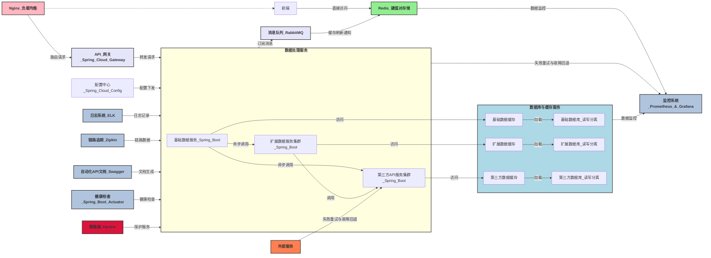

### 1. 初期设计

#### 1.1 设计需求摘要
1. 系统由三个核心服务组成:基础数据服务、扩展数据服务和第三方API服务。
2. 基础数据服务负责处理基本数据请求,并异步调用扩展数据服务和第三方API服务获取额外的数据。
3. 扩展数据服务和第三方API服务分别处理更复杂的数据计算和外部系统交互,它们的结果可以被缓存以提高效率。
4. 为了增强系统的容错性,每个服务都应配备断路器(如Hystrix/Resilience4j/Sentinel (Spring Cloud Circuit Breaker))。
5. 为了处理高并发和增加系统的可靠性,扩展数据服务和第三方API服务需要部署成集群。
6. 系统需要引入缓存(如Redis)来加速数据访问,为扩展数据和第三方数据分别设立专用的缓存实例。
7. 持久化数据需要存储在数据库中,并采用读写分离的部署方式。
8. 需要对系统进行全面的监控(如使用Prometheus和Grafana),以便实时了解系统的性能和健康状态。
9. 使用消息队列(RabbitMQ)实现了服务间的异步通信和缓存更新通知,提高系统的响应速度和数据一致性。
10. 集成了配置中心、日志收集、调用链追踪、API文档生成等多个辅助组件,从多方面提升系统的可运维性。

#### 1.2 Mermaid 图表

### 2.后期设计
#### 2.1 设计需求摘要
1. **数据流处理与实时分析**:
    * 为了实现实时的数据处理和分析,可以引入流处理平台(如Apache Kafka Streams、Apache Flink)来处理来自各个服务的事件数据, 通过对实时数据的处理和分析,可以快速发现系统anomaly,并触发自动化的修复和调整措施。
    * 对于一些非核心的、临时性的任务(如数据处理、报表生成等),可以考虑采用无服务器架构(如Spring Cloud Function框架、AWS Lambda、Google Cloud Functions)来实现。
2. **服务网格(Service Mesh)** :
    * 引入服务网格(如Istio或Linkerd)来管理服务间的通信、安全、观测等,提供更细粒度的流量控制、故障注入和断路等功能。
    * 服务网格可以与Kubernetes无缝集成,简化服务间的通信和部署。
3. **混沌工程(Chaos Engineering)** :
    * 在系统中引入混沌工程实践,通过故意注入故障(如随机终止服务实例、模拟网络延迟等)来验证系统的容错能力。
    * 混沌工程可以帮助找出系统中的薄弱点,并驱动团队不断完善架构设计和故障处理机制。
4. **分布式跟踪(Distributed Tracing)** :
    * 除了使用Zipkin进行调用链跟踪外,还可以考虑引入更强大的分布式跟踪解决方案,如Jaeger或SkyWalking。
    * 更高级的分布式跟踪系统如Jaeger或SkyWalking能够提供更多维度的数据(如拓扑图、性能瓶颈分析等),并与服务网格和Kubernetes集成,实现端到端的可观测性。
5. **安全加固** :
    * 除了API网关的认证和鉴权外,还应该对内部服务间的通信进行加密(如使用mTLS)。
    * 对敏感数据(如用户信息、密钥等)进行脱敏处理,并使用密钥管理服务(如HashiCorp Vault)统一管理密钥。
    * 定期进行安全审计和渗透测试,及时发现和修复潜在的安全漏洞。
    * 在系统中引入混沌工程实践,通过故意注入故障(如随机终止服务实例、模拟网络延迟等)来验证系统的容错能力,找出系统中的薄弱点,并驱动团队不断完善架构设计和故障处理机制。
6. **自动化运维与持续部署** :
    * 进一步完善CI/CD流程,实现从代码提交到生产部署的全自动化。
    * 引入基础设施即代码(Infrastructure as Code)实践,使用工具如Terraform或AWS CloudFormation管理基础设施。
    * 使用配置管理工具(如Ansible、Chef等)实现服务配置的统一管理和自动化部署。
    * 结合自愈机制(如Kubernetes Pod重启策略、Liveness&Readiness监测等),实现故障的自动检测和恢复。
    * 采用不可变基础设施(Immutable Infrastructure)理念,将服务打包为不可变的镜像或容器,通过版本控制和自动化部署来管理。
    * 引入服务网格(如Istio或Linkerd)来管理服务间的通信、安全、观测等,提供更细粒度的流量控制、故障注入和断路等功能。
    * 服务网格可以与Kubernetes无缝集成,简化服务间的通信和部署。
#### 2.3 设计目标
本系统设计的主要目标如下：
采用微服务架构，以Kubernetes为基础进行容器的编排和管理，从而实现服务的自动扩缩、自我修复和负载均衡。系统架构设计重点考虑了服务的解耦、系统的可伸缩性和容错能力。
- **高可用性** ：通过部署多个Kubernetes集群和使用服务网格技术，确保系统在不同的地理位置都能稳定运行。
- **可扩展性** ：系统采用模块化设计，能够根据业务需求动态扩展或缩减资源，无需停机维护。
- **安全性** ：整合最新的安全技术和实践，如使用密钥管理系统和自动化的安全策略更新，以保障数据和应用的安全。
- **易维护性** ：通过自动化部署和详细的监控日志系统，减轻运维人员的负担，提高系统的可维护性。
- **处理高并发访问** ：利用负载均衡和缓存技术，提高系统对外服务的并发处理能力。
- **数据一致性** ：采用先进的分布式数据库技术，确保数据在多个处理节点间的一致性。
- **数据安全** ：实现数据加密传输和访问控制，防止未授权访问和数据泄露。
- **监控与日志** ：部署全面的监控系统和日志记录功能，实时监控系统状态，快速响应和解决可能出现的问题。

#### 2.4 简介

##### 2.4.1 目的 本文档旨在描述一个基于微服务架构的高性能、高可用、可扩展的后端服务系统的架构设计。该系统由三个核心服务组成:基础数据服务、扩展数据服务集群和第三方API服务集群。文档将详细阐述系统的业务需求、架构决策、技术选型以及部署策略,为开发团队提供清晰的指导和参考。

* 系统的整体架构和各个组件之间的交互关系
* 每个服务的职责边界和设计考量
* 如何利用缓存、消息队列、配置中心等组件提高系统的性能和可扩展性
* 如何通过服务容错、监控、日志等机制保障系统的高可用性
* 如何利用容器化技术和编排工具简化系统的部署和运维

##### 2.4.2 范围 本文档的范围包括:
* 业务架构:描述系统所处的业务环境、领域模型以及关键业务流程
* 应用架构:描述系统的核心服务、服务交互模式以及数据流
* 技术架构:描述系统采用的技术栈、数据存储设计、服务框架选择、消息通信机制、配置管理、安全设计、日志与监控等方面的技术决策
* 部署架构:描述系统的部署模型、环境、容器化策略以及编排工具的使用

##### 2.4.3 本文档不包括:

* 详细的API设计和接口定义
* 详细的数据库表结构和SQL语句
* 详细的代码实现和算法描述

##### 2.4.4 系统上下文 本系统是一个面向多个客户端的后端服务,提供基础数据查询、扩展数据计算以及第三方数据访问等功能。系统采用微服务架构,通过RESTful API与前端应用、移动端App以及其他外部系统进行交互。

##### 2.4.5 架构风格 本系统采用微服务架构风格,将业务功能拆分为多个独立的服务,每个服务都有自己的数据存储和部署环境。服务之间通过轻量级的通信机制(如HTTP/REST或消息队列)进行交互,实现松耦合和高内聚。同时,系统引入了多个支撑组件,如API网关、配置中心、消息队列、缓存等,以提高系统的性能、可扩展性和可维护性。

##### 2.4.6 架构决策
1. 采用微服务架构,将系统拆分为基础数据服务、扩展数据服务集群和第三方API服务集群,提高系统的可扩展性和灵活性。
2. 使用Spring Boot作为微服务开发框架,Spring Cloud作为微服务治理平台,提高开发效率和系统稳定性。
3. 使用Nginx作为反向代理和负载均衡器,提高系统的并发处理能力和可用性。
4. 使用Redis作为分布式缓存,提高数据访问性能和减轻数据库压力。
5. 使用RabbitMQ/kafka作为消息队列,实现服务之间的异步通信和解耦。
6. 后期采用读写分离的数据库设计,提高数据读取性能和可扩展性。
7. 引入如Hystrix/Resilience4j/Sentinel (Spring Cloud Circuit Breaker)作为断路器,防止服务级联失败和提高系统容错能力。
8. 集成ELK stack(Elasticsearch, Logstash, Kibana)进行集中日志管理和分析。
9. 集成Prometheus和Grafana进行系统监控和告警。
10. 使用Zipkin/SkyWalking进行分布式链路追踪,快速定位和诊断性能问题。
11. 使用Swagger/Springdoc OpenAPI(支持springboot2.x及以上版本)生成API文档,方便前后端开发人员协作和测试。
12. 使用Docker和Kubernetes进行服务的容器化部署和编排,提高部署效率和系统可维护性。系统目标 本系统的目标是: